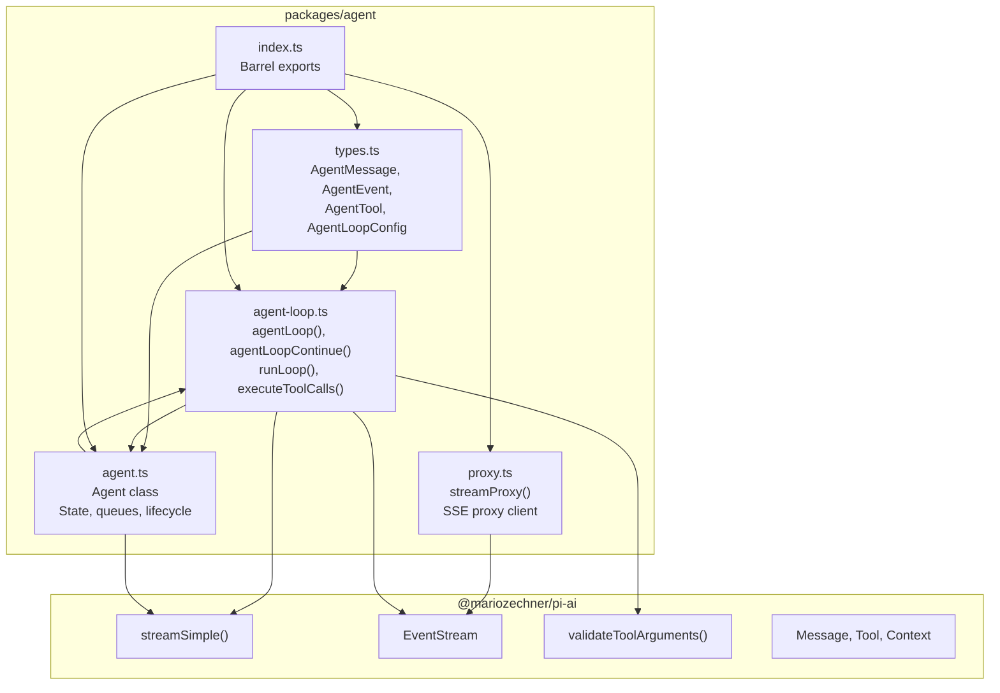
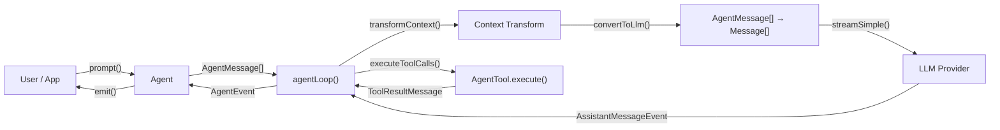

# packages/agent — Design Documentation

Stateful agent runtime with tool calling, steering/follow-up queues, and event streaming. Wraps `@mariozechner/pi-ai` streaming into a turn-based agent loop.

## Architecture

## Data Flow

## Document Index

| Document | Source | Description |
|---|---|---|
| [types.md](types.md) | `src/types.ts` | Core type definitions — AgentMessage, AgentEvent, AgentTool, AgentLoopConfig, AgentState |
| [agent-loop.md](agent-loop.md) | `src/agent-loop.ts` | Agent loop engine — turn processing, LLM streaming, tool execution, steering/follow-up |
| [agent.md](agent.md) | `src/agent.ts` | Agent class — stateful wrapper with queues, lifecycle management, event emission |
| [proxy.md](proxy.md) | `src/proxy.ts` | Proxy stream function — SSE-based LLM proxy client with partial message reconstruction |
| [index.md](index.md) | `src/index.ts` | Barrel exports |
