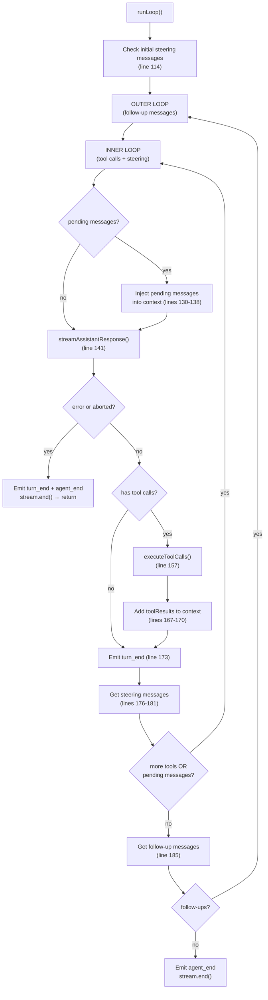
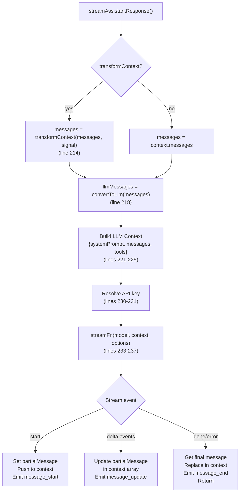
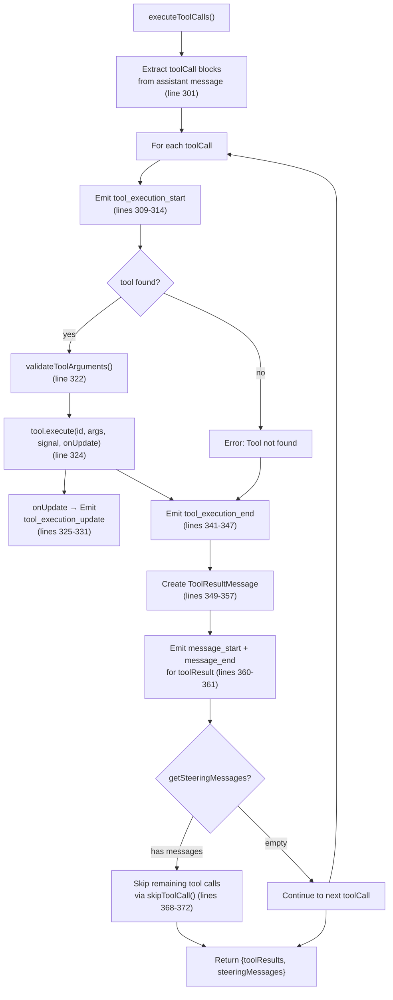

# agent-loop.ts — Agent Loop Engine

**Source:** `packages/agent/src/agent-loop.ts`

## Purpose

Core agent loop that processes turns: streams LLM responses, executes tool calls, handles steering/follow-up message injection. Works with `AgentMessage` throughout, only transforming to `Message[]` at the LLM call boundary.

## Exported Functions

### `agentLoop()` (line 28)

```typescript
export function agentLoop(
    prompts: AgentMessage[],
    context: AgentContext,
    config: AgentLoopConfig,
    signal?: AbortSignal,
    streamFn?: StreamFn,
): EventStream<AgentEvent, AgentMessage[]>
```

Starts an agent loop with new prompt messages. Adds prompts to context, emits `agent_start` + `turn_start` + message events for each prompt, then delegates to `runLoop()`.

### `agentLoopContinue()` (line 65)

```typescript
export function agentLoopContinue(
    context: AgentContext,
    config: AgentLoopConfig,
    signal?: AbortSignal,
    streamFn?: StreamFn,
): EventStream<AgentEvent, AgentMessage[]>
```

Continues an agent loop from existing context without adding a new message. Used for retries where context already has user message or tool results.

**Validation (lines 71–77):**
- Throws if `context.messages` is empty
- Throws if last message is `assistant` role (LLM providers require user/toolResult as last message)

## Internal Functions

### `createAgentStream()` (line 94)

```typescript
function createAgentStream(): EventStream<AgentEvent, AgentMessage[]>
```

Creates an `EventStream` that terminates on `agent_end` events and extracts the messages array as the result.

### `runLoop()` (line 104)

```typescript
async function runLoop(
    currentContext: AgentContext,
    newMessages: AgentMessage[],
    config: AgentLoopConfig,
    signal: AbortSignal | undefined,
    stream: EventStream<AgentEvent, AgentMessage[]>,
    streamFn?: StreamFn,
): Promise<void>
```

Main loop logic shared by `agentLoop` and `agentLoopContinue`. Implements a two-level loop:



**Outer loop (line 117):** Continues when follow-up messages arrive after agent would otherwise stop.

**Inner loop (line 122):** Processes tool calls and steering messages. Continues while there are pending tool calls or injected messages.

**Steering check (lines 176–181):** After tool execution, checks for steering messages from `getSteeringMessages()`. If `executeToolCalls()` already captured steering (user interrupted during tool execution), those take priority.

**Follow-up check (lines 185–190):** When inner loop completes (no more tools or steering), checks `getFollowUpMessages()`. If non-empty, sets as pending and re-enters outer loop.

### `streamAssistantResponse()` (line 204)

```typescript
async function streamAssistantResponse(
    context: AgentContext,
    config: AgentLoopConfig,
    signal: AbortSignal | undefined,
    stream: EventStream<AgentEvent, AgentMessage[]>,
    streamFn?: StreamFn,
): Promise<AssistantMessage>
```

Streams an LLM response. This is where `AgentMessage[]` gets transformed to `Message[]`.



**Context transformation pipeline (lines 212–218):**
1. `transformContext()` — optional AgentMessage-level transform (pruning, injection)
2. `convertToLlm()` — converts AgentMessage[] to Message[] for the LLM

**Partial message management (lines 239–288):**
- On `start`: Creates partial message, pushes to context, emits `message_start`
- On delta events (`text_start/delta/end`, `thinking_*`, `toolcall_*`): Updates partial in context array, emits `message_update` with the raw `AssistantMessageEvent`
- On `done`/`error`: Replaces partial with final message in context, emits `message_end`

### `executeToolCalls()` (line 294)

```typescript
async function executeToolCalls(
    tools: AgentTool<any>[] | undefined,
    assistantMessage: AssistantMessage,
    signal: AbortSignal | undefined,
    stream: EventStream<AgentEvent, AgentMessage[]>,
    getSteeringMessages?: AgentLoopConfig["getSteeringMessages"],
): Promise<{ toolResults: ToolResultMessage[]; steeringMessages?: AgentMessage[] }>
```

Executes tool calls sequentially from an assistant message.



**Sequential execution (line 305):** Tool calls execute one at a time in order. This allows steering messages to interrupt between calls.

**Steering interrupt (lines 364–374):** After each tool execution, checks `getSteeringMessages()`. If the user has queued messages, remaining tool calls are skipped via `skipToolCall()` and the steering messages are returned.

**Error handling (lines 333–339):** Caught errors produce a text content result with the error message and `isError: true`.

### `skipToolCall()` (line 380)

```typescript
function skipToolCall(
    toolCall: Extract<AssistantMessage["content"][number], { type: "toolCall" }>,
    stream: EventStream<AgentEvent, AgentMessage[]>,
): ToolResultMessage
```

Creates a skipped tool result with error text `"Skipped due to queued user message."`. Emits `tool_execution_start` and `tool_execution_end` events (no actual execution). Returns a `ToolResultMessage` with `isError: true`.
