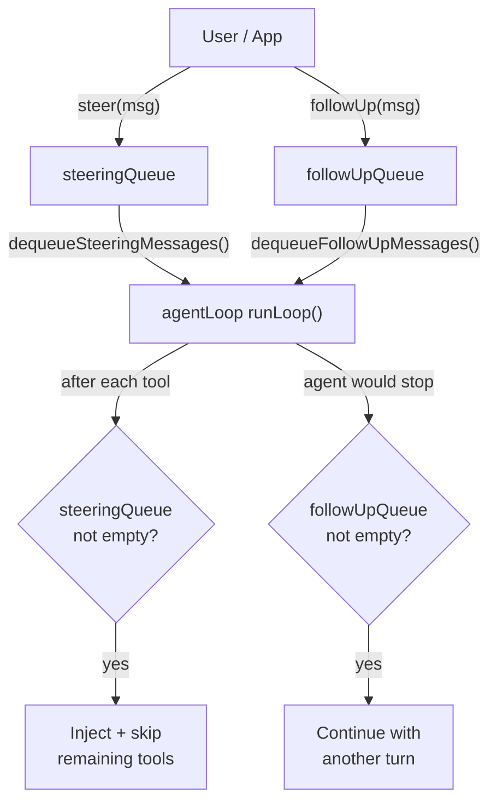
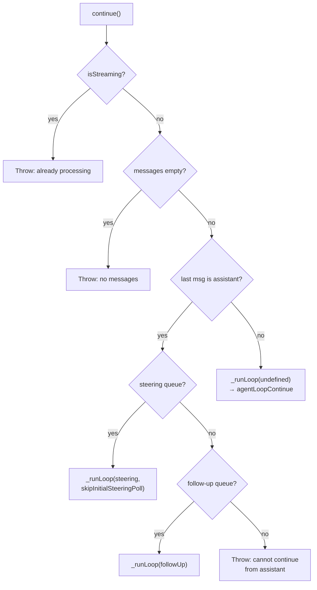
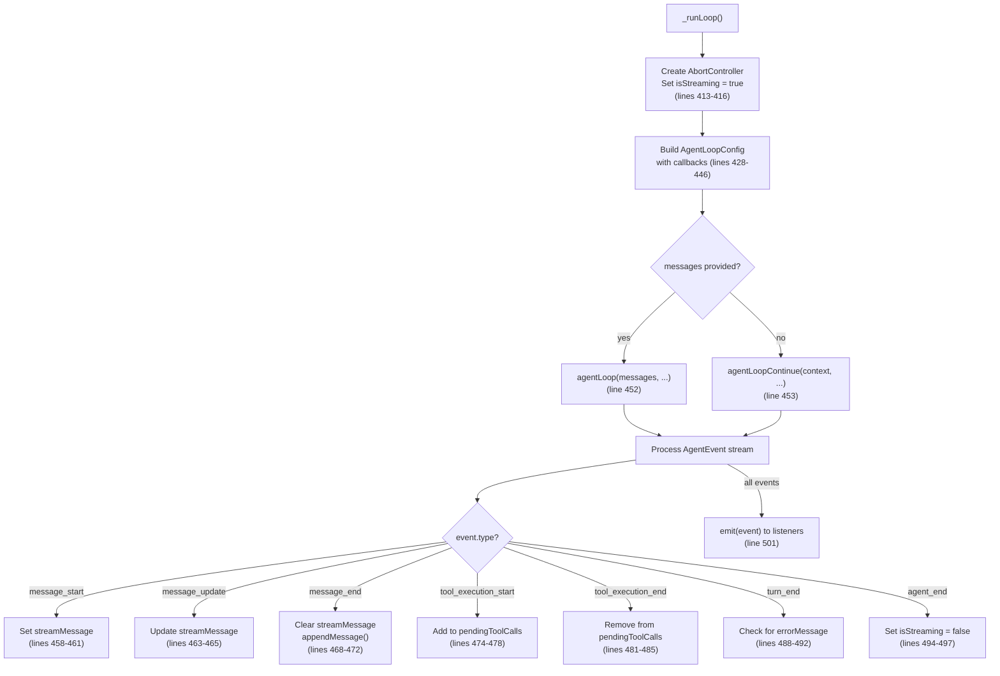

# agent.ts — Agent Class

**Source:** `packages/agent/src/agent.ts`

## Purpose

Stateful agent wrapper around `agentLoop`/`agentLoopContinue`. Manages state, steering/follow-up queues, event emission, and lifecycle. This is the primary public API for apps.

## Internal Functions

### `defaultConvertToLlm()` (line 31)

```typescript
function defaultConvertToLlm(messages: AgentMessage[]): Message[]
```

Default message converter. Filters to only `user`, `assistant`, and `toolResult` role messages — strips any custom message types.

## Exported Types

### `AgentOptions` (line 35)

```typescript
export interface AgentOptions {
    initialState?: Partial<AgentState>;
    convertToLlm?: (messages: AgentMessage[]) => Message[] | Promise<Message[]>;
    transformContext?: (messages: AgentMessage[], signal?: AbortSignal) => Promise<AgentMessage[]>;
    steeringMode?: "all" | "one-at-a-time";
    followUpMode?: "all" | "one-at-a-time";
    streamFn?: StreamFn;
    sessionId?: string;
    getApiKey?: (provider: string) => Promise<string | undefined> | string | undefined;
    thinkingBudgets?: ThinkingBudgets;
    transport?: Transport;
    maxRetryDelayMs?: number;
}
```

| Field | Line | Description |
|---|---|---|
| `initialState` | 36 | Partial initial `AgentState` merged with defaults |
| `convertToLlm` | 42 | Custom message converter. Default: `defaultConvertToLlm` |
| `transformContext` | 48 | Optional context transform before conversion |
| `steeringMode` | 53 | `"all"` sends all queued steering at once; `"one-at-a-time"` (default) sends one per turn |
| `followUpMode` | 58 | Same as steering mode but for follow-up messages |
| `streamFn` | 63 | Custom stream function (e.g., `streamProxy`). Default: `streamSimple` |
| `sessionId` | 69 | Session ID for provider caching (e.g., OpenAI Codex) |
| `getApiKey` | 75 | Dynamic API key resolver for expiring tokens |
| `thinkingBudgets` | 80 | Custom token budgets for thinking levels |
| `transport` | 85 | Preferred transport (`"sse"` default, `"websocket"`) |
| `maxRetryDelayMs` | 93 | Max delay for server-requested retries. Default: 60000ms |

## `Agent` Class (line 96)

### Constructor (line 126)

```typescript
constructor(opts: AgentOptions = {})
```

Initializes state by merging `opts.initialState` with defaults. Default model: `gemini-2.5-flash-lite-preview-06-17`. Default steering/follow-up mode: `"one-at-a-time"`. Default transport: `"sse"`.

### State & Properties

| Property/Method | Line | Description |
|---|---|---|
| `state` (getter) | 198 | Returns current `AgentState` |
| `sessionId` (get/set) | 143, 151 | Session ID for provider caching |
| `thinkingBudgets` (get/set) | 158, 165 | Custom thinking token budgets |
| `transport` (getter) | 172 | Current transport preference |
| `setTransport()` | 179 | Set transport preference |
| `maxRetryDelayMs` (get/set) | 186, 194 | Max retry delay cap |

### State Mutators

| Method | Line | Description |
|---|---|---|
| `setSystemPrompt()` | 208 | Set system prompt |
| `setModel()` | 212 | Set LLM model |
| `setThinkingLevel()` | 216 | Set reasoning level |
| `setSteeringMode()` | 220 | Set steering dequeue mode |
| `setFollowUpMode()` | 228 | Set follow-up dequeue mode |
| `setTools()` | 236 | Set available tools |
| `replaceMessages()` | 240 | Replace all messages (copies array) |
| `appendMessage()` | 244 | Append single message |
| `clearMessages()` | 311 | Clear all messages |
| `reset()` | 323 | Full reset: messages, streaming state, queues |

### Steering & Follow-Up Queues



| Method | Line | Description |
|---|---|---|
| `steer()` | 252 | Queue steering message — delivered after current tool, skips remaining |
| `followUp()` | 260 | Queue follow-up message — delivered when agent finishes |
| `clearSteeringQueue()` | 264 | Clear steering queue |
| `clearFollowUpQueue()` | 268 | Clear follow-up queue |
| `clearAllQueues()` | 272 | Clear both queues |
| `hasQueuedMessages()` | 277 | Check if any queued messages exist |

  Steering and follow-up are two message queues that let you inject messages into a running agent at different points:

  Steering (steer(), line 252)

  Interrupts the agent mid-run, between tool executions. When the agent finishes executing a tool, it checks the steering queue. If messages are
   found:

  1. Remaining tool calls are skipped (marked as errors with "Skipped due to queued user message")
  2. The steering messages are injected into context
  3. The agent makes another LLM call with the new context

  Use case: User wants to redirect the agent while it's working. For example, typing "stop, do this instead" while the agent is executing a
  multi-tool response.

  Follow-up (followUp(), line 260)

  Processed after the agent would otherwise stop — when there are no more tool calls and no steering messages. If follow-up messages are found,
  the agent continues with another turn instead of ending.

  Use case: Queuing additional work that should wait until the current task finishes. For example, "when you're done with that, also run the
  tests."

  Dequeue modes (lines 53, 58)

  Both queues support two modes:
  - "one-at-a-time" (default): Only the first queued message is delivered per check — the rest stay queued for subsequent turns
  - "all": All queued messages are delivered at once

  Flow summary

  Agent running → tool executes → check steering queue
                                    ├─ has messages → skip remaining tools, inject, continue
                                    └─ empty → execute next tool
                                 ...all tools done → check steering again
                                    └─ empty → check follow-up queue
                                                 ├─ has messages → inject, continue
                                                 └─ empty → agent_end

### `dequeueSteeringMessages()` (line 281)

```typescript
private dequeueSteeringMessages(): AgentMessage[]
```

In `"one-at-a-time"` mode (line 282): returns only the first queued message. In `"all"` mode (line 290): returns and clears entire queue.

### `dequeueFollowUpMessages()` (line 296)

```typescript
private dequeueFollowUpMessages(): AgentMessage[]
```

Same dequeue logic as steering, respecting `followUpMode`.

### Lifecycle Methods

#### `prompt()` (line 334)

```typescript
async prompt(message: AgentMessage | AgentMessage[]): Promise<void>;
async prompt(input: string, images?: ImageContent[]): Promise<void>;
```

Send a prompt to the agent. Three overloads:
- **String** (line 350): Creates a user message with text content and optional images
- **Single AgentMessage** (line 363): Wraps in array
- **AgentMessage[]** (line 349): Passes through directly

Throws if agent is already streaming (line 338). Calls `_runLoop()` with the messages.

#### `continue()` (line 372)

```typescript
async continue(): Promise<void>
```

Continue from current context. Used for retries and processing queued messages.



#### `abort()` (line 315)

Aborts the current AbortController.

#### `waitForIdle()` (line 319)

```typescript
waitForIdle(): Promise<void>
```

Returns the running prompt promise, or `Promise.resolve()` if idle.

### `_runLoop()` (line 405)

```typescript
private async _runLoop(
    messages?: AgentMessage[],
    options?: { skipInitialSteeringPoll?: boolean }
): Promise<void>
```

Core method that configures and runs the agent loop.



**Config callbacks (lines 428–446):**
- `getSteeringMessages`: Wraps `dequeueSteeringMessages()` with optional initial poll skip (for `continue()` with pre-dequeued steering)
- `getFollowUpMessages`: Wraps `dequeueFollowUpMessages()`
- `convertToLlm`, `transformContext`, `getApiKey`: Passed from constructor options

**Partial message handling (lines 504–518):** After stream completes, checks if there's an unfinished partial message. If it has non-empty content, appends it. If all content is empty and signal was aborted, throws.

**Error handling (lines 520–542):** On catch, creates a synthetic error `AssistantMessage` with `stopReason: "error"` or `"aborted"`, appends it, and emits `agent_end`.

**Cleanup (lines 543–551):** Always resets `isStreaming`, `streamMessage`, `pendingToolCalls`, `abortController`, and resolves `runningPrompt`.

### Event Emission

#### `subscribe()` (line 202)

```typescript
subscribe(fn: (e: AgentEvent) => void): () => void
```

Subscribe to agent events. Returns unsubscribe function.

#### `emit()` (line 554)

```typescript
private emit(e: AgentEvent): void
```

Broadcasts event to all subscribed listeners.
