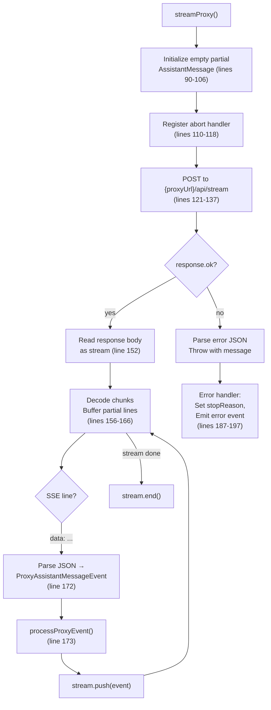
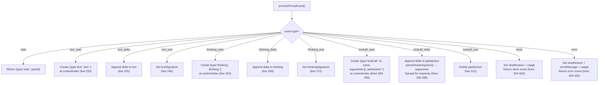

# proxy.ts — LLM Proxy Stream Client

**Source:** `packages/agent/src/proxy.ts`

## Purpose

Proxy stream function for apps that route LLM calls through a server. The server manages auth and proxies requests to LLM providers. Strips `partial` field from events to reduce bandwidth — client reconstructs it locally.

## Internal Classes

### `ProxyMessageEventStream` (line 20)

```typescript
class ProxyMessageEventStream extends EventStream<AssistantMessageEvent, AssistantMessage>
```

Extends `EventStream`. Terminates on `done` or `error` events. Extracts `AssistantMessage` from terminal events.

## Exported Types

### `ProxyAssistantMessageEvent` (line 36)

```typescript
export type ProxyAssistantMessageEvent =
    | { type: "start" }
    | { type: "text_start"; contentIndex: number }
    | { type: "text_delta"; contentIndex: number; delta: string }
    | { type: "text_end"; contentIndex: number; contentSignature?: string }
    | { type: "thinking_start"; contentIndex: number }
    | { type: "thinking_delta"; contentIndex: number; delta: string }
    | { type: "thinking_end"; contentIndex: number; contentSignature?: string }
    | { type: "toolcall_start"; contentIndex: number; id: string; toolName: string }
    | { type: "toolcall_delta"; contentIndex: number; delta: string }
    | { type: "toolcall_end"; contentIndex: number }
    | { type: "done"; reason: StopReason; usage: AssistantMessage["usage"] }
    | { type: "error"; reason: StopReason; errorMessage?: string; usage: AssistantMessage["usage"] }
```

Bandwidth-optimized event format. Omits the `partial` field present in standard `AssistantMessageEvent` — the client reconstructs partial messages locally using `contentIndex`.

### `ProxyStreamOptions` (line 59)

```typescript
export interface ProxyStreamOptions extends SimpleStreamOptions {
    authToken: string;
    proxyUrl: string;
}
```

Extends `SimpleStreamOptions` with proxy-specific auth token and server URL.

## `streamProxy()` (line 85)

```typescript
export function streamProxy(
    model: Model<any>, context: Context, options: ProxyStreamOptions
): ProxyMessageEventStream
```

Stream function that proxies LLM calls through a server. Drop-in replacement for `streamSimple` via the `streamFn` option on `Agent`.



**Request body (lines 127–136):** Sends `model`, `context`, and selected `options` (temperature, maxTokens, reasoning) as JSON.

**SSE parsing (lines 168–179):** Reads response body as stream, splits on newlines, extracts `data:` prefixed lines, parses as JSON `ProxyAssistantMessageEvent`.

**Abort handling (lines 110–118):** Registers abort listener that cancels the reader. Cleanup in `finally` block (lines 198–202).

## `processProxyEvent()` (line 211)

```typescript
function processProxyEvent(
    proxyEvent: ProxyAssistantMessageEvent,
    partial: AssistantMessage,
): AssistantMessageEvent | undefined
```

Reconstructs full `AssistantMessageEvent` objects from bandwidth-optimized proxy events by maintaining and mutating the `partial` message.



**Text events (lines 219–249):** Create text block at `contentIndex`, accumulate deltas, attach signature on end.

**Thinking events (lines 251–281):** Same pattern as text but for `thinking` blocks with `thinkingSignature`.

**Tool call events (lines 283–321):**
- `toolcall_start` (line 284): Creates toolCall with `partialJson` tracking field
- `toolcall_delta` (line 296): Appends to `partialJson`, calls `parseStreamingJson()` to parse partial JSON into `arguments`. Spreads content for reactivity.
- `toolcall_end` (line 312): Deletes temporary `partialJson` field

**Exhaustive check (lines 334–337):** Uses TypeScript `never` type to ensure all event types are handled.
