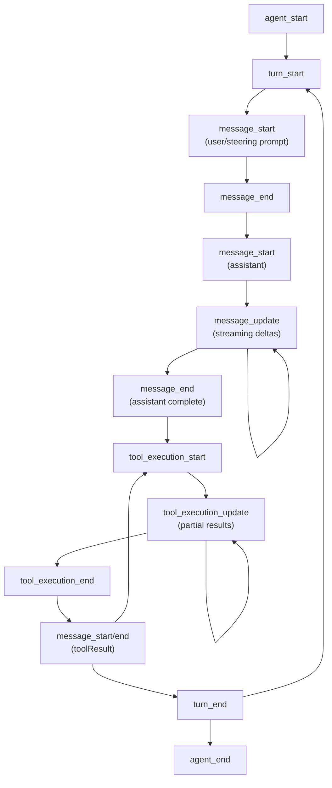

# types.ts — Agent Type Definitions

**Source:** `packages/agent/src/types.ts`

## Purpose

Core type definitions for the agent runtime. Defines the extensible message system, tool interface, configuration, state, and event types.

## Exported Types

### `StreamFn` (line 15)

```typescript
export type StreamFn = (
    ...args: Parameters<typeof streamSimple>
) => ReturnType<typeof streamSimple> | Promise<ReturnType<typeof streamSimple>>;
```

Stream function signature matching `streamSimple` but allowing async return (for proxy backends that need async config lookup).

### `AgentLoopConfig` (line 22)

```typescript
export interface AgentLoopConfig extends SimpleStreamOptions {
    model: Model<any>;
    convertToLlm: (messages: AgentMessage[]) => Message[] | Promise<Message[]>;
    transformContext?: (messages: AgentMessage[], signal?: AbortSignal) => Promise<AgentMessage[]>;
    getApiKey?: (provider: string) => Promise<string | undefined> | string | undefined;
    getSteeringMessages?: () => Promise<AgentMessage[]>;
    getFollowUpMessages?: () => Promise<AgentMessage[]>;
}
```

Configuration for the agent loop. Key callbacks:

| Field | Line | Description |
|---|---|---|
| `convertToLlm` | 48 | Converts `AgentMessage[]` → `Message[]` at LLM call boundary. Custom messages filtered/transformed here. |
| `transformContext` | 67 | Optional pre-conversion transform for context pruning, injection. Operates on `AgentMessage[]`. |
| `getApiKey` | 75 | Dynamic API key resolver for expiring tokens (e.g., OAuth). Called before each LLM call. |
| `getSteeringMessages` | 86 | Returns steering messages to inject mid-run. Called after each tool execution. Non-empty → skips remaining tools. |
| `getFollowUpMessages` | 97 | Returns follow-up messages after agent would stop. Non-empty → agent continues with another turn. |

### `ThinkingLevel` (line 104)

```typescript
export type ThinkingLevel = "off" | "minimal" | "low" | "medium" | "high" | "xhigh";
```

Reasoning level for models that support it. `"xhigh"` only supported by specific OpenAI models.

### `CustomAgentMessages` (line 120)

```typescript
export interface CustomAgentMessages {
    // Empty by default - apps extend via declaration merging
}
```

Extensible interface for custom app messages. Apps extend via TypeScript declaration merging to add custom message types (e.g., `artifact`, `notification`).

### `AgentMessage` (line 129)

```typescript
export type AgentMessage = Message | CustomAgentMessages[keyof CustomAgentMessages];
```

Union of standard LLM `Message` types and any custom messages added via declaration merging. This is the core message type used throughout the agent runtime.

### `AgentState` (line 134)

```typescript
export interface AgentState {
    systemPrompt: string;
    model: Model<any>;
    thinkingLevel: ThinkingLevel;
    tools: AgentTool<any>[];
    messages: AgentMessage[];
    isStreaming: boolean;
    streamMessage: AgentMessage | null;
    pendingToolCalls: Set<string>;
    error?: string;
}
```

Complete agent state for UI binding. Tracks streaming status, current partial message, pending tool executions, and error state.

### `AgentToolResult<T>` (line 146)

```typescript
export interface AgentToolResult<T> {
    content: (TextContent | ImageContent)[];
    details: T;
}
```

Tool execution result with content blocks (text/images) and typed details for UI display.

### `AgentToolUpdateCallback<T>` (line 154)

```typescript
export type AgentToolUpdateCallback<T = any> = (partialResult: AgentToolResult<T>) => void;
```

Callback for streaming partial tool execution updates.

### `AgentTool<TParameters, TDetails>` (line 157)

```typescript
export interface AgentTool<TParameters extends TSchema = TSchema, TDetails = any> extends Tool<TParameters> {
    label: string;
    execute: (
        toolCallId: string,
        params: Static<TParameters>,
        signal?: AbortSignal,
        onUpdate?: AgentToolUpdateCallback<TDetails>,
    ) => Promise<AgentToolResult<TDetails>>;
}
```

Extends the base `Tool` interface from `pi-ai` with:
- **`label`** (line 159): Human-readable label for UI display
- **`execute`** (line 160): Async execution function with abort support and streaming updates via `onUpdate` callback

### `AgentContext` (line 169)

```typescript
export interface AgentContext {
    systemPrompt: string;
    messages: AgentMessage[];
    tools?: AgentTool<any>[];
}
```

Like `Context` from `pi-ai` but uses `AgentMessage[]` and `AgentTool[]`.

### `AgentEvent` (line 179)

```typescript
export type AgentEvent =
    | { type: "agent_start" }
    | { type: "agent_end"; messages: AgentMessage[] }
    | { type: "turn_start" }
    | { type: "turn_end"; message: AgentMessage; toolResults: ToolResultMessage[] }
    | { type: "message_start"; message: AgentMessage }
    | { type: "message_update"; message: AgentMessage; assistantMessageEvent: AssistantMessageEvent }
    | { type: "message_end"; message: AgentMessage }
    | { type: "tool_execution_start"; toolCallId: string; toolName: string; args: any }
    | { type: "tool_execution_update"; toolCallId: string; toolName: string; args: any; partialResult: any }
    | { type: "tool_execution_end"; toolCallId: string; toolName: string; result: any; isError: boolean };
```

Discriminated union of agent lifecycle events:


