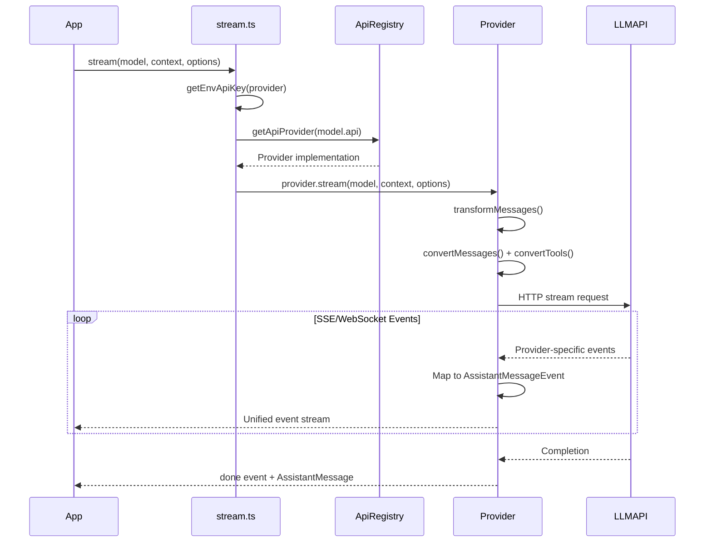

# packages/ai - Design Documentation

Unified multi-provider LLM streaming API. This directory contains design documentation for every source file in `packages/ai/src/`.

## Package Architecture

```mermaid
graph TB
    subgraph "Public API"
        IDX[index.ts<br/>Barrel exports]
        STR[stream.ts<br/>stream / complete]
        CLI[cli.ts<br/>OAuth login CLI]
    end

    subgraph "Core"
        TYP[types.ts<br/>All type definitions]
        MOD[models.ts<br/>Model registry]
        GEN[models.generated.ts<br/>Auto-generated catalog]
        REG[api-registry.ts<br/>Provider plugin registry]
        ENV[env-api-keys.ts<br/>API key resolution]
    end

    subgraph "Providers"
        RB[register-builtins.ts]
        ANT[anthropic.ts]
        OAC[openai-completions.ts]
        OAR[openai-responses.ts]
        ORS[openai-responses-shared.ts]
        OCR[openai-codex-responses.ts]
        AZR[azure-openai-responses.ts]
        GOO[google.ts]
        GV[google-vertex.ts]
        GS[google-shared.ts]
        GGC[google-gemini-cli.ts]
        BED[amazon-bedrock.ts]
        GCH[github-copilot-headers.ts]
        SO[simple-options.ts]
        TM[transform-messages.ts]
    end

    subgraph "Utilities"
        ES[event-stream.ts]
        VAL[validation.ts]
        OVF[overflow.ts]
        JP[json-parse.ts]
        SU[sanitize-unicode.ts]
        TBH[typebox-helpers.ts]
        HP[http-proxy.ts]
    end

    subgraph "OAuth"
        OI[oauth/index.ts<br/>Registry + high-level API]
        OT[oauth/types.ts]
        OP[oauth/pkce.ts]
        OA[oauth/anthropic.ts]
        OGG[oauth/google-gemini-cli.ts]
        OGA[oauth/google-antigravity.ts]
        OGH[oauth/github-copilot.ts]
        OOC[oauth/openai-codex.ts]
    end

    STR --> REG
    STR --> ENV
    STR --> RB
    REG --> ANT & OAC & OAR & OCR & AZR & GOO & GV & GGC & BED
    MOD --> GEN
    IDX --> STR & MOD & REG & ENV & TYP & ES & OI

    OAR --> ORS
    AZR --> ORS
    GOO --> GS
    GV --> GS
    GGC --> GS
    ANT & OAC & BED --> TM
    ANT & OAC & OAR & OCR & AZR & GOO & GV & GGC & BED --> SO

    OI --> OA & OGG & OGA & OGH & OOC
    OA & OGG & OGA & OOC --> OP
```

## Document Index

### Core
| File | Doc | Description |
|---|---|---|
| `types.ts` | [types.md](types.md) | All type definitions, message types, streaming events |
| `stream.ts` | [stream.md](stream.md) | Public streaming API entry point |
| `models.ts` | [models.md](models.md) | Model registry, lookup, cost calculation |
| `models.generated.ts` | [models.md](models.md) | Auto-generated model catalog |
| `api-registry.ts` | [api-registry.md](api-registry.md) | Provider plugin registry |
| `env-api-keys.ts` | [env-api-keys.md](env-api-keys.md) | Environment variable API key resolution |
| `index.ts` | [index.md](index.md) | Package barrel exports |
| `cli.ts` | [cli.md](cli.md) | OAuth login CLI tool |

### Providers
| File | Doc | Description |
|---|---|---|
| `anthropic.ts` | [providers/anthropic.md](providers/anthropic.md) | Anthropic Claude API |
| `openai-completions.ts` | [providers/openai-completions.md](providers/openai-completions.md) | OpenAI Chat Completions (+ compatible APIs) |
| `openai-responses.ts` | [providers/openai-responses.md](providers/openai-responses.md) | OpenAI Responses API |
| `openai-responses-shared.ts` | [providers/openai-responses.md](providers/openai-responses.md) | Shared Responses utilities |
| `openai-codex-responses.ts` | [providers/openai-codex-responses.md](providers/openai-codex-responses.md) | OpenAI Codex (ChatGPT backend) |
| `azure-openai-responses.ts` | [providers/azure-openai-responses.md](providers/azure-openai-responses.md) | Azure OpenAI Responses |
| `google.ts` | [providers/google.md](providers/google.md) | Google Generative AI |
| `google-vertex.ts` | [providers/google.md](providers/google.md) | Google Vertex AI |
| `google-shared.ts` | [providers/google.md](providers/google.md) | Shared Google utilities |
| `google-gemini-cli.ts` | [providers/google-gemini-cli.md](providers/google-gemini-cli.md) | Gemini CLI / Antigravity |
| `amazon-bedrock.ts` | [providers/amazon-bedrock.md](providers/amazon-bedrock.md) | Amazon Bedrock |
| `github-copilot-headers.ts` | [providers/github-copilot-headers.md](providers/github-copilot-headers.md) | Copilot dynamic headers |
| `register-builtins.ts` | [providers/register-builtins.md](providers/register-builtins.md) | Built-in provider registration |
| `simple-options.ts` | [providers/simple-options.md](providers/simple-options.md) | Stream option helpers |
| `transform-messages.ts` | [providers/transform-messages.md](providers/transform-messages.md) | Cross-provider message transformation |

### Utilities
| File | Doc | Description |
|---|---|---|
| `event-stream.ts` | [utils/event-stream.md](utils/event-stream.md) | Async event stream with queue+waiter |
| `validation.ts` | [utils/validation.md](utils/validation.md) | AJV-based tool call validation |
| `overflow.ts` | [utils/overflow.md](utils/overflow.md) | Context overflow detection |
| `json-parse.ts` | [utils/json-parse.md](utils/json-parse.md) | Streaming JSON parser |
| `sanitize-unicode.ts` | [utils/sanitize-unicode.md](utils/sanitize-unicode.md) | Unicode surrogate sanitization |
| `typebox-helpers.ts` | [utils/typebox-helpers.md](utils/typebox-helpers.md) | TypeBox string enum helper |
| `http-proxy.ts` | [utils/http-proxy.md](utils/http-proxy.md) | HTTP proxy setup |

### OAuth
| File | Doc | Description |
|---|---|---|
| `oauth/types.ts` | [utils/oauth/types.md](utils/oauth/types.md) | OAuth type definitions |
| `oauth/pkce.ts` | [utils/oauth/pkce.md](utils/oauth/pkce.md) | PKCE code generation |
| `oauth/index.ts` | [utils/oauth/index.md](utils/oauth/index.md) | OAuth registry and management |
| `oauth/anthropic.ts` | [utils/oauth/anthropic.md](utils/oauth/anthropic.md) | Anthropic OAuth |
| `oauth/google-gemini-cli.ts` | [utils/oauth/google-gemini-cli.md](utils/oauth/google-gemini-cli.md) | Google Cloud Code Assist OAuth |
| `oauth/google-antigravity.ts` | [utils/oauth/google-antigravity.md](utils/oauth/google-antigravity.md) | Antigravity OAuth |
| `oauth/github-copilot.ts` | [utils/oauth/github-copilot.md](utils/oauth/github-copilot.md) | GitHub Copilot OAuth |
| `oauth/openai-codex.ts` | [utils/oauth/openai-codex.md](utils/oauth/openai-codex.md) | OpenAI Codex OAuth |

## Key Architectural Patterns

1. **Provider Plugin Architecture** — Providers self-register via api-registry; enables testing, extensions, dynamic switching
2. **Generic Type Safety** — `Model<TApi>` carries API type through the system for compile-time provider matching
3. **Async Event Streaming** — `EventStream` supports both real-time iteration and batch `result()` consumption
4. **Cross-Provider Message Transformation** — Centralized normalization of thinking blocks, tool IDs, and signatures across provider boundaries
5. **Dual Thinking Modes** — Adaptive (model decides) vs budget-based (fixed token allocation) per model capability
6. **OAuth Modularity** — Each provider implements `OAuthProviderInterface` with different flow types (device code, auth code + PKCE)

## Data Flow: Complete Request

