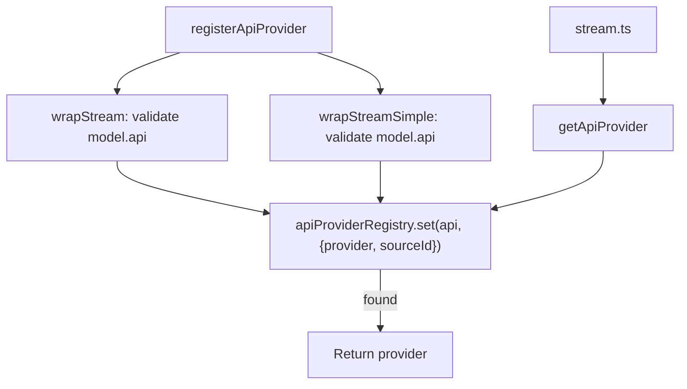

# api-registry.ts — Provider Plugin Registry

**Source:** `packages/ai/src/api-registry.ts`

## Purpose

Plugin registry for LLM API implementations. Allows providers to register themselves and enables dynamic provider resolution, switching, and testing.

## Type Exports (lines 11–27)

- **`ApiStreamFunction`** (line 11): `(model, context, options?) => AssistantMessageEventStream`
- **`ApiStreamSimpleFunction`** (line 17): Same but with `SimpleStreamOptions`
- **`ApiProvider<TApi, TOptions>`** (line 23): Interface with `api`, `stream`, and `streamSimple` fields

## Internal Types (lines 29–38)

- **`ApiProviderInternal`** (line 29): Internal version with erased generics (uses `Api` and `ApiStreamFunction`)
- **`RegisteredApiProvider`** (line 35): Wraps provider with optional `sourceId` for bulk removal

## Registry (line 40)

```typescript
const apiProviderRegistry = new Map<string, RegisteredApiProvider>();
```

## `wrapStream()` (lines 42–52)

Internal helper that creates a wrapper function which validates `model.api === expectedApi` at runtime before delegating. Throws `Error("Mismatched api: ...")` on mismatch.

## `wrapStreamSimple()` (lines 54–64)

Same pattern for `streamSimple`. Both wrappers cast the generic `Model<Api>` to the specific `Model<TApi>`.

## `registerApiProvider()` (lines 66–78)

```typescript
export function registerApiProvider<TApi, TOptions>(
    provider: ApiProvider<TApi, TOptions>, sourceId?: string
): void
```

Wraps both `stream` and `streamSimple` with type-checking wrappers, stores in registry keyed by `provider.api`. Optional `sourceId` enables bulk removal.

## `getApiProvider()` (lines 80–82)

```typescript
export function getApiProvider(api: Api): ApiProviderInternal | undefined
```

Simple map lookup.

## `getApiProviders()` (lines 84–86)

Returns all registered providers as an array.

## `unregisterApiProviders()` (lines 88–94)

```typescript
export function unregisterApiProviders(sourceId: string): void
```

Iterates registry and deletes all entries matching the given `sourceId`. Used for clean extension/plugin removal.

## `clearApiProviders()` (lines 96–98)

Clears entire registry. Used by `resetApiProviders()` in tests.

## Registration Flow


