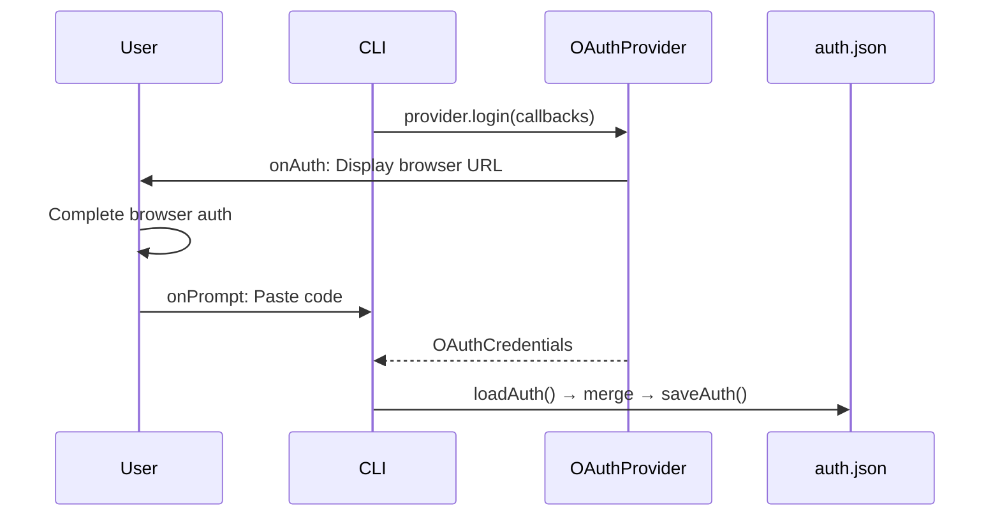

# cli.ts — OAuth Login CLI

**Source:** `packages/ai/src/cli.ts`

## Purpose

Command-line tool for interactive OAuth provider authentication. Saves credentials to `auth.json`.

## Constants

- **`AUTH_FILE`** (line 8): `"auth.json"`
- **`PROVIDERS`** (line 9): All registered OAuth providers from `getOAuthProviders()`

## `prompt()` (line 11–13)

Internal readline wrapper returning a Promise<string>.

## `loadAuth()` (lines 15–22)

Reads and parses `auth.json`. Returns empty object if file missing or invalid.

## `saveAuth()` (lines 24–26)

Writes credentials to `auth.json` with 2-space indent.

## `login()` (lines 28–59)

```typescript
async function login(providerId: OAuthProviderId): Promise<void>
```



1. Resolves provider from registry (line 29), exits if unknown
2. Creates readline interface (line 35)
3. Calls `provider.login()` with callbacks:
   - `onAuth`: prints URL and instructions (line 40–43)
   - `onPrompt`: reads line from stdin (line 45–47)
   - `onProgress`: prints status (line 48)
4. Merges credentials into `auth.json` with `type: "oauth"` (line 51–53)

## `main()` (lines 61–133)

Entry point. Parses `process.argv`:

| Command | Behavior | Lines |
|---|---|---|
| `help` / `--help` / `-h` | Print usage with provider list | 65–82 |
| `list` | Print all OAuth providers | 84–90 |
| `login [provider]` | Interactive selection (lines 95–112) or direct login | 92–122 |
| unknown | Error message + exit(1) | 125–127 |

Interactive selection prompts numbered list and reads choice (lines 96–111). Validates provider against known list (line 114).

Called at line 130 with `.catch()` for top-level error handling.
