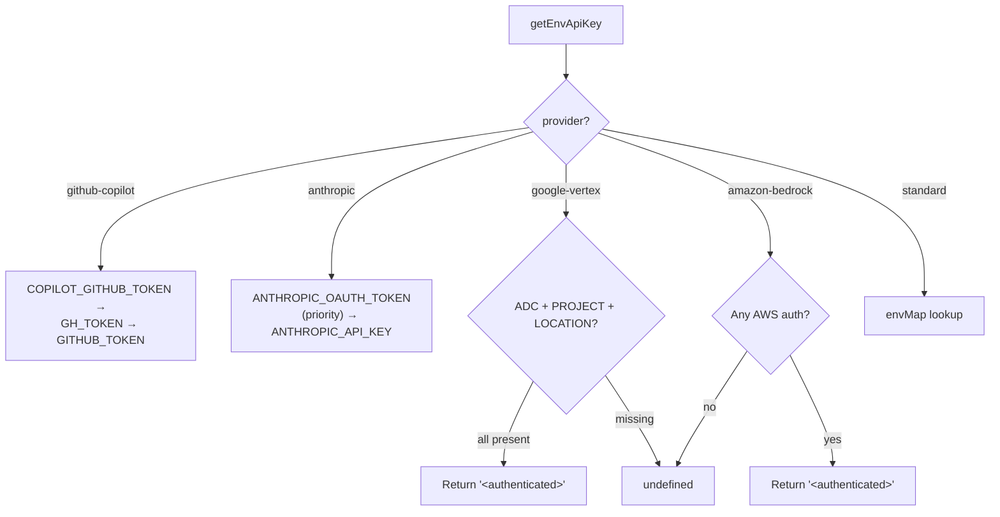

# env-api-keys.ts — API Key Resolution

**Source:** `packages/ai/src/env-api-keys.ts`

## Purpose

Resolves API keys from environment variables per provider. Handles standard keys, OAuth tokens, and credential-based auth (Vertex, Bedrock).

## Browser Safety (lines 1–17)

Dynamic imports for `node:fs`, `node:os`, `node:path` — loaded only in Node.js/Bun, never in browser. Variables `_existsSync`, `_homedir`, `_join` start as `null` and are populated asynchronously.

## `hasVertexAdcCredentials()` (lines 23–49)

Internal helper. Checks for Google Vertex Application Default Credentials:
1. If Node modules haven't loaded yet, returns `false` WITHOUT caching (retries next call)
2. In browser, caches `false` permanently (line 31–33)
3. Checks `GOOGLE_APPLICATION_CREDENTIALS` env var path (line 38–40)
4. Falls back to `~/.config/gcloud/application_default_credentials.json` (line 43–45)
5. Caches result after first successful check

## `getEnvApiKey()` (lines 56–121)

```typescript
export function getEnvApiKey(provider: KnownProvider): string | undefined
```



### Provider-specific logic:

| Provider | Env Vars (priority order) | Line |
|---|---|---|
| `github-copilot` | COPILOT_GITHUB_TOKEN, GH_TOKEN, GITHUB_TOKEN | 60–62 |
| `anthropic` | ANTHROPIC_OAUTH_TOKEN (priority), ANTHROPIC_API_KEY | 65–67 |
| `google-vertex` | ADC credentials + GOOGLE_CLOUD_PROJECT + GOOGLE_CLOUD_LOCATION | 71–79 |
| `amazon-bedrock` | AWS_PROFILE, AWS_ACCESS_KEY_ID+SECRET, AWS_BEARER_TOKEN_BEDROCK, ECS/IRSA | 81–99 |

### Standard mapping (lines 101–117):

| Provider | Env Var |
|---|---|
| openai | OPENAI_API_KEY |
| azure-openai-responses | AZURE_OPENAI_API_KEY |
| google | GEMINI_API_KEY |
| groq | GROQ_API_KEY |
| cerebras | CEREBRAS_API_KEY |
| xai | XAI_API_KEY |
| openrouter | OPENROUTER_API_KEY |
| vercel-ai-gateway | AI_GATEWAY_API_KEY |
| zai | ZAI_API_KEY |
| mistral | MISTRAL_API_KEY |
| minimax | MINIMAX_API_KEY |
| huggingface | HF_TOKEN |
| opencode | OPENCODE_API_KEY |
| kimi-coding | KIMI_API_KEY |
