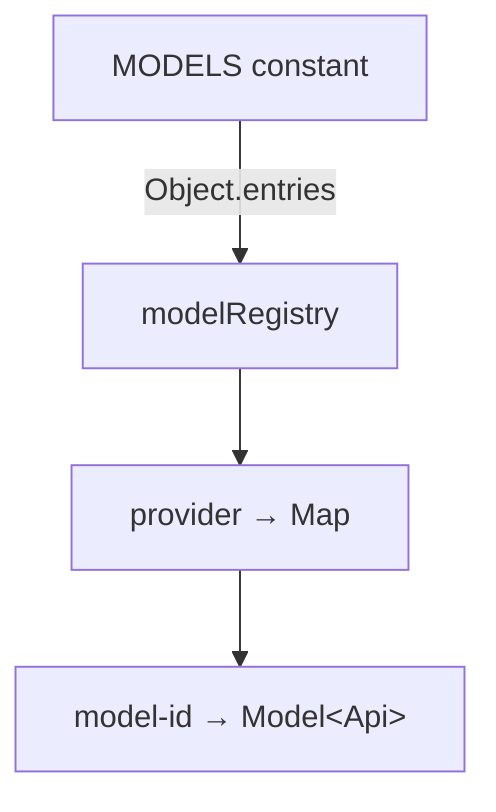

# models.ts — Model Registry & Utilities

**Source:** `packages/ai/src/models.ts`

## Purpose

Model registry, lookup, and utility functions. Manages the complete set of available models across all providers.

## Internal Registry (lines 1–13)

```typescript
const modelRegistry: Map<string, Map<string, Model<Api>>> = new Map();
```

Populated on module load from `MODELS` constant in `models.generated.ts`:



Two-level map: `provider` → `modelId` → `Model<Api>`.

## `getModel()` (lines 20–26)

```typescript
export function getModel<TProvider extends KnownProvider, TModelId extends ...>(
    provider: TProvider, modelId: TModelId
): Model<ModelApi<TProvider, TModelId>>
```

Type-safe model lookup. The return type extracts the correct `Api` from the generated models using conditional type `ModelApi` (line 15–18). Returns `undefined` if not found.

## `getProviders()` (lines 28–30)

Returns `KnownProvider[]` array of all registered provider names.

## `getModels()` (lines 32–37)

```typescript
export function getModels<TProvider extends KnownProvider>(provider: TProvider): Model<...>[]
```

Returns all models for a given provider as an array.

## `calculateCost()` (lines 39–46)

```typescript
export function calculateCost<TApi extends Api>(model: Model<TApi>, usage: Usage): Usage["cost"]
```

Computes cost by multiplying `(model.cost.X / 1,000,000) * usage.X` for input, output, cacheRead, cacheWrite. Mutates `usage.cost` in-place and returns it. Total is the sum of all four.

## `supportsXhigh()` (lines 55–65)

```typescript
export function supportsXhigh<TApi extends Api>(model: Model<TApi>): boolean
```

Returns `true` for:
- GPT-5.2 / GPT-5.3 model families (line 56)
- Anthropic Messages API Opus 4.6 models — xhigh maps to adaptive effort "max" (line 60–62)

## `modelsAreEqual()` (lines 71–77)

```typescript
export function modelsAreEqual(a, b): boolean
```

Compares models by `id` AND `provider`. Returns `false` if either is null/undefined.

---

# models.generated.ts — Auto-Generated Model Catalog

**Source:** `packages/ai/src/models.generated.ts`

Single exported constant: `MODELS: Record<KnownProvider, Record<string, Model<Api>>>`. 328KB+ with 100s of models across 20+ providers. Each entry uses `satisfies` for compile-time verification. **Do not edit manually** — regenerate with `npm run generate-models`.
