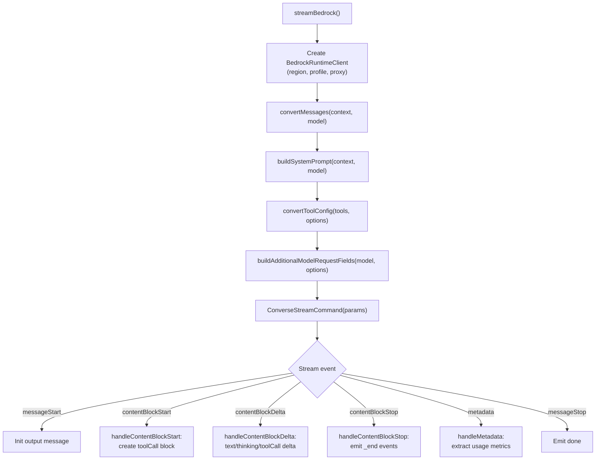
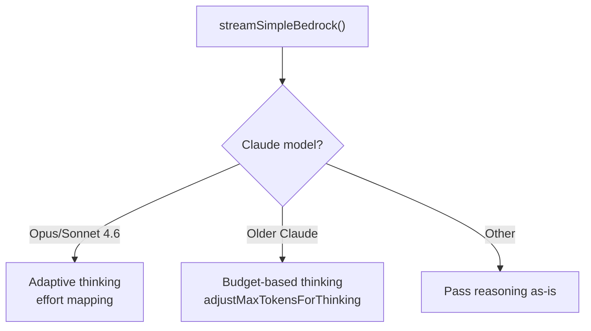
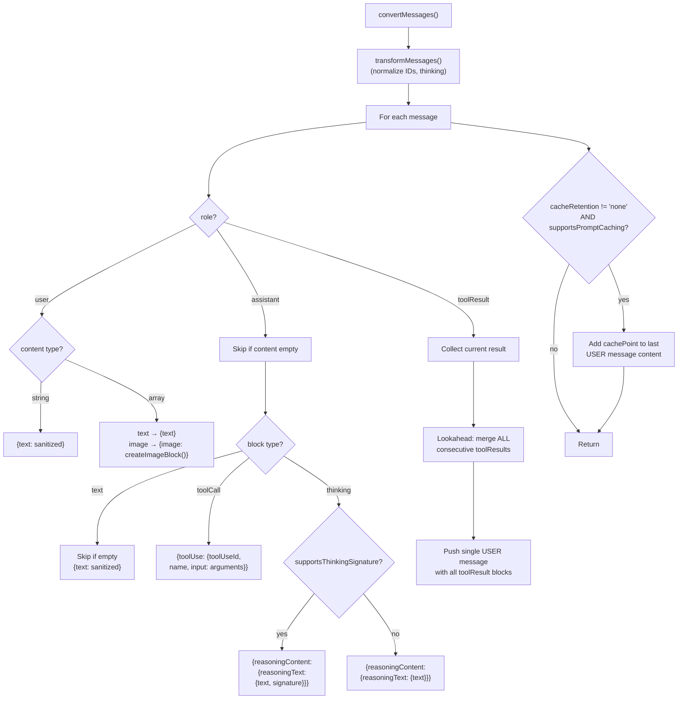
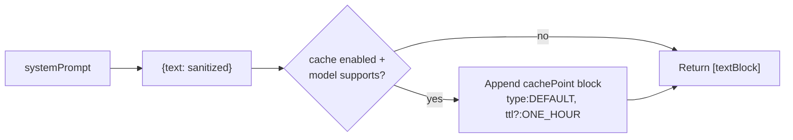
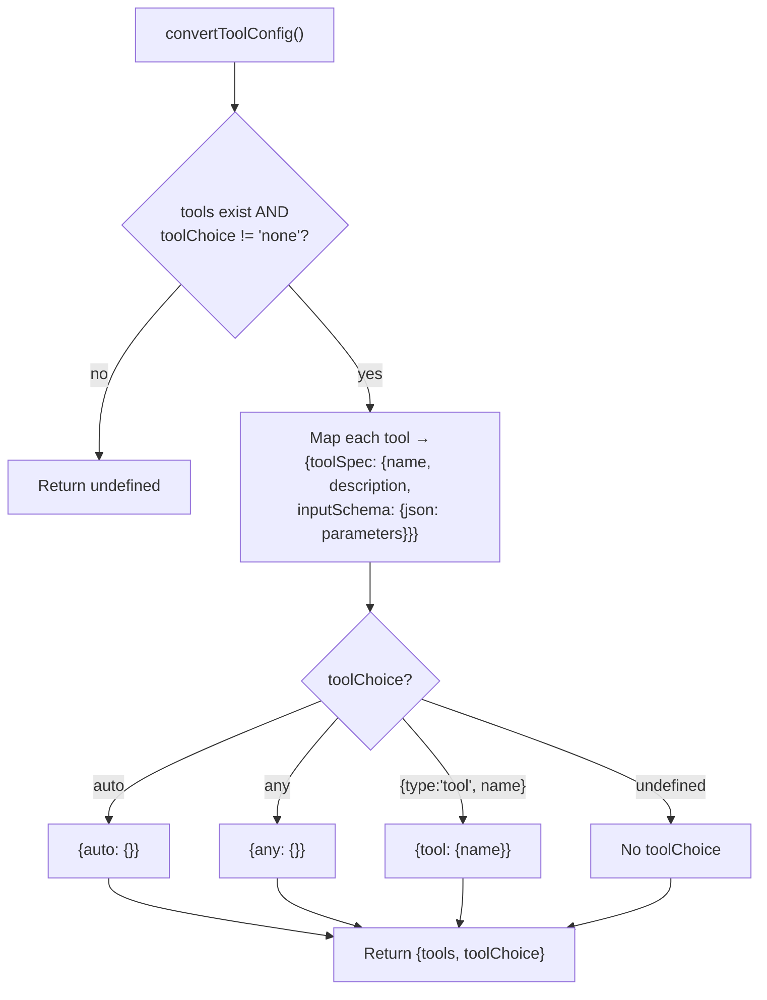
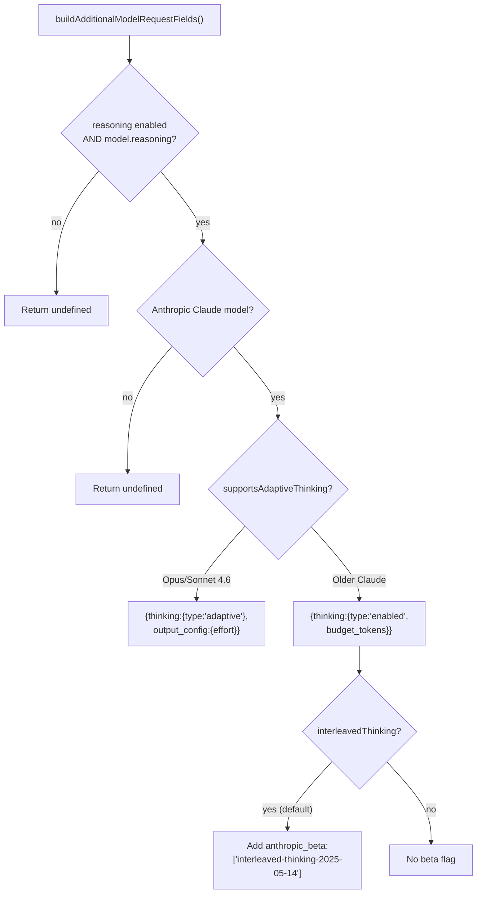

# amazon-bedrock.ts — Amazon Bedrock Provider

**Source:** `packages/ai/src/providers/amazon-bedrock.ts`

## Purpose

Amazon Bedrock Converse Stream API provider. Supports Claude, Qwen, Minimax, Moonshot. Handles adaptive/budget thinking, prompt caching, proxy, and HTTP/2.

## Exported Types

- **`BedrockOptions`** (line 48): Extends StreamOptions with `region`, `profile`, `toolChoice`, `reasoning`, `thinkingBudgets`, `interleavedThinking`

## `streamBedrock()` (line 62)



### Event Handlers

- **`handleContentBlockStart()`** (line 251): Creates `toolCall` block on `toolUse` start
- **`handleContentBlockDelta()`** (line 274): Updates text/toolCall/thinking blocks with delta content, creates text block if needed
- **`handleContentBlockStop()`** (line 347): Finalizes blocks, emits `_end` events, parses JSON for toolCalls
- **`handleMetadata()`** (line 332): Extracts usage metrics from metadata event

## `streamSimpleBedrock()` (line 207)



- **`supportsAdaptiveThinking()`** (line 376): Checks for opus-4-6/sonnet-4-6 model IDs
- **`mapThinkingLevelToEffort()`** (line 385): Maps to `"low"/"medium"/"high"/"max"`

## Key Internal Functions

### AWS Configuration

Region from options or `AWS_REGION`/`AWS_DEFAULT_REGION`. Proxy via `HTTP_PROXY`/`HTTPS_PROXY` with `NodeHttpHandler`. Force HTTP/1.1 via `AWS_BEDROCK_FORCE_HTTP1=1`.

### Prompt Caching

- **`resolveCacheRetention()`** (line 408): Options or `PI_CACHE_RETENTION` env
- **`supportsPromptCaching()`** (line 422): Checks `cost.cacheRead/Write` or Claude 4.x/3.7-sonnet/3.5-haiku patterns
- Cache points added to system prompt and last user message

### Message Conversion

- **`convertMessages()`** (line 472): Converts to Bedrock format. Handles user text/images, assistant text/toolCalls/thinking with signatures, tool results. Adds cache points for supported models.
- **`supportsThinkingSignature()`** (line 443): Only `anthropic.claude` or `anthropic/claude` models
- **`normalizeToolCallId()`** (line 467): Alphanumeric + underscore/hyphen, max 64 chars

### Thinking Configuration

- **`buildAdditionalModelRequestFields()`** (line 667): For Claude models with reasoning:
  - Adaptive (Opus/Sonnet 4.6): `thinking.type: "adaptive"` with `output_config.effort`
  - Budget (older Claude): `thinking.type: "enabled"` with `budget_tokens`
  - Includes `anthropic_beta` for interleaved thinking

### Tool Conversion & Stop Reason

- **`mapStopReason()`** (line 652): Maps Bedrock stop reasons (END_TURN→"stop", MAX_TOKENS→"length", TOOL_USE→"toolUse")

---

## Message & Tool Conversion Details

### `convertMessages()` (lines 472–619)

```typescript
function convertMessages(
    context: Context, model: Model<"bedrock-converse-stream">,
    cacheRetention: CacheRetention
): Message[]
```

Converts internal `Message[]` to Bedrock `Message[]` format. First calls `transformMessages()` (line 478) for normalization.



**User messages (lines 484–501):** String → `{text: sanitized}`. Array → maps text/image, images converted via `createImageBlock()` (line 712).

**Assistant messages (lines 502–553):**
- Skips entirely if `content.length === 0` (aborted requests)
- **Text** → skip if empty, push `{text: sanitized}`
- **Tool calls** → `{toolUse: {toolUseId, name, input: arguments}}`
- **Thinking** (lines 527–544): If `supportsThinkingSignature(model)` (line 443 — checks for `anthropic.claude` or `anthropic/claude`) → includes `signature` in `reasoningText`. Otherwise → omits signature to avoid API errors with non-Anthropic models.

**Tool results (lines 555–598):**
- **Consecutive merging** (lines 574–589): Lookahead loop collects ALL consecutive toolResult messages into single USER message
- Each result: `{toolUseId, content: [...blocks], status: ERROR|SUCCESS}`
- Images converted via `createImageBlock()`

**Cache points (lines 605–616):**
- Added to last USER message if `cacheRetention !== "none"` AND `supportsPromptCaching(model)`
- `CachePointType.DEFAULT` with optional `CacheTTL.ONE_HOUR` for `cacheRetention === "long"`

### `buildSystemPrompt()` (lines 448–465)

```typescript
function buildSystemPrompt(
    systemPrompt: string | undefined, model, cacheRetention
): SystemContentBlock[] | undefined
```



### `convertToolConfig()` (lines 621–650)

```typescript
function convertToolConfig(
    tools: Tool[] | undefined, toolChoice: BedrockOptions["toolChoice"]
): ToolConfiguration | undefined
```



- **Lines 627–633**: Maps `Tool[]` to Bedrock `BedrockTool[]` — wraps parameters in `{json: tool.parameters}` (unlike other providers that pass schema directly)
- **Lines 635–647**: Converts `toolChoice` to Bedrock-specific format (`{auto: {}}`, `{any: {}}`, or `{tool: {name}}`)

### `buildAdditionalModelRequestFields()` (lines 667–710)

Configures thinking for Anthropic Claude models on Bedrock.



- **Adaptive** (Opus/Sonnet 4.6): `effort` mapped from reasoning level (xhigh→"max" for Opus, xhigh→"high" for Sonnet)
- **Budget-based** (older Claude): Default budgets minimal=1024, low=2048, medium=8192, high=16384. Custom budgets from `options.thinkingBudgets` override defaults.
