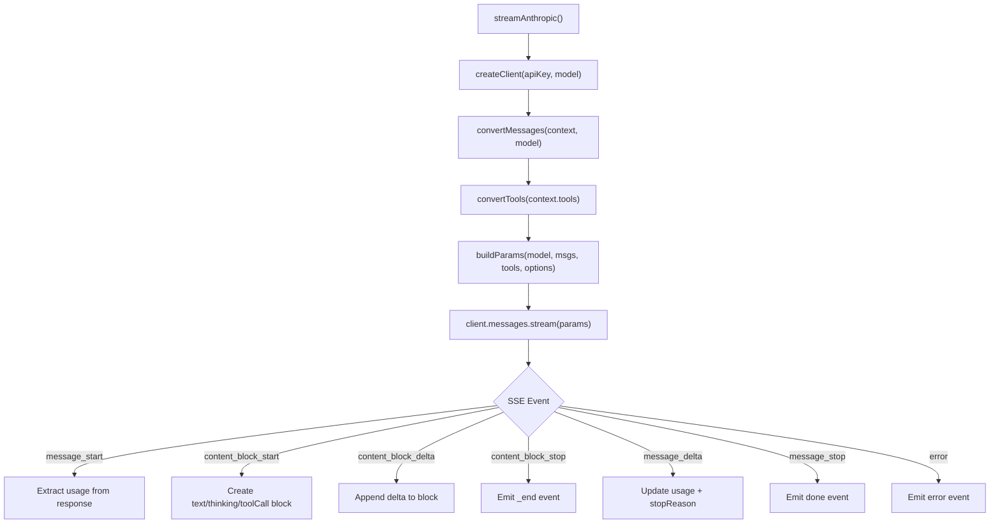
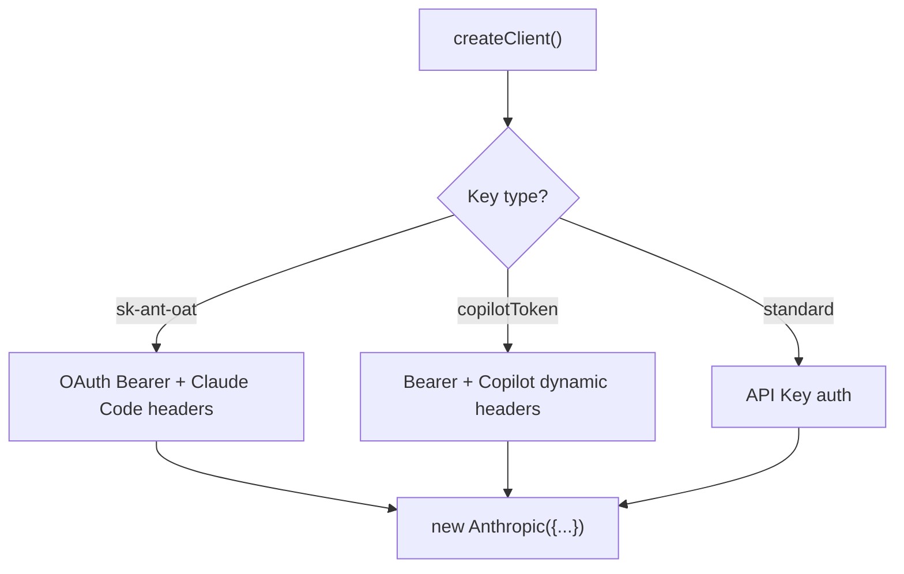
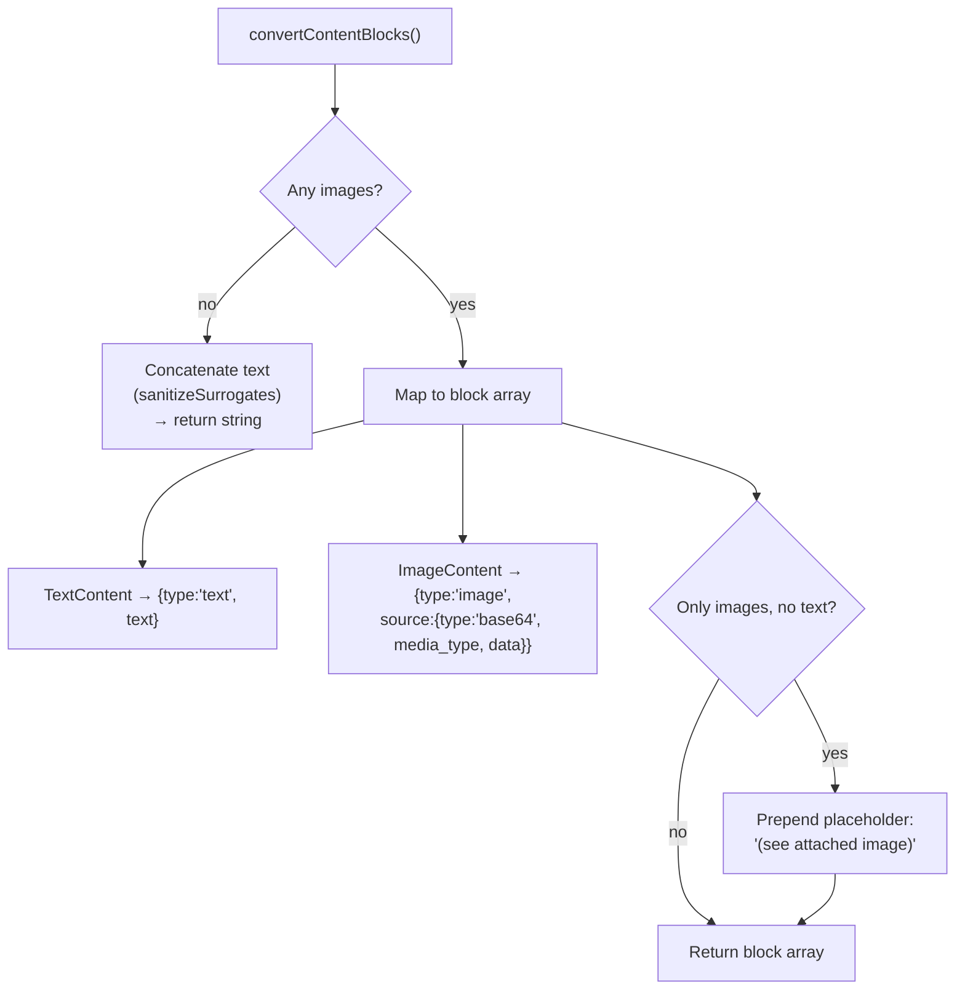
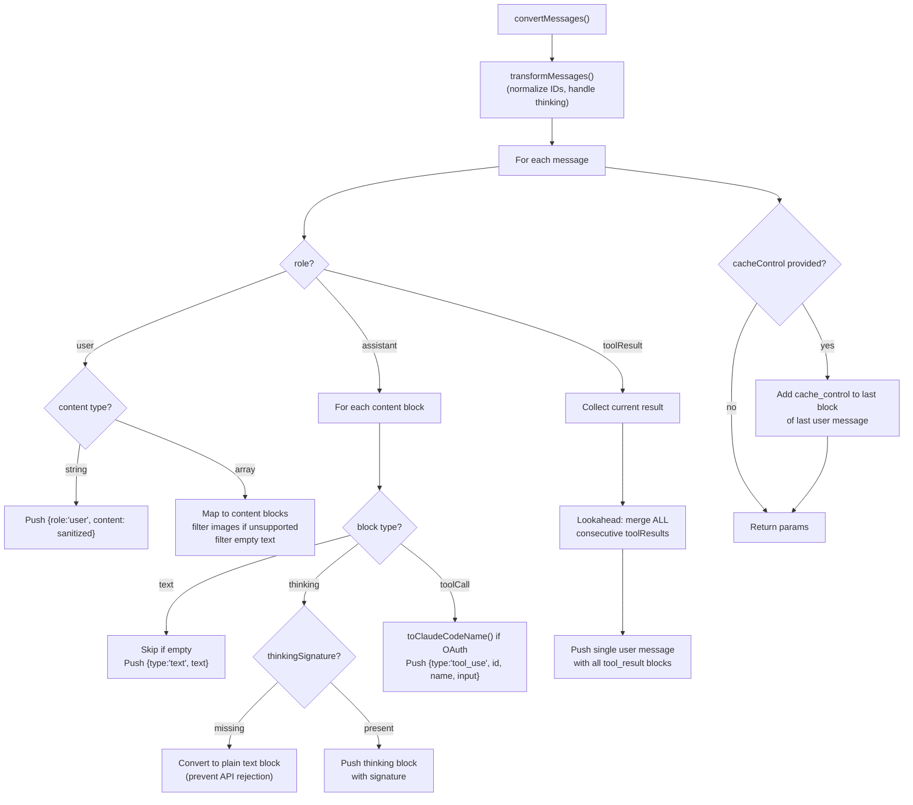
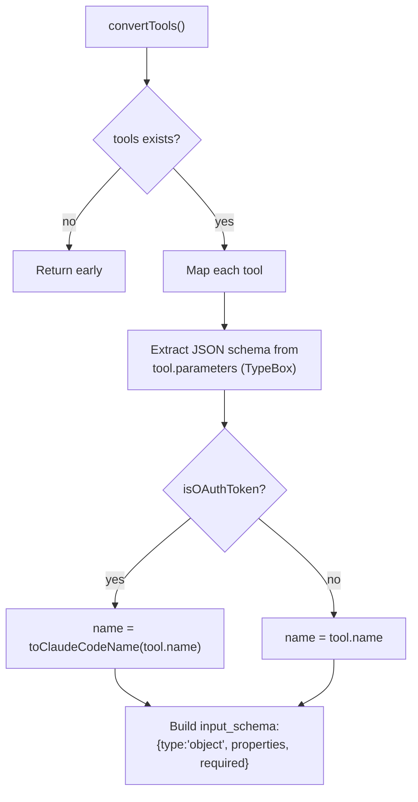

# anthropic.ts — Anthropic Claude Provider

**Source:** `packages/ai/src/providers/anthropic.ts`

## Purpose

Streaming provider for Anthropic's Claude API (`anthropic-messages`). Handles OAuth/API key/Copilot auth, adaptive thinking (Opus/Sonnet 4.6), budget-based thinking (older models), and fine-grained tool streaming.

## Constants

| Name | Line | Value |
|---|---|---|
| `claudeCodeVersion` | 65 | `"2.1.2"` |
| `claudeCodeTools` | 70 | Array of canonical Claude Code tool names |
| `ccToolLookup` | 90 | Map for case-insensitive tool name lookup |

## Exported Types

- **`AnthropicEffort`** (line 155): `"low" | "medium" | "high" | "max"`
- **`AnthropicOptions`** (line 157): Extends StreamOptions with `thinkingEnabled`, `thinkingBudgetTokens`, `effort`, `interleavedThinking`, `toolChoice`

## `streamAnthropic()` (line 193)

```typescript
export function streamAnthropic(model, context, options?): AssistantMessageEventStream
```



Processes Anthropic SSE events into unified `AssistantMessageEvent` stream. Handles `input_json` tool call deltas, thinking block signatures, and cache usage metrics.

## `streamSimpleAnthropic()` (line 447)

Wraps `streamAnthropic` with reasoning level mapping:
- Calls `supportsAdaptiveThinking()` (line 416) — checks for Opus/Sonnet 4.6 model IDs
- Adaptive models: maps reasoning to `AnthropicEffort` via `mapThinkingLevelToEffort()` (line 430)
- Older models: uses `adjustMaxTokensForThinking()` for budget-based thinking

## Key Internal Functions

### Authentication

- **`isOAuthToken()`** (line 488): Checks if key contains `"sk-ant-oat"` prefix
- **`createClient()`** (line 492): Creates Anthropic SDK client with auth detection:



### Message Conversion

- **`convertMessages()`** (line 662): Converts `Message[]` to Anthropic `MessageParam[]`. Handles system prompt caching, merges consecutive tool results into user messages (Anthropic requirement), preserves thinking signatures for same model.
- **`convertContentBlocks()`** (line 106): Converts TextContent/ImageContent to Anthropic format with base64 image encoding.
- **`convertTools()`** (line 819): Converts Tool[] to Anthropic tool format with JSON schema.

### Request Building

- **`buildParams()`** (line 573): Constructs `MessageCreateParamsStreaming`. Configures thinking (adaptive with effort or enabled with budget), adds cache control to last user message with optional TTL for long retention.
- **`normalizeToolCallId()`** (line 658): Sanitizes to 64 chars max, alphanumeric + underscore/hyphen only.
- **`mapStopReason()`** (line 837): Maps Anthropic stop reasons to normalized `StopReason`.

### Cache Control

- **`resolveCacheRetention()`** (line 39): Resolves from options or `PI_CACHE_RETENTION` env var, defaults to "short"
- **`getCacheControl()`** (line 49): Returns ephemeral cache with optional 1h TTL for api.anthropic.com

---

## Message & Tool Conversion Details

### `convertContentBlocks()` (lines 106–153)

```typescript
function convertContentBlocks(content: (TextContent | ImageContent)[]): string | ContentBlockArray
```



- **Line 119–123**: No images → return concatenated text as plain string (simpler format)
- **Line 126–141**: Images present → return array of text/image blocks
- **Line 144–150**: If only images and no text, prepends placeholder text `"(see attached image)"` to avoid API rejection
- All text passed through `sanitizeSurrogates()` for Unicode safety

### `convertMessages()` (lines 662–817)

```typescript
function convertMessages(
    messages: Message[], model: Model<"anthropic-messages">,
    isOAuthToken: boolean, cacheControl?: { type: "ephemeral"; ttl?: "1h" }
): MessageParam[]
```

Converts internal `Message[]` to Anthropic `MessageParam[]` format. First calls `transformMessages()` (line 671) for cross-provider normalization with `normalizeToolCallId`.



Key behaviors by role:

**User messages (lines 676–714):**
- String content → simple user message with sanitized text
- Array content → content blocks with image filtering (line 702: skip images if model doesn't support)
- Empty blocks skipped entirely

**Assistant messages (lines 715–755):**
- **Thinking blocks** (lines 725–741): If `thinkingSignature` is missing → converts to plain text (line 732–733, prevents API rejection). If present → keeps as thinking block with both text and signature
- **Tool calls** (lines 742–748): Name converted via `toClaudeCodeName()` for OAuth tokens (line 746). Output as `tool_use` block with `id`, `name`, `input`
- Skips message if no blocks remain (line 751)

**Tool results (lines 756–788):**
- **Consecutive merging**: Lookahead loop (lines 769–779) collects ALL consecutive `toolResult` messages into a single user message — Anthropic requires tool results as user messages
- Each result converted via `convertContentBlocks()` (line 763)

**Cache control (lines 792–813):**
- Added to last block of last user message
- If last user message is a string, converts to content block array first (lines 804–811)

### `convertTools()` (lines 819–835)

```typescript
function convertTools(tools: Tool[], isOAuthToken: boolean): Anthropic.Messages.Tool[]
```



- **Line 823**: TypeBox parameters are already JSON Schema — extracts `properties` and `required` directly
- **Line 826**: OAuth tokens get tool names converted to Claude Code canonical casing
- **Lines 828–832**: Wraps in `{type: "object", properties: ..., required: ...}` with safe fallbacks (`|| {}`, `|| []`)
