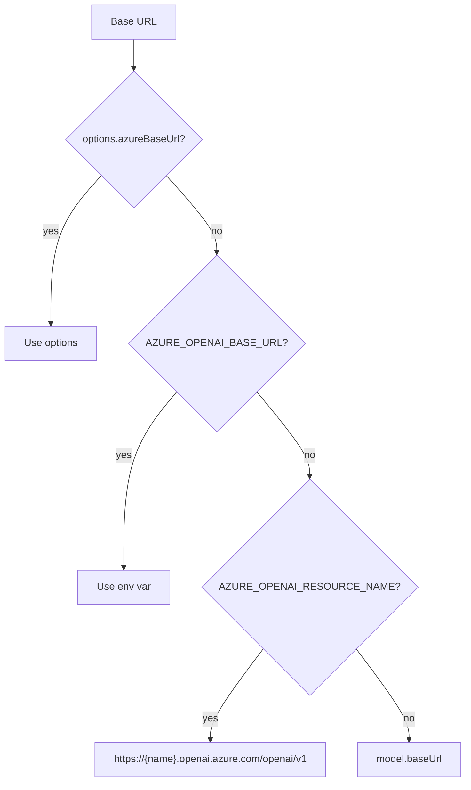

# azure-openai-responses.ts — Azure OpenAI Responses Provider

**Source:** `packages/ai/src/providers/azure-openai-responses.ts`

## Purpose

Azure OpenAI Responses API streaming. Wraps shared OpenAI Responses logic with Azure-specific deployment resolution, API versioning, and resource name handling.

## Constants

- **`DEFAULT_AZURE_API_VERSION`** (line 18): `"v1"`
- **`AZURE_TOOL_CALL_PROVIDERS`** (line 19): Set including `"openai"`, `"openai-codex"`, `"opencode"`, `"azure-openai-responses"`

## Exported Types

- **`AzureOpenAIResponsesOptions`** (line 43): Extends StreamOptions with `reasoningEffort`, `reasoningSummary`, `azureApiVersion`, `azureResourceName`, `azureBaseUrl`, `azureDeploymentName`

## `streamAzureOpenAIResponses()` (line 55)

Creates `AzureOpenAI` client, resolves deployment name, builds params, delegates to `processResponsesStream()`.

## `streamSimpleAzureOpenAIResponses()` (line 120)

Wraps with SimpleStreamOptions reasoning clamping.

## Key Internal Functions

### Deployment Resolution

- **`parseDeploymentNameMap()`** (line 21): Parses `AZURE_OPENAI_DEPLOYMENT_NAME_MAP` env var — comma-separated `modelId=deploymentName` pairs
- **`resolveDeploymentName()`** (line 34): Options → env map → model.id fallback

### Configuration

- **`resolveAzureConfig()`** (line 147): Resolves baseUrl and apiVersion from options/env/defaults
- **`normalizeAzureBaseUrl()`** (line 139): Strips trailing slashes
- **`buildDefaultBaseUrl()`** (line 143): Constructs URL from resource name

### Client & Params

- **`createClient()`** (line 178): Creates `AzureOpenAI` with apiKey, apiVersion, baseURL
- **`buildParams()`** (line 205): Builds `ResponseCreateParamsStreaming` with deployment name mapping

---

## Message & Tool Conversion

Azure OpenAI Responses shares all conversion logic with `openai-responses-shared.ts`:

- **Messages**: Converted via `convertResponsesMessages()` from shared module — same pipe-separated ID format, same reasoning item handling, same cross-model stripping
- **Tools**: Converted via `convertResponsesTools()` from shared module — same `{type: "function", name, description, parameters, strict}` format
- **Deployment mapping**: After conversion, the model ID in the request is replaced with the resolved Azure deployment name (from `resolveDeploymentName()`)

See [openai-responses.md](openai-responses.md) for full conversion details.
