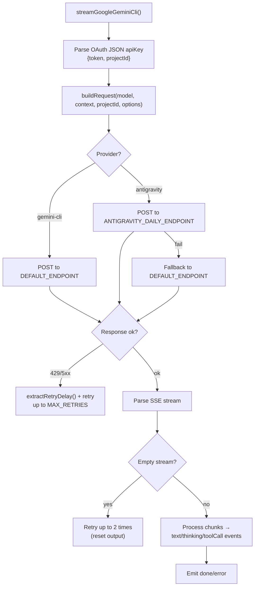
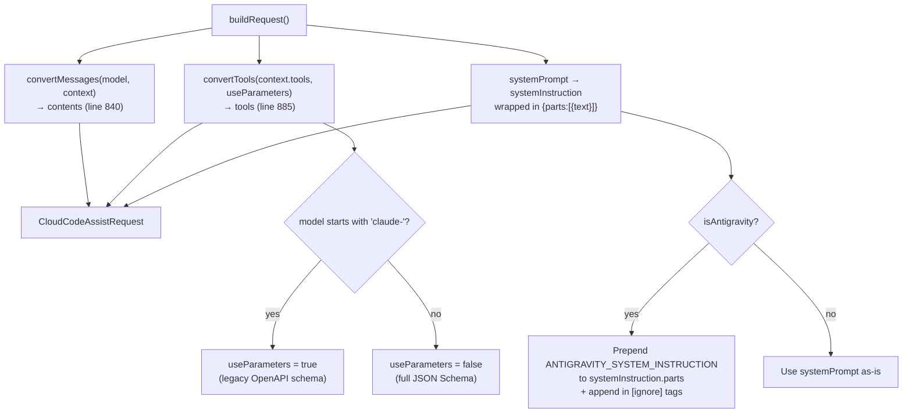

# google-gemini-cli.ts — Google Gemini CLI / Antigravity Provider

**Source:** `packages/ai/src/providers/google-gemini-cli.ts`

## Purpose

Provider for Google Cloud Code Assist API (Gemini CLI) and Antigravity (multi-model). Custom fetch-based SSE streaming with retry logic, multi-endpoint fallback, and empty stream retry.

## Constants

| Name | Line | Value |
|---|---|---|
| `DEFAULT_ENDPOINT` | 60 | `"https://cloudcode-pa.googleapis.com"` |
| `ANTIGRAVITY_DAILY_ENDPOINT` | 61 | `"https://daily-cloudcode-pa.sandbox.googleapis.com"` |
| `ANTIGRAVITY_ENDPOINT_FALLBACKS` | 62 | Array of fallback endpoints |
| `GEMINI_CLI_HEADERS` | 64 | User-Agent, X-Goog-Api-Client headers |
| `MAX_RETRIES` | 101 | 3 |
| `BASE_DELAY_MS` | 102 | 1000 |
| `MAX_EMPTY_STREAM_RETRIES` | 103 | 2 |
| `CLAUDE_THINKING_BETA_HEADER` | 105 | `"interleaved-thinking-2025-05-14"` |
| `ANTIGRAVITY_SYSTEM_INSTRUCTION` | 91 | System prompt for Antigravity provider |

## Exported Types

- **`GoogleThinkingLevel`** (line 39): `"THINKING_LEVEL_UNSPECIFIED" | "MINIMAL" | "LOW" | "MEDIUM" | "HIGH"`
- **`GoogleGeminiCliOptions`** (line 41): Extends StreamOptions with `toolChoice`, thinking config, `projectId`

## `streamGoogleGeminiCli()` (line 310)



Parses OAuth credentials from JSON apiKey format (`{token, projectId}`). Implements:
- **Retry logic**: Up to 3 retries with exponential backoff for 429/5xx errors
- **Empty stream retry**: Up to 2 retries if server returns no content (lines 103–104)
- **Multi-endpoint fallback**: Antigravity tries daily sandbox, falls back to prod
- **Claude thinking beta**: Adds `"interleaved-thinking-2025-05-14"` header for Claude models

## `extractRetryDelay()` (line 116)

Extracts retry delay from multiple formats:
- Headers: `retry-after`, `x-ratelimit-reset`, `x-ratelimit-reset-after`
- Text patterns: `"reset after 18h31m10s"`, `"Please retry in 5s"`
- JSON field: `retryDelay`
Returns milliseconds or undefined.

## `buildRequest()` (line 833)

Builds CloudCodeAssistRequest with model, project, contents (from `google-shared` converters), system instruction, generation config, tools, thinking config. Injects `ANTIGRAVITY_SYSTEM_INSTRUCTION` if applicable.

## `streamSimpleGoogleGeminiCli()` (line 778)

Wraps with SimpleStreamOptions. Uses `getGeminiCliThinkingLevel()` (line 919) for Gemini 3 level mapping, budget tokens for older models.

## Key Internal Helpers

- **`isClaudeThinkingModel()`** (line 207): Checks for "claude" AND "thinking" in modelId
- **`isRetryableError()`** (line 215): 429/5xx or resource exhausted/rate limit keywords
- **`extractErrorMessage()`** (line 226): Parses JSON error response for message field
- **`getAntigravityHeaders()`** (line 77): Version header from env or default `"1.15.8"`

---

## Message & Tool Conversion Details

### `buildRequest()` — Conversion Calls (lines 833–915)

```typescript
export function buildRequest(
    model: Model<"google-gemini-cli">, context: Context,
    projectId: string, options?: GoogleGeminiCliOptions,
    isAntigravity = false
): CloudCodeAssistRequest
```

Delegates to `google-shared.ts` converters but wraps in Gemini CLI-specific request structure.



**Message conversion** (line 840): Calls `convertMessages(model, context)` from `google-shared.ts` — same Content[] format as Google/Vertex.

**Tool conversion** (lines 881–892):
- **Line 884**: `useParameters = model.id.startsWith("claude-")` — Claude models via Google APIs need legacy parameter format
- **Line 885**: Calls `convertTools(context.tools, useParameters)` from `google-shared.ts`
- **Lines 886–892**: If `toolChoice` option provided, wraps in `toolConfig` with `mapToolChoice()` mapping

**System instruction** (lines 870–905):
- Wraps `systemPrompt` in `{parts: [{text: ...}]}` object (not plain string)
- **Antigravity** (lines 895–905): Prepends `ANTIGRAVITY_SYSTEM_INSTRUCTION` to parts, adds `role: "user"`, appends instruction again in `[ignore]` tags

**Thinking config** (lines 851–862):
- Gemini 3 models → `thinkingLevel` (cast to any)
- Older models → `thinkingBudget` (budgetTokens)

**Request wrapper** (lines 907–915): Wraps everything in `CloudCodeAssistRequest` with project, model, request, requestType (`"agent"` for Antigravity), userAgent, and unique requestId
