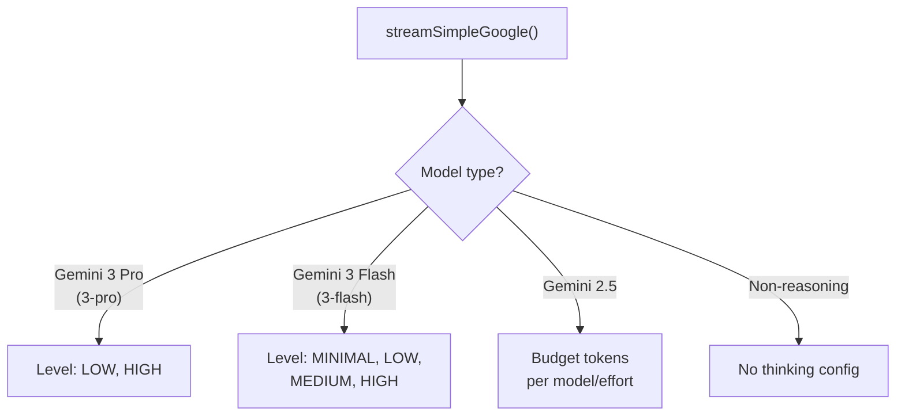
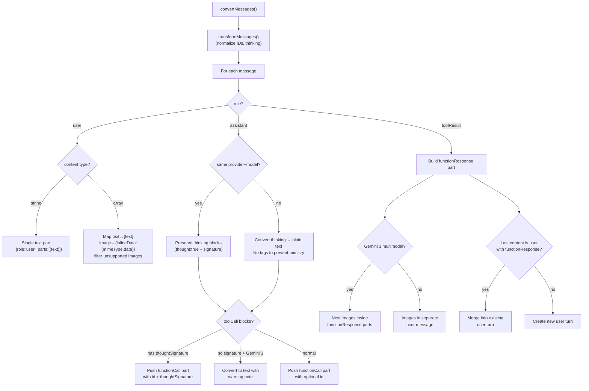
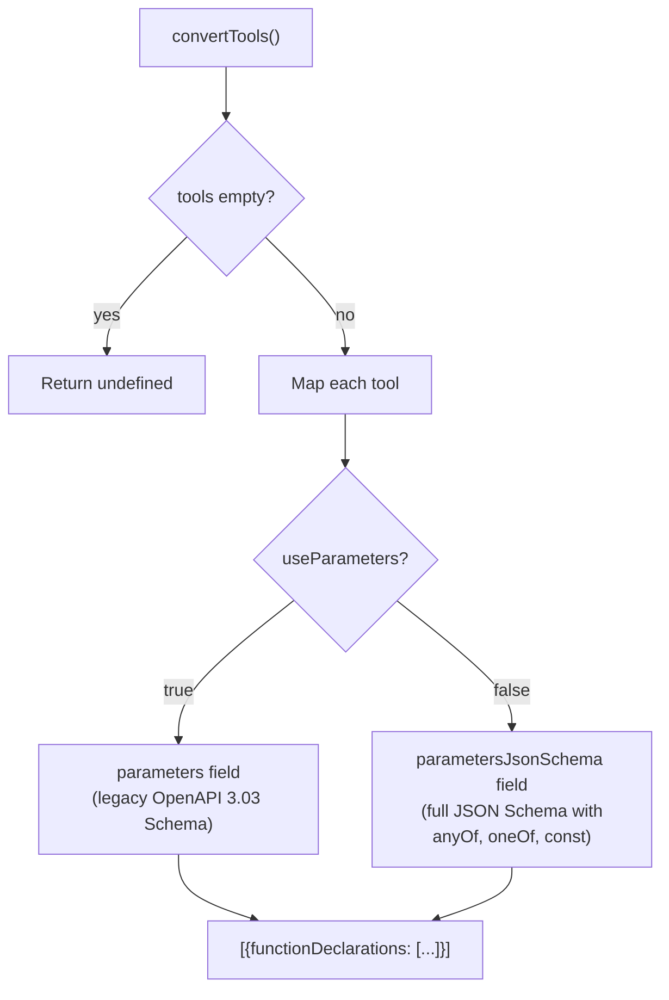

# google.ts — Google Generative AI Provider

**Source:** `packages/ai/src/providers/google.ts`

## Purpose

Google Generative AI API streaming for Gemini models via the public API. Supports adaptive thinking for Gemini 3 and budget-based thinking for Gemini 2.5.

## Exported Types

- **`GoogleOptions`** (line 36): Extends StreamOptions with `toolChoice`, thinking config (`enabled`, `budgetTokens`, `level`)

## `streamGoogle()` (line 48)

```typescript
export function streamGoogle(model, context, options?): AssistantMessageEventStream
```

Creates `GoogleGenAI` client, calls `generateContentStream()`, processes chunks:
- **Text parts**: Emit text_delta events
- **Thinking parts**: Detected via `part.thought === true` (from `google-shared.js`)
- **Function calls**: Generates unique IDs as `{name}_{timestamp}_{counter}` using `toolCallCounter` (line 46)
- **Usage**: Extracted from `usageMetadata` in response

## `streamSimpleGoogle()` (line 271)



- **`isGemini3ProModel()`** (line 388): Checks `model.id.includes("3-pro")`
- **`isGemini3FlashModel()`** (line 392): Checks `model.id.includes("3-flash")`
- **`getGemini3ThinkingLevel()`** (line 396): Maps effort to `GoogleThinkingLevel`
- **`getGoogleBudget()`** (line 422): Returns per-model budget — 2.5-pro: 128/2048/8192/32768, 2.5-flash: 128/2048/8192/24576

## Key Internal Functions

- **`createClient()`** (line 308): Creates `GoogleGenAI` client with optional baseUrl, apiVersion, headers
- **`buildParams()`** (line 328): Builds `GenerateContentParameters` with content, config, system instruction, tools, thinking config, abort signal

---

## Message & Tool Conversion Details

Both `google.ts` and `google-vertex.ts` delegate all conversion to `google-shared.ts`.

### `convertMessages()` (google-shared.ts lines 71–231)

```typescript
export function convertMessages<T extends GoogleApiType>(
    model: Model<T>, context: Context
): Content[]
```

Converts internal `Message[]` to Gemini `Content[]` format. First calls `transformMessages()` for cross-provider normalization.



**User messages (lines 80–106):** String → single text part. Array → maps text/images with image filtering.

**Assistant messages (lines 107–170):**
- **Same model check** (lines 109–110): Determines whether to preserve thinking blocks and signatures
- **Text blocks** (lines 113–120): Skip empty. Preserve `thoughtSignature` if same model.
- **Thinking blocks** (lines 121–137): Same model → keep as `thought: true` part. Different model → convert to plain text (no `<thinking>` tags to prevent mimicry)
- **Tool calls** (lines 138–162):
  - **Gemini 3 special case** (lines 144–149): If no `thoughtSignature`, convert to text with warning note (prevents API validation errors for unsigned function calls)
  - **Normal case** (lines 150–161): Push `functionCall` part with optional `id` field (required for Claude/GPT-OSS models via `requiresToolCallId()`) and optional `thoughtSignature`

**Tool results (lines 171–227):**
- **Multimodal support** (lines 179–185): Gemini 3 supports images nested inside `functionResponse.parts`
- **Merge strategy** (lines 209–218): If last content is a user turn with `functionResponse`, appends to it (Gemini requires tool results in user turns)
- **Legacy fallback** (lines 221–226): Older models get images in separate user message

### `convertTools()` (google-shared.ts lines 241–255)

```typescript
export function convertTools(
    tools: Tool[], useParameters = false
): { functionDeclarations: Record<string, unknown>[] }[] | undefined
```



- **Line 245**: Returns `undefined` if tools array is empty
- **Line 251**: `useParameters` flag controls schema field name — `true` for Claude models via Google APIs (legacy format), `false` (default) for full JSON Schema support
- Returns single-element array wrapping all function declarations

---

# google-vertex.ts — Google Vertex AI Provider

**Source:** `packages/ai/src/providers/google-vertex.ts`

Nearly identical to `google.ts` but with Vertex-specific client setup.

## Constants

- **`API_VERSION`** (line 47): `"v1"`
- **`THINKING_LEVEL_MAP`** (line 49): Maps `GoogleThinkingLevel` strings to SDK `ThinkingLevel` enum

## Exported Types

- **`GoogleVertexOptions`** (line 36): Adds `project` and `location` to GoogleOptions

## Key Differences from google.ts

- **`createClient()`** (line 318): `vertexai: true` flag in constructor
- **`resolveProject()`** (line 341): `GOOGLE_CLOUD_PROJECT` or `GCLOUD_PROJECT` env var
- **`resolveLocation()`** (line 351): `GOOGLE_CLOUD_LOCATION` env var (required)
- Uses `ThinkingLevel` enum from SDK instead of string values

---

# google-shared.ts — Shared Google Utilities

**Source:** `packages/ai/src/providers/google-shared.ts`

## Exported Functions

| Function | Line | Description |
|---|---|---|
| `isThinkingPart()` | 27 | Returns `part.thought === true` |
| `retainThoughtSignature()` | 40 | Preserves non-empty incoming signature, else existing |
| `requiresToolCallId()` | 64 | True for `claude-*` or `gpt-oss-*` models |
| `convertMessages()` | 71 | Converts `Message[]` to Gemini `Content[]` — handles user/assistant/toolResult, preserves thought signatures for same model, converts cross-model unsigned tool calls to text |
| `convertTools()` | 241 | Converts `Tool[]` to function declarations with `parametersJsonSchema` |
| `mapToolChoice()` | 260 | Maps `"auto"/"none"/"any"` to `FunctionCallingConfigMode` enum |
| `mapStopReason()` | 276 | Maps Gemini `FinishReason` enum to `StopReason` |
| `mapStopReasonString()` | 308 | Maps string stop reason |

### Thought Signature Handling

- **`base64SignaturePattern`** (line 46): `/^[A-Za-z0-9+/]+={0,2}$/`
- **`isValidThoughtSignature()`** (line 48): Validates length divisible by 4 and matches base64 pattern
- **`resolveThoughtSignature()`** (line 57): Only preserves from same provider/model with valid base64
