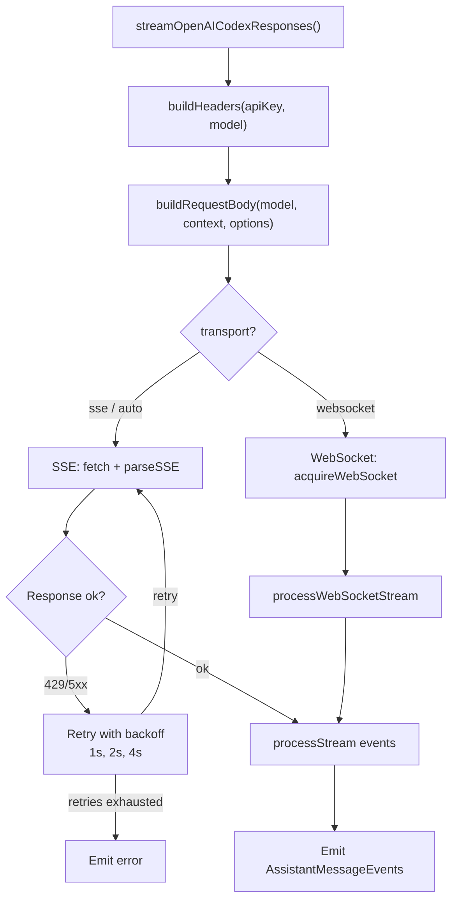
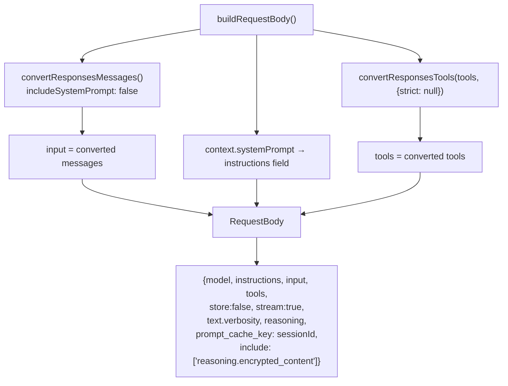

# openai-codex-responses.ts — OpenAI Codex Responses Provider

**Source:** `packages/ai/src/providers/openai-codex-responses.ts`

## Purpose

Provider for OpenAI's Codex Responses API (ChatGPT backend). Custom SSE and WebSocket transports, retry logic, and session-based connection pooling.

## Constants

| Name | Line | Value |
|---|---|---|
| `DEFAULT_CODEX_BASE_URL` | 29 | `"https://chatgpt.com/backend-api"` |
| `JWT_CLAIM_PATH` | 30 | `"https://api.openai.com/auth"` |
| `MAX_RETRIES` | 31 | 3 |
| `BASE_DELAY_MS` | 32 | 1000 |
| `SESSION_WEBSOCKET_CACHE_TTL_MS` | 430 | 5 * 60 * 1000 (5 min) |

## Exported Types

- **`OpenAICodexResponsesOptions`** (line 48): Extends StreamOptions with `reasoningEffort`, `reasoningSummary`, `textVerbosity`, `transport`

## `streamOpenAICodexResponses()` (line 102)



### SSE Transport (default)

- Fetches with retry logic: up to 3 retries with exponential backoff (lines 31–32)
- `isRetryableError()` (line 77): Checks 429/5xx status or rate limit keywords
- `parseSSE()` (line 391): Custom SSE parser extracting JSON from `data:` lines
- `extractRetryDelay()`: Extracts server-provided delay from headers/body

### WebSocket Transport

- **`acquireWebSocket()`** (line 557): Gets or creates cached WebSocket per sessionId. Manages busy state and reconnection.
- **`connectWebSocket()`** (line 497): Creates WebSocket with headers, handles open/error/close/abort events.
- **`scheduleSessionWebSocketExpiry()`** (line 486): 5-minute idle timeout on cached connections.
- **`processWebSocketStream()`** (line 762): Sends request via WebSocket, processes stream, manages lifecycle.
- **`parseWebSocket()`** (line 671): Async generator parsing WebSocket messages with queue pattern.

### Shared Processing

- **`buildRequestBody()`** (line 277): Constructs Codex request with model, instructions, input, tools, reasoning/text config.
- **`processStream()`** (line 344): Wraps `processResponsesStream` with `mapCodexEvents` event transformer.
- **`mapCodexEvents()`** (line 353): Transforms Codex event format to `ResponseStreamEvent` format.
- **`extractAccountId()`** (line 825): Decodes JWT token for `chatgpt_account_id`.
- **`buildHeaders()`** (line 838): Auth headers, account ID, beta flags, OS detection.
- **`parseErrorResponse()`** (line 794): Friendly messages for usage/rate limit errors.

## `streamSimpleOpenAICodexResponses()` (line 254)

Wraps with SimpleStreamOptions reasoning clamping.

---

## Message & Tool Conversion Details

### `buildRequestBody()` (lines 277–315)

```typescript
function buildRequestBody(
    model: Model<"openai-codex-responses">, context: Context,
    options?: OpenAICodexResponsesOptions
): RequestBody
```

Delegates message/tool conversion to shared Responses utilities, but with Codex-specific structure.



Key difference from standard Responses API:
- **Line 282–284**: Calls `convertResponsesMessages()` with `includeSystemPrompt: false` — system prompt goes to `instructions` field instead of messages
- **Line 290**: System prompt placed in `instructions` field directly
- **Line 303–305**: Tools converted via `convertResponsesTools()` with `strict: null`
- **Line 295**: `prompt_cache_key` set from `options.sessionId` for session-based caching
- **Line 296**: Always includes `["reasoning.encrypted_content"]` for reasoning support
