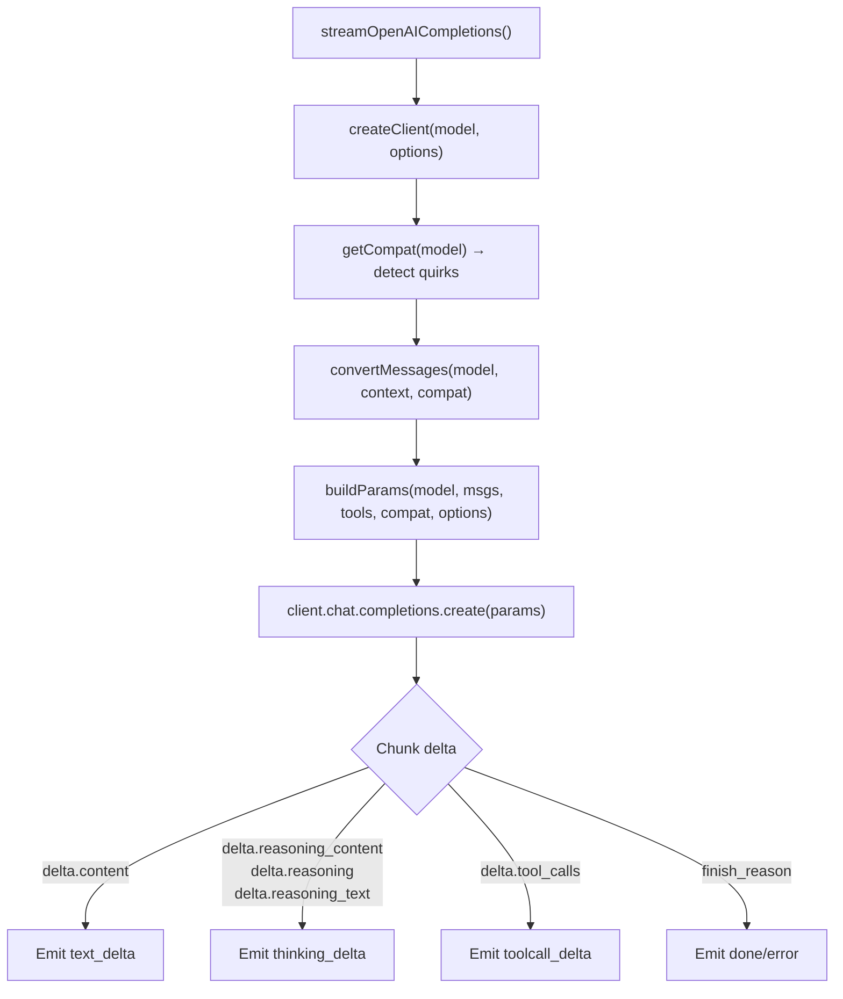
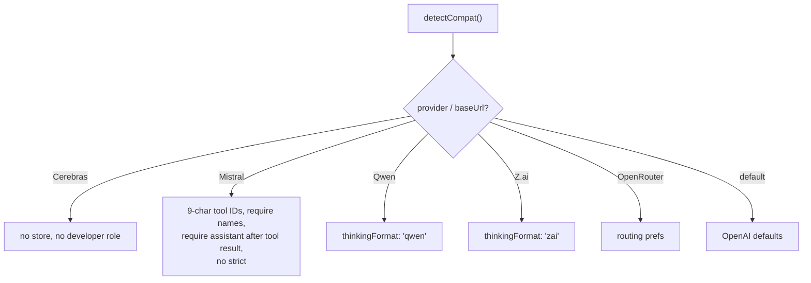
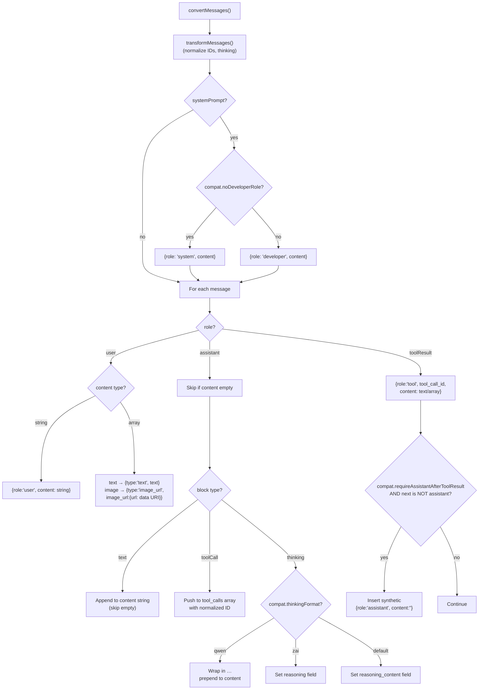
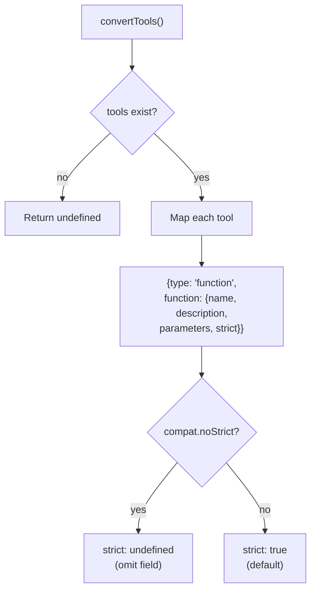

# openai-completions.ts — OpenAI Chat Completions Provider

**Source:** `packages/ai/src/providers/openai-completions.ts`

## Purpose

OpenAI Chat Completions API streaming — the most widely supported LLM API. Provides cross-provider compatibility for OpenAI-compatible endpoints (Mistral, Cerebras, xAI, Groq, Z.ai, Qwen, etc.).

## Constants

- **`OPENAI_TOOL_CALL_PROVIDERS`** (line 21): Set of `"openai"`, `"openai-codex"`, `"opencode"`

## Exported Types

- **`OpenAICompletionsOptions`** (line 73): Extends StreamOptions with `toolChoice` and `reasoningEffort`

## `streamOpenAICompletions()` (line 78)

```typescript
export function streamOpenAICompletions(model, context, options?): AssistantMessageEventStream
```



Processes streaming chunks. Handles three different thinking field names (`reasoning_content`, `reasoning`, `reasoning_text`) for provider compatibility. Includes reasoning tokens in usage output.

## `streamSimpleOpenAICompletions()` (line 325)

Wraps `streamOpenAICompletions`. Clamps xhigh → high unless `supportsXhigh()`. Extracts `toolChoice` from options.

## Key Internal Functions

### Compatibility Detection

- **`detectCompat()`** (line 762): Auto-detects provider settings from `baseUrl` and `provider`:



- **`getCompat()`** (line 808): Merges explicit `model.compat` with `detectCompat()` results

### Message/Tool Conversion

- **`convertMessages()`** (line 490): Converts to `ChatCompletionMessageParam[]`. Uses `developer` or `system` role based on compat. Bridges Mistral gap with synthetic assistant messages after tool results. Filters empty content.
- **`convertTools()`** (line 722): Converts to `ChatCompletionTool[]`. Applies `strict` mode conditionally.
- **`normalizeMistralToolId()`** (line 40): Pads/truncates IDs to exactly 9 alphanumeric chars.
- **`hasToolHistory()`** (line 59): Checks if messages contain tool results or assistant tool calls (affects param building).

### Request Building

- **`createClient()`** (line 346): Creates OpenAI client with optional Copilot dynamic headers.
- **`buildParams()`** (line 384): Builds `ChatCompletionCreateParamsStreaming` with compatibility-aware settings — `stream_options`, `store`, `max_tokens` vs `max_completion_tokens`, reasoning effort (openai/zai/qwen formats).
- **`maybeAddOpenRouterAnthropicCacheControl()`** (line 457): For OpenRouter with anthropic/* models, adds `cache_control: { type: "ephemeral" }` to last text block.
- **`mapStopReason()`** (line 738): Maps `finish_reason` to `StopReason`.

---

## Message & Tool Conversion Details

### `convertMessages()` (lines 490–720)

```typescript
function convertMessages(
    model: Model<"openai-completions">, context: Context,
    compat: OpenAICompletionsCompat
): ChatCompletionMessageParam[]
```

Converts internal `Message[]` to OpenAI `ChatCompletionMessageParam[]` format. First calls `transformMessages()` (line 498) for cross-provider normalization.



**System prompt (lines 500–509):** Uses `developer` role by default (OpenAI convention). Falls back to `system` role when `compat.noDeveloperRole` is set (Cerebras, etc.).

**User messages (lines 515–535):** String content passes through directly. Array content maps text and image blocks — images converted to `image_url` with base64 data URI format.

**Assistant messages (lines 536–620):**
- Skips entirely if `content.length === 0` (aborted requests)
- **Text blocks**: Concatenated into single content string, empty blocks skipped
- **Tool calls** (lines 560–583): Each mapped to `{id, type:'function', function:{name, arguments}}`. IDs normalized via `normalizeMistralToolId()` when `compat.mistralToolIds` is set (pads/truncates to exactly 9 alphanumeric chars). Tool call `name` included in message when `compat.requireToolCallNameInMessage` is set.
- **Thinking blocks** (lines 584–607): Format depends on `compat.thinkingFormat`:
  - `"qwen"` → wrapped in `<think>…</think>` tags, prepended to content string
  - `"zai"` → set as `reasoning` field on message
  - Default → set as `reasoning_content` field on message

**Tool results (lines 621–694):**
- Mapped to `{role: 'tool', tool_call_id, content}` with text and optional image blocks
- **Mistral bridge** (lines 673–693): When `compat.requireAssistantAfterToolResult` is set AND the next message is not an assistant message, inserts a synthetic `{role: 'assistant', content: ''}` message. This prevents Mistral API validation errors that require assistant turns between tool results and user messages.

**Post-processing (lines 696–720):** Filters out messages with empty content (unless they have tool_calls), ensuring clean message arrays.

### `convertTools()` (lines 722–736)

```typescript
function convertTools(
    tools: Tool[] | undefined, compat: OpenAICompletionsCompat
): ChatCompletionTool[] | undefined
```



- **Line 726**: Each tool mapped to `{type: 'function', function: {name, description, parameters}}`
- **Line 731**: `strict: true` by default for structured outputs. Set to `undefined` when `compat.noStrict` is set (Mistral doesn't support strict mode).

### `normalizeMistralToolId()` (line 40)

```typescript
function normalizeMistralToolId(id: string): string
```

Mistral requires exactly 9-character alphanumeric tool call IDs. Strips non-alphanumeric characters, then pads with `"0"` or truncates to exactly 9 characters.
