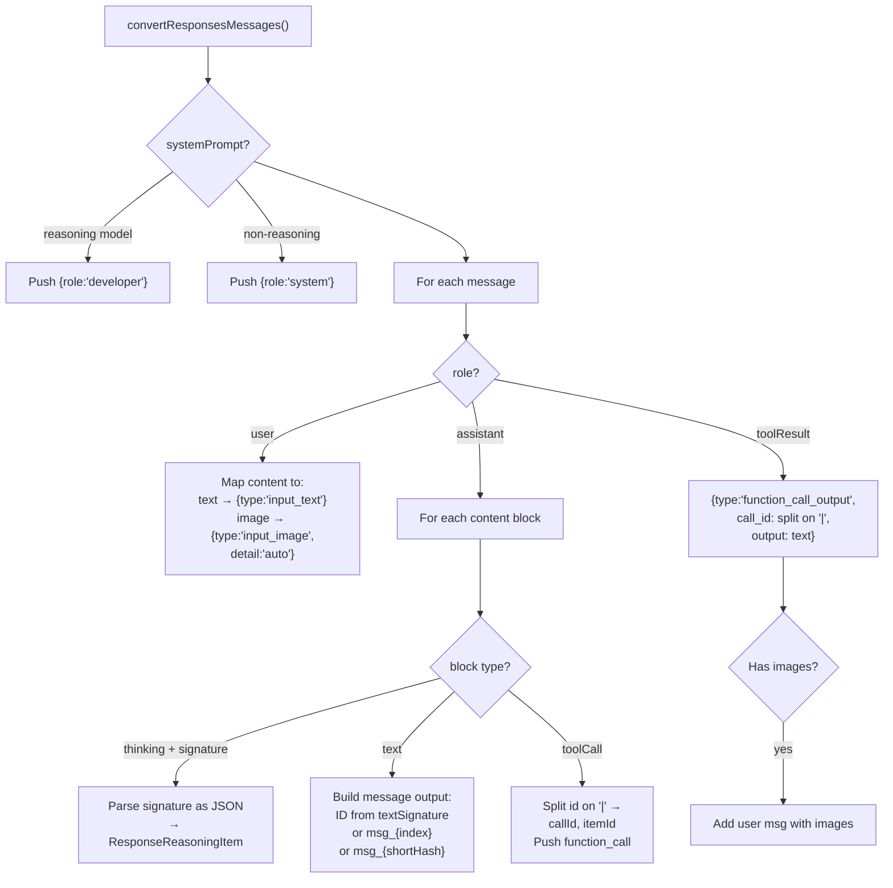
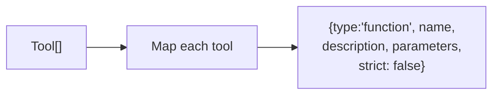

# openai-responses.ts — OpenAI Responses API Provider

**Source:** `packages/ai/src/providers/openai-responses.ts`

## Purpose

Streaming provider for OpenAI's Responses API. Supports reasoning with encrypted content, service tier pricing, and prompt caching.

## Constants

- **`OPENAI_TOOL_CALL_PROVIDERS`** (line 21): Set of `"openai"`, `"openai-codex"`, `"opencode"`

## Exported Types

- **`OpenAIResponsesOptions`** (line 52): Extends StreamOptions with `reasoningEffort`, `reasoningSummary`, `serviceTier`

## `streamOpenAIResponses()` (line 61)

Creates OpenAI client (line 146), calls `client.responses.create()`, delegates stream processing to `processResponsesStream()` from shared module. Applies service tier pricing multiplier after completion.

- **`getServiceTierCostMultiplier()`** (line 239): Returns 0.5 for flex, 2 for priority, 1 default
- **`applyServiceTierPricing()`** (line 250): Multiplies all cost fields by tier multiplier

## `streamSimpleOpenAIResponses()` (line 127)

Wraps with `SimpleStreamOptions` reasoning clamping.

## Key Internal Functions

- **`resolveCacheRetention()`** (line 27): From options or `PI_CACHE_RETENTION` env var
- **`getPromptCacheRetention()`** (line 41): Returns `"24h"` only if long retention AND `api.openai.com` baseUrl
- **`createClient()`** (line 146): Creates OpenAI client with optional Copilot dynamic headers
- **`buildParams()`** (line 184): Builds `ResponseCreateParamsStreaming` with messages, cache key/retention, tools, reasoning config. Special handling for gpt-5 models to suppress reasoning.

---

# openai-responses-shared.ts — Shared Responses Utilities

**Source:** `packages/ai/src/providers/openai-responses-shared.ts`

## Purpose

Shared message/tool conversion and stream processing for both `openai-responses.ts` and `azure-openai-responses.ts`.

## Exported Types

- **`OpenAIResponsesStreamOptions`** (line 51): `serviceTier` and `applyServiceTierPricing` callback
- **`ConvertResponsesMessagesOptions`** (line 59): `includeSystemPrompt` boolean
- **`ConvertResponsesToolsOptions`** (line 63): optional `strict` boolean

## `convertResponsesMessages()` (line 71)

Converts `Message[]` to OpenAI Responses `ResponseInput` format. Normalizes pipe-separated tool call IDs (`{call_id}|{item_id}`), handles reasoning items, strips IDs for cross-model messages.

- **`shortHash()`** (line 38): Murmur3-style hash for deterministic ID shortening

## `convertResponsesTools()` (lines 246–255)

Converts `Tool[]` to OpenAI Responses tools array with configurable `strict` parameter. Defaults strict to `false` if not specified.

---

## Message & Tool Conversion Details

### `convertResponsesMessages()` (lines 71–240)

```typescript
export function convertResponsesMessages<TApi extends Api>(
    model: Model<TApi>, context: Context,
    allowedToolCallProviders: ReadonlySet<string>,
    options?: ConvertResponsesMessagesOptions
): ResponseInput
```

Converts internal `Message[]` to OpenAI Responses API `ResponseInput` format.



**Tool call ID format** (lines 79–95, pipe-separated `{callId}|{itemId}`):
- If provider NOT in `allowedToolCallProviders` → pass through unchanged
- If ID contains `|` → split, sanitize both parts to `[a-zA-Z0-9_-]`, ensure itemId starts with `"fc_"`, truncate to 64 chars, strip trailing underscores

**Assistant message IDs** (lines 160–175):
- Uses `textSignature` as message output ID if available
- If signature > 64 chars → generates `msg_${shortHash(signature)}` via Murmur3-style hash (line 38)
- Fallback: `msg_${msgIndex}`

**Cross-model handling** (lines 139–140): If `isDifferentModel` (different model ID but same provider/api) and itemId starts with `"fc_"` → omits ID to avoid pairing validation errors.

### `convertResponsesTools()` (lines 246–255)



- `strict` defaults to `false` if `options?.strict` is undefined
- Passes `tool.parameters` directly as JSON Schema

## `processResponsesStream()` (line 261)

Async function that processes `ResponseStreamEvent` stream. Handles reasoning summary parts, text/function call deltas, tool call argument streaming, usage metrics, and service tier pricing.
