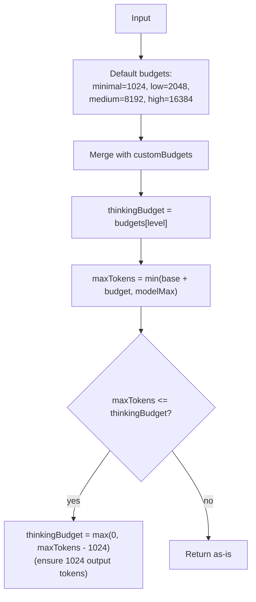

# simple-options.ts — Stream Options Helpers

**Source:** `packages/ai/src/providers/simple-options.ts`

## Purpose

Helper functions for building base stream options from `SimpleStreamOptions`. Token budget calculation for thinking/reasoning.

## `buildBaseOptions()` (lines 3–16)

```typescript
export function buildBaseOptions(model, options?, apiKey?): StreamOptions
```

Constructs common `StreamOptions` from `SimpleStreamOptions`:
- `maxTokens`: `options.maxTokens || Math.min(model.maxTokens, 32000)` (line 6)
- `apiKey`: `apiKey || options.apiKey` (line 8)
- Passes through: temperature, signal, cacheRetention, sessionId, headers, onPayload, maxRetryDelayMs, metadata

## `clampReasoning()` (lines 18–20)

```typescript
export function clampReasoning(effort): Exclude<ThinkingLevel, "xhigh"> | undefined
```

Maps `"xhigh"` → `"high"`. All other values pass through unchanged.

## `adjustMaxTokensForThinking()` (lines 22–46)

```typescript
export function adjustMaxTokensForThinking(
    baseMaxTokens, modelMaxTokens, reasoningLevel, customBudgets?
): { maxTokens: number; thinkingBudget: number }
```



Returns `{ maxTokens, thinkingBudget }` ensuring minimum 1024 output tokens.
