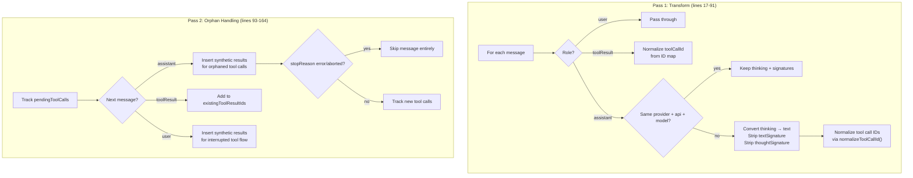

# transform-messages.ts — Cross-Provider Message Transformation

**Source:** `packages/ai/src/providers/transform-messages.ts`

## Purpose

Cross-provider message normalization. Handles tool call ID mapping, thinking block conversion across model boundaries, and synthetic tool result generation.

## `transformMessages()` (lines 8–167)

```typescript
export function transformMessages<TApi>(
    messages: Message[],
    model: Model<TApi>,
    normalizeToolCallId?: (id, model, source) => string
): Message[]
```

### Two-Pass Architecture



### Pass 1: Content Transformation (lines 17–91)

For each assistant message, determines `isSameModel` (line 35–38) by comparing `provider`, `api`, and `model` fields.

**Thinking blocks** (lines 41–52):
- Same model + has signature → keep (needed for replay, even if empty for encrypted OpenAI reasoning)
- Same model, no signature → keep if has content, skip if empty
- Different model → convert to plain `TextContent`

**Text blocks** (lines 54–59):
- Same model → keep with `textSignature`
- Different model → strip `textSignature`

**Tool calls** (lines 62–79):
- Different model → strip `thoughtSignature` (line 66–69)
- Different model + `normalizeToolCallId` provided → normalize ID and track mapping (lines 71–77)

### Pass 2: Orphaned Tool Call Handling (lines 93–164)

Tracks `pendingToolCalls` and `existingToolResultIds` to detect orphaned tool calls.

**Synthetic results inserted when** (lines 104–118, 144–158):
- Next assistant message arrives with pending orphaned tool calls
- User message interrupts pending tool calls

Synthetic result format:
```typescript
{ role: "toolResult", content: [{ type: "text", text: "No result provided" }], isError: true }
```

**Error/aborted messages skipped** (lines 121–129): Incomplete turns that shouldn't be replayed (partial content, incomplete tool calls).
