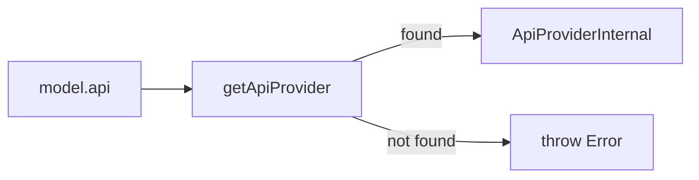
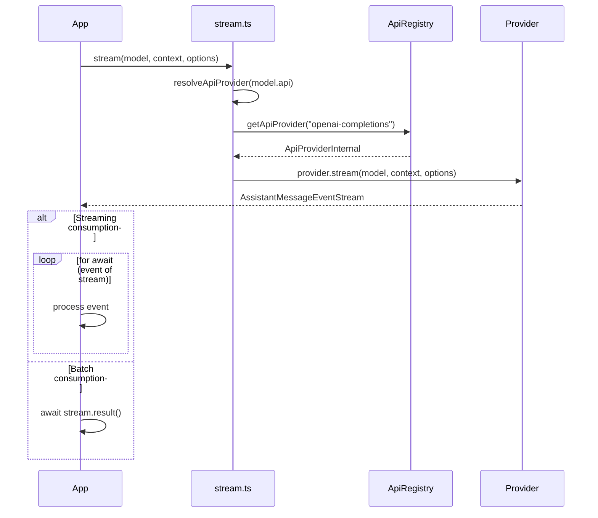

# stream.ts — Public Streaming API

**Source:** `packages/ai/src/stream.ts`

## Purpose

Public API entry point for streaming LLM requests. Routes models to registered providers via the API registry. This is a thin router — actual streaming logic lives in individual provider implementations.

## Side-Effect Imports (lines 1–2)

```typescript
import "./providers/register-builtins.js";  // Auto-registers all 9 built-in providers
import "./utils/http-proxy.js";             // Configures fetch proxy from env vars
```

These run on module load, ensuring providers and proxy are ready before any stream call.

## `resolveApiProvider()` (line 18–24)

Internal helper. Looks up the provider registered for the given API string. Throws if none found.



## `stream()` (lines 26–33)

```typescript
export function stream<TApi extends Api>(
    model: Model<TApi>, context: Context, options?: ProviderStreamOptions
): AssistantMessageEventStream
```

Resolves the provider for `model.api` and calls `provider.stream()`. Returns an async iterable event stream that yields `AssistantMessageEvent` objects as they arrive.

## `complete()` (lines 35–42)

```typescript
export async function complete<TApi extends Api>(
    model: Model<TApi>, context: Context, options?: ProviderStreamOptions
): Promise<AssistantMessage>
```

Calls `stream()` and awaits `stream.result()` to get the final `AssistantMessage`. Convenience wrapper for batch consumption.

## `streamSimple()` (lines 44–51)

```typescript
export function streamSimple<TApi extends Api>(
    model: Model<TApi>, context: Context, options?: SimpleStreamOptions
): AssistantMessageEventStream
```

Like `stream()` but calls `provider.streamSimple()`, which handles reasoning/thinking budget configuration automatically.

## `completeSimple()` (lines 53–60)

```typescript
export async function completeSimple<TApi extends Api>(
    model: Model<TApi>, context: Context, options?: SimpleStreamOptions
): Promise<AssistantMessage>
```

Awaits `streamSimple()` result. Convenience wrapper.

## Request Flow


