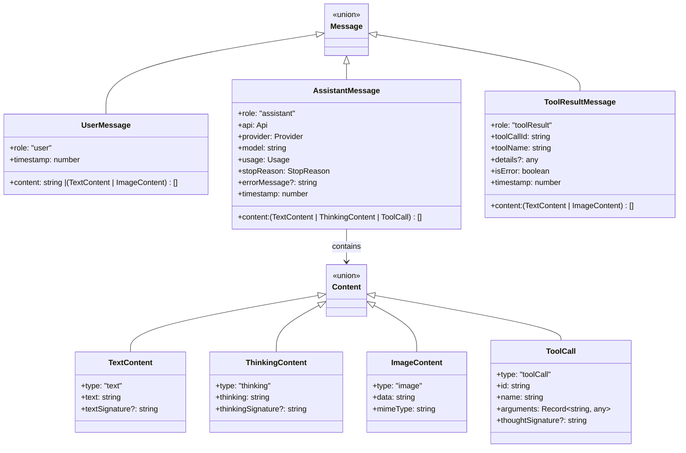
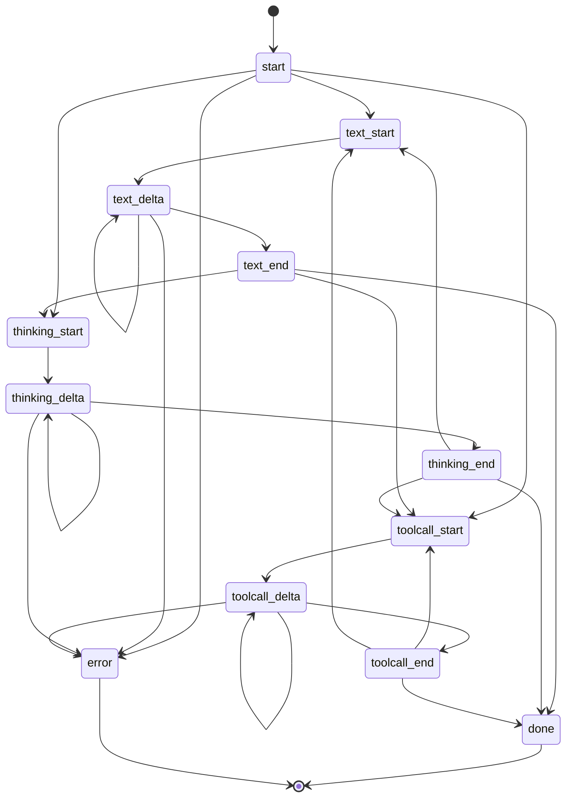

# types.ts — Core Type Definitions

**Source:** `packages/ai/src/types.ts`

## Purpose

Central type definitions for the unified multi-provider LLM streaming API. Defines all contracts between the streaming layer, providers, and consumers.

## Type Overview

## API & Provider Identification (lines 5–41)

- **`KnownApi`** (line 5): Union of 9 API types — `"openai-completions"`, `"openai-responses"`, `"azure-openai-responses"`, `"openai-codex-responses"`, `"anthropic-messages"`, `"bedrock-converse-stream"`, `"google-generative-ai"`, `"google-gemini-cli"`, `"google-vertex"`
- **`Api`** (line 16): `KnownApi | (string & {})` — extensible for custom providers
- **`KnownProvider`** (line 18): Union of 20+ providers (openai, anthropic, google, amazon-bedrock, groq, mistral, etc.)
- **`Provider`** (line 41): `KnownProvider | string`

## Configuration Types (lines 43–112)

- **`ThinkingLevel`** (line 43): `"minimal" | "low" | "medium" | "high" | "xhigh"`
- **`ThinkingBudgets`** (line 46): Token allocations per thinking level
- **`CacheRetention`** (line 54): `"none" | "short" | "long"`
- **`Transport`** (line 56): `"sse" | "websocket" | "auto"`
- **`StreamOptions`** (line 58): Base options — temperature, maxTokens, signal, apiKey, transport, cacheRetention, sessionId, headers, onPayload, maxRetryDelayMs, metadata
- **`ProviderStreamOptions`** (line 105): `StreamOptions & Record<string, unknown>`
- **`SimpleStreamOptions`** (line 108): Extends StreamOptions with `reasoning` (ThinkingLevel) and `thinkingBudgets`
- **`StreamFunction<TApi, TOptions>`** (line 115): Generic provider stream signature

## Content Types (lines 121–145)

- **`TextContent`** (line 121): Text with optional `textSignature` (OpenAI responses message ID)
- **`ThinkingContent`** (line 127): Thinking with optional `thinkingSignature` (reasoning item ID)
- **`ImageContent`** (line 133): Base64-encoded image with MIME type
- **`ToolCall`** (line 139): Function call with id, name, arguments, optional `thoughtSignature` (Google-specific)

## Usage & Messages (lines 147–206)

- **`Usage`** (line 147): Token counts (input, output, cacheRead, cacheWrite, totalTokens) + nested cost object
- **`StopReason`** (line 162): `"stop" | "length" | "toolUse" | "error" | "aborted"`
- **`UserMessage`** (line 164): User role with string or mixed content, timestamp
- **`AssistantMessage`** (line 170): Assistant role with content blocks, api/provider/model, usage, stopReason
- **`ToolResultMessage`** (line 182): Tool result with toolCallId, toolName, content, isError
- **`Message`** (line 192): Union of all three message types
- **`Tool`** (line 196): Tool definition with name, description, TypeBox parameters schema
- **`Context`** (line 202): Request context — systemPrompt, messages, tools

## Streaming Events (lines 208–220)

**`AssistantMessageEvent`** — discriminated union:

| Event | Key fields | Line |
|---|---|---|
| `start` | `partial: AssistantMessage` | 209 |
| `text_start/delta/end` | `contentIndex`, `delta`/`content` | 210–212 |
| `thinking_start/delta/end` | `contentIndex`, `delta`/`content` | 213–215 |
| `toolcall_start/delta/end` | `contentIndex`, `delta`/`toolCall` | 216–218 |
| `done` | `reason`, `message: AssistantMessage` | 219 |
| `error` | `reason`, `error: AssistantMessage` | 220 |

## Compatibility Interfaces (lines 222–308)

- **`OpenAICompletionsCompat`** (line 226): Override URL-based auto-detection for OpenAI-compatible APIs — supportsStore, supportsDeveloperRole, supportsReasoningEffort, thinkingFormat, requiresMistralToolIds, etc.
- **`OpenAIResponsesCompat`** (line 256): Reserved for future use
- **`OpenRouterRouting`** (line 265): Provider routing with `only`/`order` arrays
- **`VercelGatewayRouting`** (line 277): Same pattern for Vercel AI Gateway
- **`Model<TApi>`** (line 285): Complete model definition — id, name, api, provider, baseUrl, reasoning, input, cost ($/M tokens), contextWindow, maxTokens, headers, compat (conditional on TApi)
