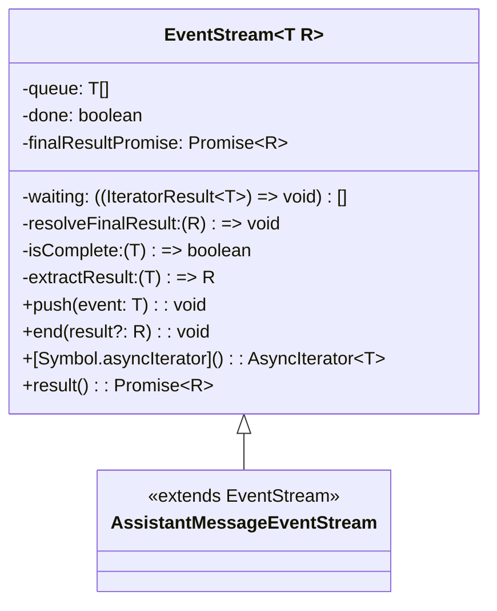
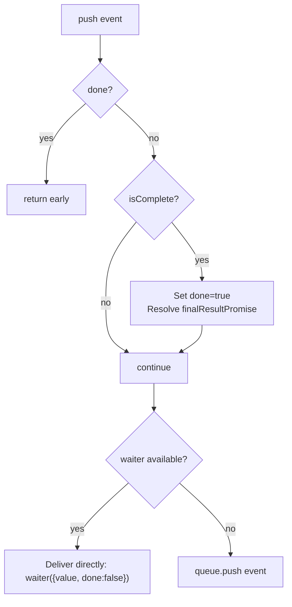
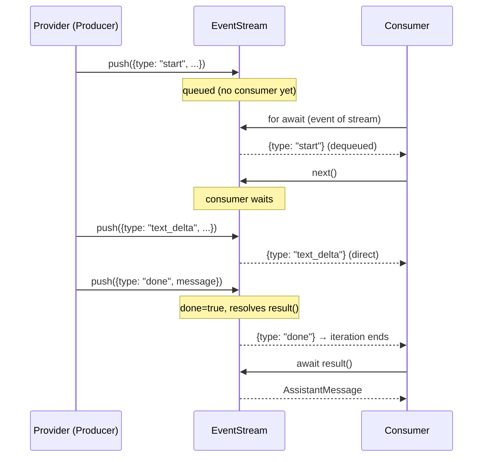

# event-stream.ts — Async Event Stream

**Source:** `packages/ai/src/utils/event-stream.ts`

## Purpose

Generic async iterable event stream for streaming LLM responses. Separates event-by-event iteration from final result extraction. The specialized `AssistantMessageEventStream` is used by all providers.

## Class Overview

## `EventStream<T, R>` (lines 4–66)

Generic async iterable with queue + waiter pattern.

### Constructor (lines 11–18)

Takes two callbacks:
- `isComplete(event)` — returns true if event is a terminal event
- `extractResult(event)` — extracts final result from terminal event

Creates the `finalResultPromise` which resolves when a complete event is pushed.

### `push()` (lines 20–35)

Delivers to waiting consumer immediately or queues. On terminal event, resolves the result promise.

### `end()` (lines 37–47)

Marks stream as done. Optionally resolves `finalResultPromise` with provided result. Notifies all waiting consumers with `{done: true}`.

### `[Symbol.asyncIterator]()` (lines 49–61)

Async generator:
1. If queue has items → yield and shift
2. If done → return
3. Otherwise → `await new Promise` that pushes resolver onto `waiting` array

### `result()` (lines 63–65)

Returns `finalResultPromise`. Can be awaited independently of iteration.

## `AssistantMessageEventStream` (lines 68–82)

Extends `EventStream<AssistantMessageEvent, AssistantMessage>` with:
- `isComplete`: `event.type === "done" || event.type === "error"` (line 71)
- `extractResult`: returns `event.message` for done, `event.error` for error (lines 72–78)

## `createAssistantMessageEventStream()` (lines 85–87)

Factory function. Returns `new AssistantMessageEventStream()`. Exported for use in extensions.

## Producer-Consumer Flow

