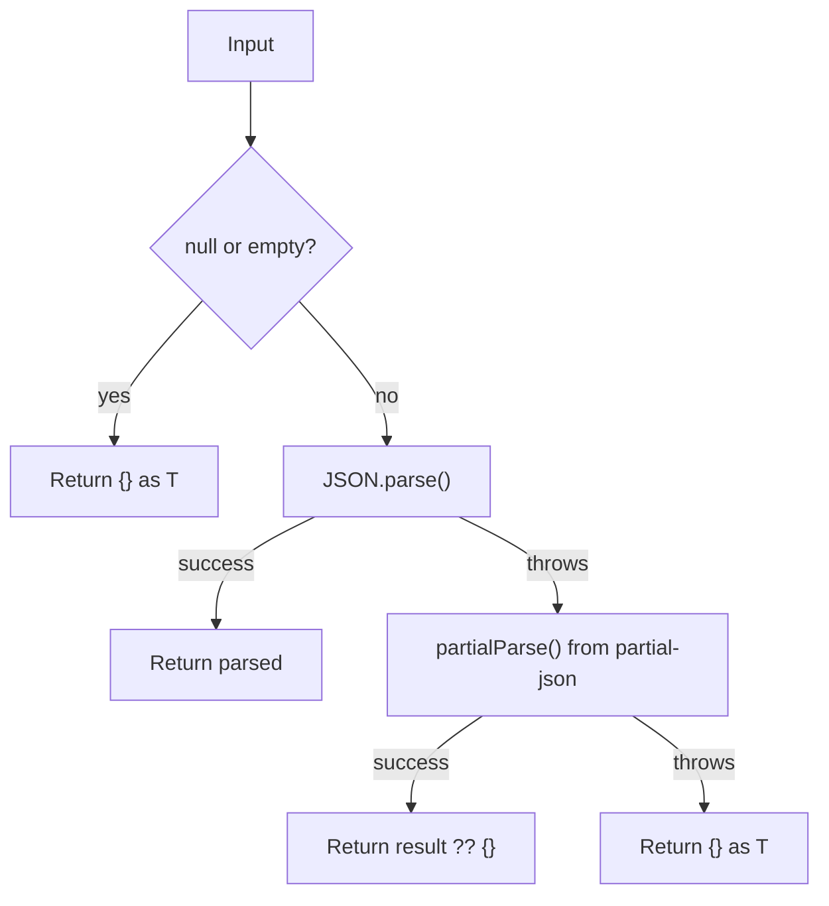

# json-parse.ts — Streaming JSON Parser

**Source:** `packages/ai/src/utils/json-parse.ts`

## Purpose

Safely parses potentially incomplete JSON during streaming. Never throws.

## `parseStreamingJson()` (lines 10–28)

```typescript
export function parseStreamingJson<T = any>(partialJson: string | undefined): T
```



- **Line 11**: Early return for null/empty input
- **Line 17**: Fast path — standard `JSON.parse` for complete JSON
- **Line 21**: Fallback — `partial-json` library for incomplete streaming JSON
- **Line 25**: Final fallback — empty object (never throws)
