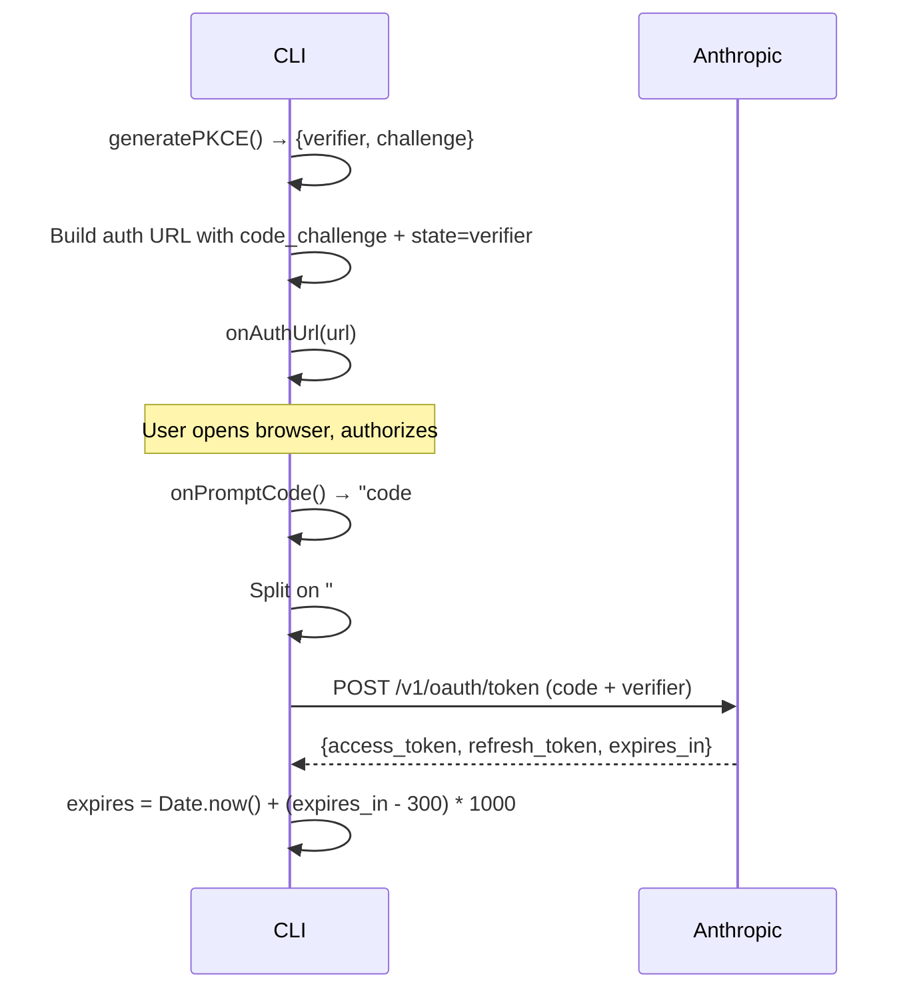

# oauth/anthropic.ts — Anthropic OAuth Provider

**Source:** `packages/ai/src/utils/oauth/anthropic.ts`

## Purpose

OAuth device code flow for Anthropic Claude Pro/Max accounts. User verifies on console.anthropic.com.

## Constants

| Name | Line | Value |
|---|---|---|
| `CLIENT_ID` | 9 | Base64-decoded string |
| `AUTHORIZE_URL` | 10 | `"https://claude.ai/oauth/authorize"` |
| `TOKEN_URL` | 11 | `"https://console.anthropic.com/v1/oauth/token"` |
| `REDIRECT_URI` | 12 | `"https://console.anthropic.com/oauth/code/callback"` |
| `SCOPES` | 13 | `"org:create_api_key user:profile user:inference"` |

## `loginAnthropic()` (lines 21–86)

```typescript
export async function loginAnthropic(
    onAuthUrl: (url: string) => void,
    onPromptCode: () => Promise<string>
): Promise<OAuthCredentials>
```



- **State verification**: Uses PKCE verifier as state parameter (line 39)
- **Token expiry buffer**: Subtracts 5 minutes (300s) for safety (line 80)

## `refreshAnthropicToken()` (lines 91–118)

```typescript
export async function refreshAnthropicToken(refreshToken: string): Promise<OAuthCredentials>
```

Posts `refresh_token` grant to TOKEN_URL. Returns updated credentials with new expiry.

## `anthropicOAuthProvider` (lines 120–138)

`OAuthProviderInterface` with:
- `id`: `"anthropic"`
- `name`: `"Anthropic (Claude Pro/Max)"`
- `getApiKey()`: returns `credentials.access`
