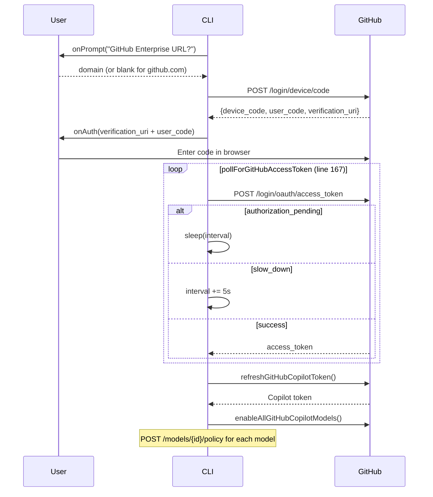

# oauth/github-copilot.ts — GitHub Copilot OAuth Provider

**Source:** `packages/ai/src/utils/oauth/github-copilot.ts`

## Purpose

Device code flow for GitHub Copilot. Supports GitHub Enterprise Server and auto-enables models after login.

## Constants

| Name | Line | Value |
|---|---|---|
| `CLIENT_ID` | 14 | Base64-decoded GitHub OAuth client ID |
| `COPILOT_HEADERS` | 16 | User-Agent, Editor-Version, Editor-Plugin-Version, Copilot-Integration-Id |

## `normalizeDomain()` (lines 43–52)

```typescript
export function normalizeDomain(input: string): string | null
```

Trims input, adds `https://` if needed, parses as URL, returns hostname. Returns null if invalid.

## `getGitHubCopilotBaseUrl()` (lines 80–89)

```typescript
export function getGitHubCopilotBaseUrl(token?, enterpriseDomain?): string
```

Extracts base URL from token's `proxy-ep` field: `proxy.xxx` → `api.xxx`. Falls back to enterprise domain or `"https://api.individual.githubcopilot.com"`.

- **`getBaseUrlFromToken()`** (line 71): Regex extraction of `proxy-ep` from semicolon-delimited token format

## `loginGitHubCopilot()` (lines 312–351)



### Key Internal Functions

- **`startDeviceFlow()`** (line 100): POSTs to device code endpoint, validates response
- **`pollForGitHubAccessToken()`** (line 167): Polling with `abortableSleep()` (line 147) — respects AbortSignal, handles slow_down by increasing interval
- **`enableAllGitHubCopilotModels()`** (line 290): Calls `enableGitHubCopilotModel()` (line 264) for all `getModels("github-copilot")` models

## `refreshGitHubCopilotToken()` (lines 226–258)

Calls Copilot v2/token endpoint with Bearer token. Extracts `token` and `expires_at` (seconds). Returns credentials with 5-min buffer on expiry.

## `githubCopilotOAuthProvider` (lines 353–381)

- `id`: `"github-copilot"`
- `name`: `"GitHub Copilot"`
- `getApiKey()`: returns `credentials.access`
- `modifyModels()`: Extracts baseUrl from token and applies to all github-copilot models
