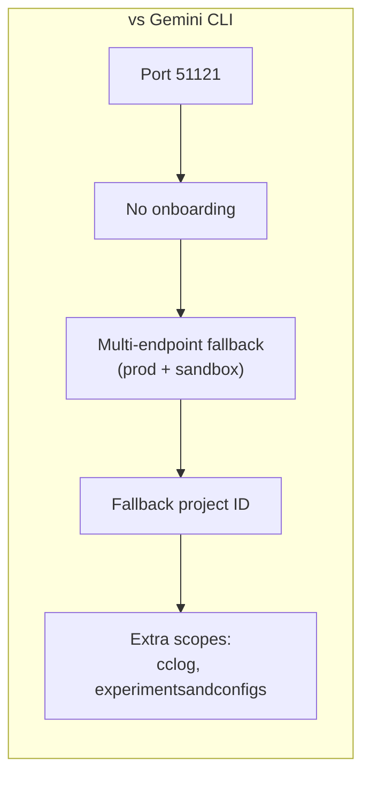

# oauth/google-antigravity.ts — Antigravity OAuth Provider

**Source:** `packages/ai/src/utils/oauth/google-antigravity.ts`

## Purpose

OAuth authorization code flow for Antigravity (multi-model: Gemini 3, Claude, GPT-OSS). Simpler project discovery than Gemini CLI — no user onboarding.

## Constants

| Name | Line | Value |
|---|---|---|
| `CLIENT_ID` | 27 | Base64-decoded (different from Gemini CLI) |
| `CLIENT_SECRET` | 30 | Base64-decoded |
| `REDIRECT_URI` | 31 | `"http://localhost:51121/oauth-callback"` |
| `SCOPES` | 34 | cloud-platform, userinfo.email/profile, cclog, experimentsandconfigs |
| `DEFAULT_PROJECT_ID` | 46 | `"rising-fact-p41fc"` (fallback) |

## `loginAntigravity()` (lines 277–434)

Same pattern as Gemini CLI but with key differences:

### `discoverProject()` (lines 157–212)

1. Tries prod endpoint: `https://cloudcode-pa.googleapis.com`
2. Falls back to sandbox: `https://daily-cloudcode-pa.sandbox.googleapis.com`
3. Handles both string and object project formats
4. Returns `DEFAULT_PROJECT_ID` if all endpoints fail

### `startCallbackServer()` (lines 66–127)

HTTP server on port 51121, handles `/oauth-callback` route.

## `refreshAntigravityToken()` (lines 238–267)

Posts `refresh_token` grant with preserved `projectId`.

## `antigravityOAuthProvider` (lines 436–457)

- `id`: `"google-antigravity"`
- `name`: `"Antigravity (Gemini 3, Claude, GPT-OSS)"`
- `usesCallbackServer`: true
- `getApiKey()`: returns `JSON.stringify({ token, projectId })`
