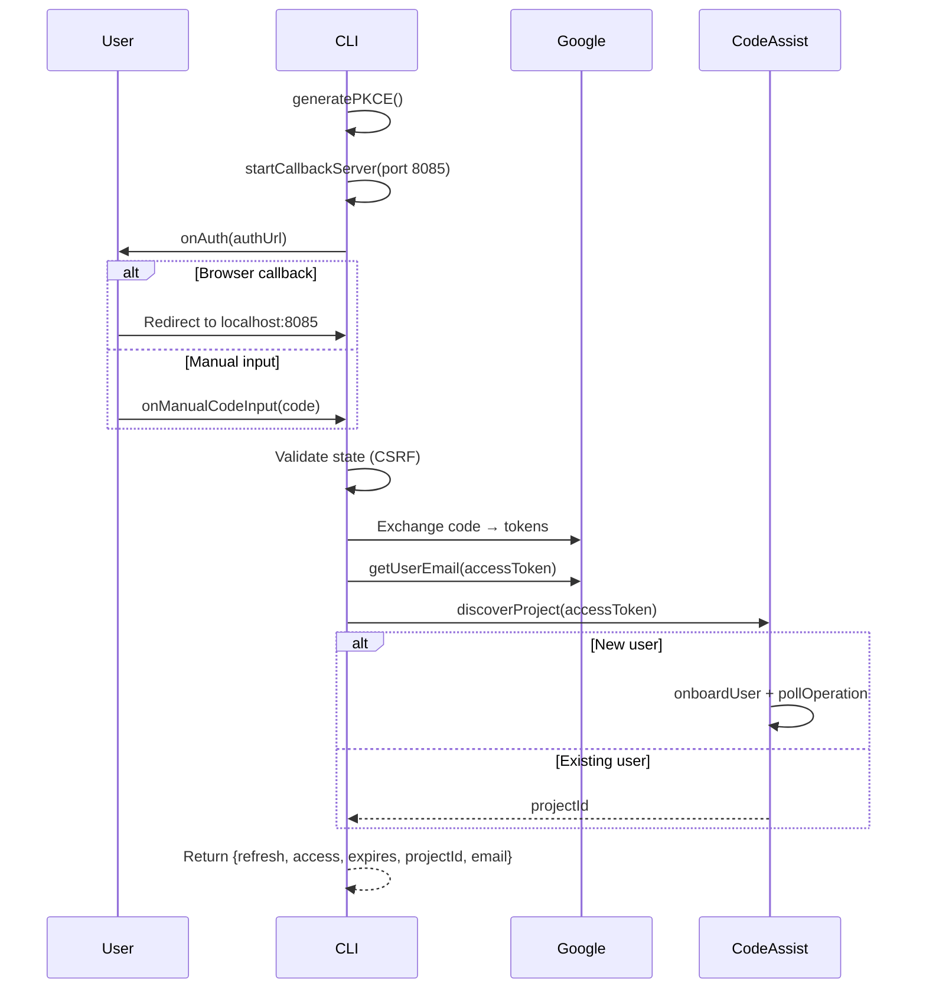

# oauth/google-gemini-cli.ts — Google Cloud Code Assist OAuth

**Source:** `packages/ai/src/utils/oauth/google-gemini-cli.ts`

## Purpose

OAuth authorization code flow for Google Cloud Code Assist (Gemini CLI). Includes project provisioning and discovery.

## Constants

| Name | Line | Value |
|---|---|---|
| `CLIENT_ID` | 26 | Base64-decoded Google OAuth client ID |
| `CLIENT_SECRET` | 29 | Base64-decoded |
| `REDIRECT_URI` | 30 | `"http://localhost:8085/oauth2callback"` |
| `SCOPES` | 31 | cloud-platform, userinfo.email, userinfo.profile |
| `AUTH_URL` | 36 | `"https://accounts.google.com/o/oauth2/v2/auth"` |
| `TOKEN_URL` | 37 | `"https://oauth2.googleapis.com/token"` |
| `CODE_ASSIST_ENDPOINT` | 38 | `"https://cloudcode-pa.googleapis.com"` |
| `TIER_FREE/LEGACY/STANDARD` | 158–160 | Tier ID constants |

## `loginGeminiCli()` (lines 419–576)

### `startCallbackServer()` (lines 58–119)

Creates HTTP server on port 8085, handles `/oauth2callback` route, extracts `code` and `state` from query params. Returns `CallbackServerInfo` with `waitForCode()` polling function.

### `discoverProject()` (lines 228–354)

1. Checks `GOOGLE_CLOUD_PROJECT` / `GOOGLE_CLOUD_PROJECT_ID` env vars first
2. Calls `loadCodeAssist` endpoint to discover existing project
3. Handles VPC-SC affected users (`SECURITY_POLICY_VIOLATED`)
4. Onboards new users with tier selection (free/legacy/standard)
5. Polls long-running operation via `pollOperation()` (lines 195–223) every 5 seconds

### `getUserEmail()` (lines 359–375)

Fetches from Google userinfo endpoint using access token.

## `refreshGoogleCloudToken()` (lines 380–409)

Posts `refresh_token` grant. Returns credentials with preserved `projectId`.

## `geminiCliOAuthProvider` (lines 578–599)

- `id`: `"google-gemini-cli"`
- `name`: `"Google Cloud Code Assist (Gemini CLI)"`
- `usesCallbackServer`: true
- `getApiKey()`: returns `JSON.stringify({ token, projectId })`
