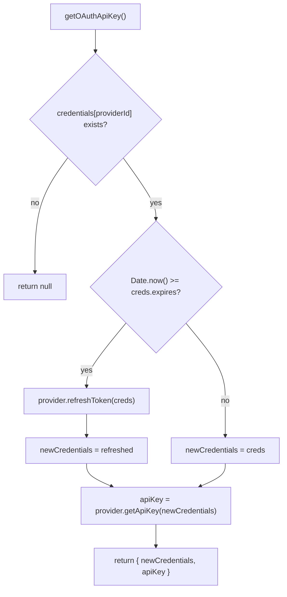

# oauth/index.ts — OAuth Credential Management Hub

**Source:** `packages/ai/src/utils/oauth/index.ts`

## Purpose

Central OAuth credential management. Provider registry, dispatcher, and high-level API for token refresh and API key extraction.

## Side Effects

- **Line 13**: Imports `../http-proxy.js` to configure fetch proxy for all OAuth flows

## Re-exports (lines 16–32)

Re-exports login functions, refresh functions, and provider objects from all 5 provider modules, plus all types from `types.ts`.

## Provider Registry (lines 45–51)

```typescript
const oauthProviderRegistry = new Map<string, OAuthProviderInterface>();
```

Pre-populated with 5 built-in providers:
1. `anthropic` — Anthropic (Claude Pro/Max)
2. `github-copilot` — GitHub Copilot
3. `google-gemini-cli` — Google Cloud Code Assist
4. `google-antigravity` — Antigravity (Gemini 3, Claude, GPT-OSS)
5. `openai-codex` — ChatGPT Plus/Pro

## `getOAuthProvider()` (lines 56–58)

```typescript
export function getOAuthProvider(id: OAuthProviderId): OAuthProviderInterface | undefined
```

Simple registry lookup.

## `registerOAuthProvider()` (lines 63–65)

```typescript
export function registerOAuthProvider(provider: OAuthProviderInterface): void
```

Adds custom provider to registry.

## `getOAuthProviders()` (lines 70–72)

Returns all registered providers as array of `OAuthProviderInterface`.

## `getOAuthProviderInfoList()` (lines 77–83)

**Deprecated.** Maps providers to `OAuthProviderInfo` objects with `available: true`.

## `refreshOAuthToken()` (lines 93–102)

**Deprecated.** Looks up provider and calls `provider.refreshToken()`. Throws if provider not found.

## `getOAuthApiKey()` (lines 111–136)

```typescript
export async function getOAuthApiKey(
    providerId, credentials: Record<string, OAuthCredentials>
): Promise<{ newCredentials: OAuthCredentials; apiKey: string } | null>
```



Gets API key with auto-refresh if expired. Returns null if no credentials exist.
