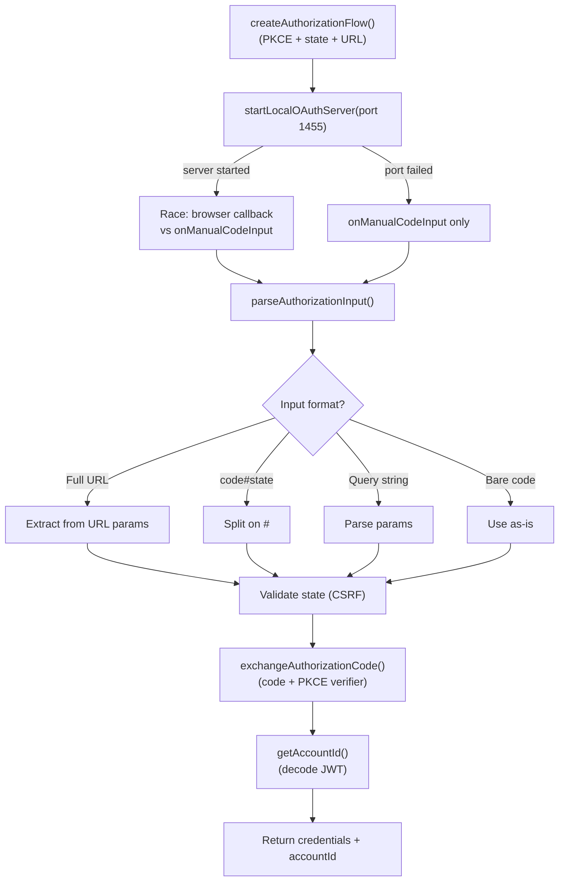

# oauth/openai-codex.ts — OpenAI Codex OAuth Provider

**Source:** `packages/ai/src/utils/oauth/openai-codex.ts`

## Purpose

OAuth authorization code flow for ChatGPT Plus/Pro (Codex subscription). Sophisticated fallback chain for code delivery and JWT-based account ID extraction.

## Constants

| Name | Line | Value |
|---|---|---|
| `CLIENT_ID` | 23 | `"app_EMoamEEZ73f0CkXaXp7hrann"` |
| `AUTHORIZE_URL` | 24 | `"https://auth.openai.com/oauth/authorize"` |
| `TOKEN_URL` | 25 | `"https://auth.openai.com/oauth/token"` |
| `REDIRECT_URI` | 26 | `"http://localhost:1455/auth/callback"` |
| `SCOPE` | 27 | `"openid profile email offline_access"` |
| `JWT_CLAIM_PATH` | 28 | `"https://api.openai.com/auth"` |

## `loginOpenAICodex()` (lines 305–410)

### `startLocalOAuthServer()` (lines 212–285)

Creates HTTP server on port 1455. Handles `/auth/callback`, validates state. Gracefully falls back to manual paste if port binding fails (logs detailed error to stderr).

### `parseAuthorizationInput()` (lines 60–88)

Accepts multiple input formats: full redirect URL, `code#state`, query string, bare code.

### `getAccountId()` (lines 287–292)

Extracts `chatgpt_account_id` from JWT payload via `decodeJwt()` (line 90). No signature verification needed.

### `exchangeAuthorizationCode()` (lines 102–142)

POSTs to TOKEN_URL with code, PKCE verifier, client_id. Returns `TokenResult` (success or failure).

## `refreshOpenAICodexToken()` (lines 415–432)

Calls `refreshAccessToken()` (line 144), re-extracts accountId from new JWT.

## `openaiCodexOAuthProvider` (lines 434–455)

- `id`: `"openai-codex"`
- `name`: `"ChatGPT Plus/Pro (Codex Subscription)"`
- `usesCallbackServer`: true
- `getApiKey()`: returns `credentials.access`
