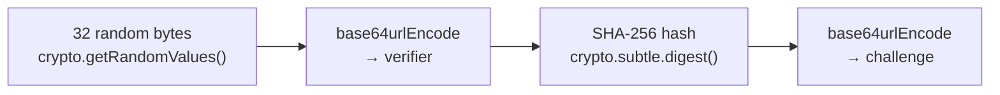

# oauth/pkce.ts — PKCE Code Generation

**Source:** `packages/ai/src/utils/oauth/pkce.ts`

## Purpose

Generates PKCE (Proof Key for Code Exchange) pairs for secure OAuth authorization code flows. Cross-platform using Web Crypto API.

## `base64urlEncode()` (lines 9–15)

Internal helper. Encodes `Uint8Array` to base64url string:
1. Convert bytes to binary string via `String.fromCharCode()` (line 11)
2. `btoa()` for base64 encoding (line 12)
3. Replace `+` → `-`, `/` → `_`, remove `=` padding (line 13–14)

## `generatePKCE()` (lines 21–34)

```typescript
export async function generatePKCE(): Promise<{ verifier: string; challenge: string }>
```



- **Line 22**: `crypto.getRandomValues(new Uint8Array(32))` — 32 bytes of randomness
- **Line 23**: Base64URL encode → verifier string
- **Line 26**: SHA-256 hash of verifier
- **Line 30**: Base64URL encode hash → challenge string
- Compatible with Node.js 20+ and browsers via Web Crypto API
