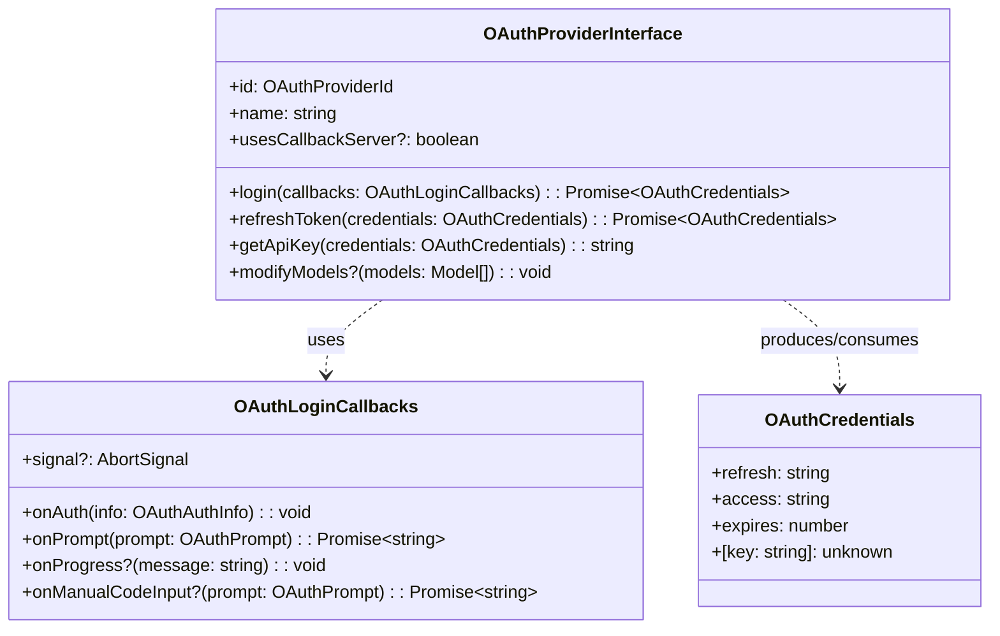

# oauth/types.ts — OAuth Type Definitions

**Source:** `packages/ai/src/utils/oauth/types.ts`

## Purpose

OAuth credential and provider interface contracts. Callback types for interactive login flows.

## Types & Interfaces

| Type | Line | Description |
|---|---|---|
| `OAuthCredentials` | 3 | `{ refresh, access, expires, [key]: unknown }` — extensible credentials |
| `OAuthProviderId` | 10 | String alias for provider identification |
| `OAuthProvider` | 13 | **Deprecated** alias for OAuthProviderId |
| `OAuthPrompt` | 15 | `{ message, placeholder?, allowEmpty? }` — user input prompt |
| `OAuthAuthInfo` | 21 | `{ url, instructions? }` — auth flow info for user |
| `OAuthLoginCallbacks` | 26 | Callbacks: `onAuth`, `onPrompt`, `onProgress?`, `onManualCodeInput?`, `signal?` |
| `OAuthProviderInterface` | 34 | Provider contract — see below |
| `OAuthProviderInfo` | 55 | **Deprecated** — `{ id, name, available }` |

## OAuthProviderInterface (lines 34–52)

## Design Notes

- **Extensible credentials**: `[key: string]: unknown` allows provider-specific fields (accountId, projectId, enterpriseUrl, email)
- **Optional `modifyModels()`**: GitHub Copilot uses this to set baseUrl from token
- **`usesCallbackServer`**: Indicates whether login requires a local HTTP server (affects UI)
