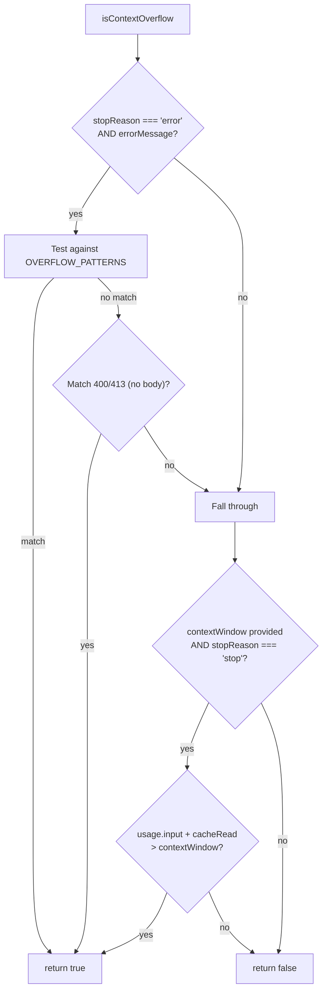

# overflow.ts — Context Overflow Detection

**Source:** `packages/ai/src/utils/overflow.ts`

## Purpose

Detects context window overflow errors from 20+ LLM providers. Handles both explicit error messages and silent overflow.

## `OVERFLOW_PATTERNS` (lines 27–43)

Array of 15 regex patterns matching provider-specific overflow error messages:

| Pattern | Provider | Line |
|---|---|---|
| `/prompt is too long/i` | Anthropic | 28 |
| `/input is too long for requested model/i` | Amazon Bedrock | 29 |
| `/exceeds the context window/i` | OpenAI | 30 |
| `/input token count.*exceeds the maximum/i` | Google | 31 |
| `/maximum prompt length is \d+/i` | xAI (Grok) | 32 |
| `/reduce the length of the messages/i` | Groq | 33 |
| `/maximum context length is \d+ tokens/i` | OpenRouter | 34 |
| `/exceeds the limit of \d+/i` | GitHub Copilot | 35 |
| `/exceeds the available context size/i` | llama.cpp | 36 |
| `/greater than the context length/i` | LM Studio | 37 |
| `/context window exceeds limit/i` | MiniMax | 38 |
| `/exceeded model token limit/i` | Kimi For Coding | 39 |
| Generic fallbacks | | 40–42 |

## `isContextOverflow()` (lines 90–114)

```typescript
export function isContextOverflow(message: AssistantMessage, contextWindow?: number): boolean
```



- **Case 1** (lines 92–103): Error-based overflow — checks patterns, then 400/413 status codes (Cerebras, Mistral)
- **Case 2** (lines 106–111): Silent overflow (z.ai) — successful response but usage exceeds context window

## `getOverflowPatterns()` (lines 119–121)

Returns copy of `OVERFLOW_PATTERNS` for testing.
