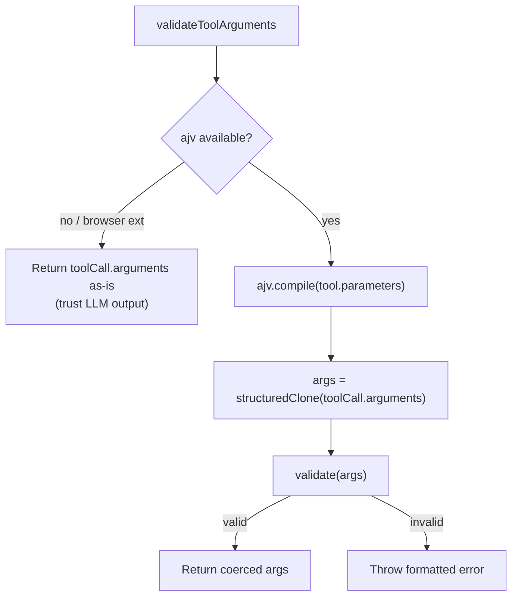

# validation.ts — Tool Call Validation

**Source:** `packages/ai/src/utils/validation.ts`

## Purpose

Validates LLM tool call arguments against TypeBox schemas using AJV. Handles browser extension CSP restrictions.

## Browser Detection (line 12)

```typescript
const isBrowserExtension = typeof globalThis !== "undefined"
    && (globalThis as any).chrome?.runtime?.id !== undefined;
```

Manifest V3 extensions don't allow eval/Function constructor required by AJV.

## AJV Initialization (lines 16–29)

Singleton instance created outside browser extensions:
```typescript
ajv = new Ajv({ allErrors: true, strict: false, coerceTypes: true });
addFormats(ajv);
```

Falls back gracefully if CSP restriction is hit (line 27).

## `validateToolCall()` (lines 38–44)

```typescript
export function validateToolCall(tools: Tool[], toolCall: ToolCall): any
```

Finds tool by name in `tools` array (line 39). Throws `"Tool not found"` if missing (line 41). Delegates to `validateToolArguments()`.

## `validateToolArguments()` (lines 53–84)

```typescript
export function validateToolArguments(tool: Tool, toolCall: ToolCall): any
```



Key details:
- **structuredClone** (line 65): Clones arguments before validation because AJV mutates for type coercion
- **Error formatting** (lines 73–83): Pretty `path: message` list with full JSON dump of received arguments
