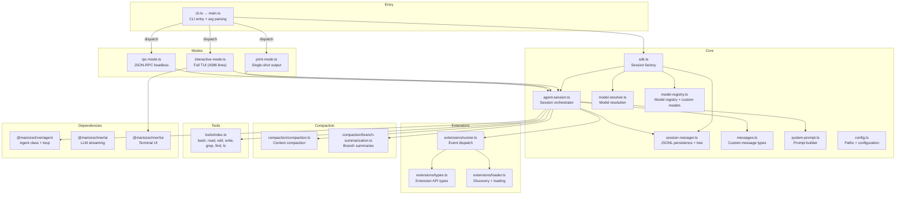
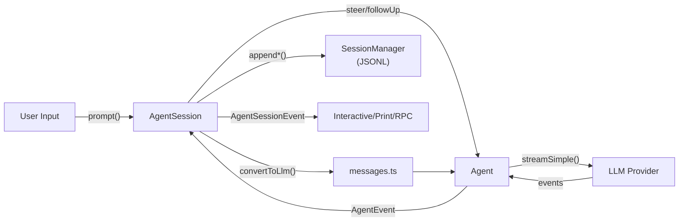

# packages/coding-agent — Design Documentation

Full coding agent CLI (`pi` command). Wraps `@mariozechner/agent` with session persistence, tool implementations, extension system, compaction, and three run modes (interactive TUI, print, RPC).

## Architecture

## Data Flow

## Document Index

### Core
| Document | Source | Description |
|---|---|---|
| [core/agent-session.md](core/agent-session.md) | `core/agent-session.ts` | Session orchestrator — prompting, steering, compaction, retry, extensions |
| [core/session-manager.md](core/session-manager.md) | `core/session-manager.ts` | JSONL persistence, tree structure, branching, context building |
| [core/sdk.md](core/sdk.md) | `core/sdk.ts` | `createAgentSession()` factory — wires all dependencies |
| [core/messages.md](core/messages.md) | `core/messages.ts` | Custom message types + `convertToLlm()` |
| [core/system-prompt.md](core/system-prompt.md) | `core/system-prompt.ts` | System prompt builder |
| [core/model-resolver.md](core/model-resolver.md) | `core/model-resolver.ts` | Model pattern matching + resolution |
| [core/model-registry.md](core/model-registry.md) | `core/model-registry.ts` | Model registry with custom models.json support |
| [config.md](config.md) | `config.ts` | Path resolution + app configuration |

### Extensions
| Document | Source | Description |
|---|---|---|
| [core/extensions/overview.md](core/extensions/overview.md) | `extensions/*.ts` | Extension system — types, loader, runner |

### Compaction
| Document | Source | Description |
|---|---|---|
| [core/compaction/overview.md](core/compaction/overview.md) | `compaction/*.ts` | Context compaction + branch summarization |

### Tools
| Document | Source | Description |
|---|---|---|
| [core/tools/overview.md](core/tools/overview.md) | `tools/*.ts` | Built-in tool implementations |

### Entry & Modes
| Document | Source | Description |
|---|---|---|
| [main.md](main.md) | `main.ts` | CLI entry point + mode dispatch |
| [modes/interactive.md](modes/interactive.md) | `modes/interactive/interactive-mode.ts` | Interactive TUI mode |
| [modes/print.md](modes/print.md) | `modes/print-mode.ts` | Non-interactive single-shot mode |
| [modes/rpc/overview.md](modes/rpc/overview.md) | `modes/rpc/*.ts` | Headless JSON-RPC mode |
