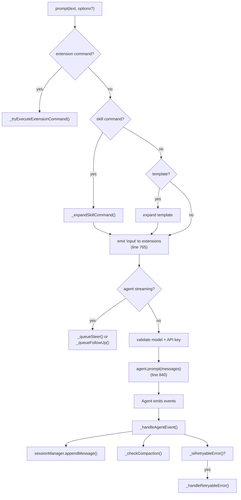
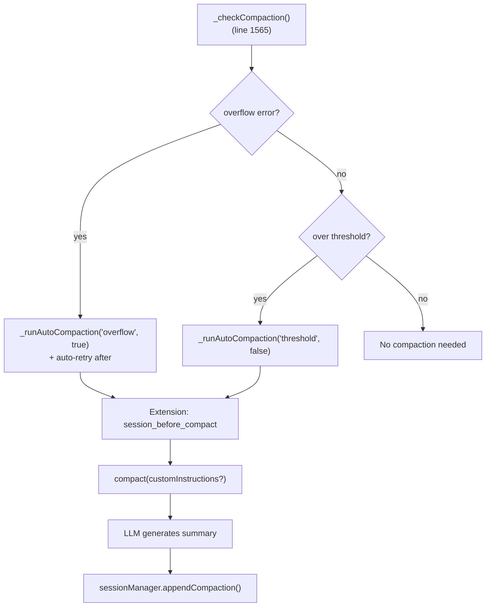

# agent-session.ts — Session Orchestrator

**Source:** `packages/coding-agent/src/core/agent-session.ts` (2865 lines)

## Purpose

High-level session orchestrator wrapping `Agent` from `@mariozechner/agent`. Manages user/AI interaction, tool management, model selection, compaction, auto-retry, extension coordination, and session persistence.

## Exported Types

### `ParsedSkillBlock` (line 89)

```typescript
export interface ParsedSkillBlock {
    name: string;
    args: string;
    content: string;
}
```

### `AgentSessionEvent` (line 112)

```typescript
export type AgentSessionEvent =
    | AgentEvent
    | { type: "pending_messages_changed" }
    | { type: "state_changed" }
    | { type: "error"; error: string }
    | { type: "user_bash"; command: string; output: string; exitCode: number | undefined }
    | { type: "compaction_started" | "compaction_done" | "compaction_cancelled" }
    | { type: "compaction_failed"; error: string }
    | { type: "auto_compaction"; reason: "overflow" | "threshold" }
    | { type: "auto_retry_start"; attempt: number; delayMs: number }
    | { type: "auto_retry_end" }
    | { type: "abort_request" }
```

Extends `AgentEvent` with session-specific lifecycle events.

### `AgentSessionConfig` (line 132)

```typescript
export interface AgentSessionConfig {
    agent: Agent;
    sessionManager: SessionManager;
    settingsManager: SettingsManager;
    modelRegistry: ModelRegistry;
    resourceLoader: ResourceLoader;
    extensionRunner?: ExtensionRunner;
    scopedModels?: ScopedModel[];
    autoRetryEnabled?: boolean;
}
```

### `PromptOptions` (line 161)

```typescript
export interface PromptOptions {
    images?: ImageContent[];
    noExtensionInput?: boolean;
    deliveryMode?: "steer" | "followUp";
    source?: "user" | "extension" | "skill" | "prompt";
}
```

### `SessionStats` (line 181)

```typescript
export interface SessionStats {
    messageCount: number;
    userMessageCount: number;
    assistantMessageCount: number;
    toolResultCount: number;
    totalInputTokens: number;
    totalOutputTokens: number;
    totalCacheReadTokens: number;
    totalCacheWriteTokens: number;
    totalCost: number;
}
```

## `AgentSession` Class (line 213)

### Core Flow



### Key Methods

#### Prompting & Message Queuing

| Method | Line | Description |
|---|---|---|
| `prompt()` | 706 | Main entry — handles commands, skills, templates, extension input events, queuing |
| `steer()` | 916 | Queue steering message (interrupt mid-run) |
| `followUp()` | 936 | Queue follow-up message (after agent finishes) |
| `sendCustomMessage()` | 1010 | Send extension message with delivery mode (`"immediate"`, `"steer"`, `"followUp"`, `"nextTurn"`) |
| `sendUserMessage()` | 1052 | Send user message with optional images |
| `clearQueue()` | 1090 | Clear all pending messages |
| `abort()` | 1121 | Abort current operation |

#### Model & Thinking Level

| Method | Line | Description |
|---|---|---|
| `setModel()` | 1211 | Set model with API key validation |
| `cycleModel()` | 1234 | Cycle through scoped or available models |
| `setThinkingLevel()` | 1326 | Set thinking level with clamping to model capabilities |
| `cycleThinkingLevel()` | 1345 | Cycle through available thinking levels |
| `supportsThinking()` | 1376 | Check if current model supports reasoning |

#### Compaction



| Method | Line | Description |
|---|---|---|
| `compact()` | 1429 | Manual compaction with extension hooks |
| `abortCompaction()` | 1542 | Cancel compaction |
| `_checkCompaction()` | 1565 | Auto-detect when compaction needed (overflow or threshold) |
| `_runAutoCompaction()` | 1615 | Execute auto-compaction with optional retry on overflow |

#### Auto-Retry

| Method | Line | Description |
|---|---|---|
| `_isRetryableError()` | 2083 | Detect retryable errors (overloaded, rate limit, 5xx) |
| `_handleRetryableError()` | 2101 | Exponential backoff: `baseDelayMs * 2^(attempt-1)`, max 3 retries |
| `abortRetry()` | 2176 | Cancel in-progress retry |
| `waitForRetry()` | 2186 | Block until retry completes |

#### Session Management

| Method | Line | Description |
|---|---|---|
| `newSession()` | 1135 | Start fresh session with optional parent tracking |
| `switchSession()` | 2325 | Switch to different session file |
| `fork()` | 2415 | Fork session with extension events |
| `navigateTree()` | 2485 | Navigate to different branch with optional summarization |
| `setSessionName()` | 2402 | Set user-defined session display name |

#### Extension System

| Method | Line | Description |
|---|---|---|
| `bindExtensions()` | 1767 | Bind extension UI context and command handlers |
| `_bindExtensionCore()` | 1851 | Bind core runtime methods (sendMessage, setTools, compact, etc.) |
| `_buildRuntime()` | 1961 | Build tool registry and activate tools |
| `reload()` | 2052 | Reload extensions and settings |

#### Event Handling

| Method | Line | Description |
|---|---|---|
| `subscribe()` | 506 | Subscribe to `AgentSessionEvent` |
| `_handleAgentEvent()` | 317 | Core event processor — persists messages, triggers compaction, auto-retry |
| `_emitExtensionEvent()` | 429 | Translates agent events to extension event system |

#### Utilities

| Method | Line | Description |
|---|---|---|
| `getSessionStats()` | 2701 | Session statistics (messages, tokens, cost) |
| `getContextUsage()` | 2745 | Context window usage percentage |
| `exportToHtml()` | 2796 | Export session as HTML |
| `executeBash()` | 2221 | Execute bash command with optional streaming |

### Internal State

```typescript
_steeringMessages: string[]              // Interrupt messages (delivered ASAP)
_followUpMessages: string[]              // Wait messages (after agent finishes)
_pendingNextTurnMessages: CustomMessage[] // Extension asides for next prompt
_retryAttempt: number                    // Current retry attempt (exponential backoff)
_toolRegistry: Map<string, AgentTool>    // Active tool registry
_baseToolRegistry: Map<string, AgentTool> // Base tools before extension overrides
_turnIndex: number                       // Turn counter for extension events
```
