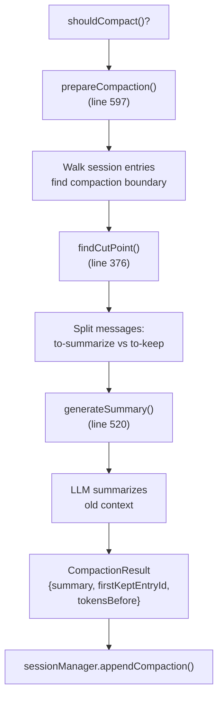
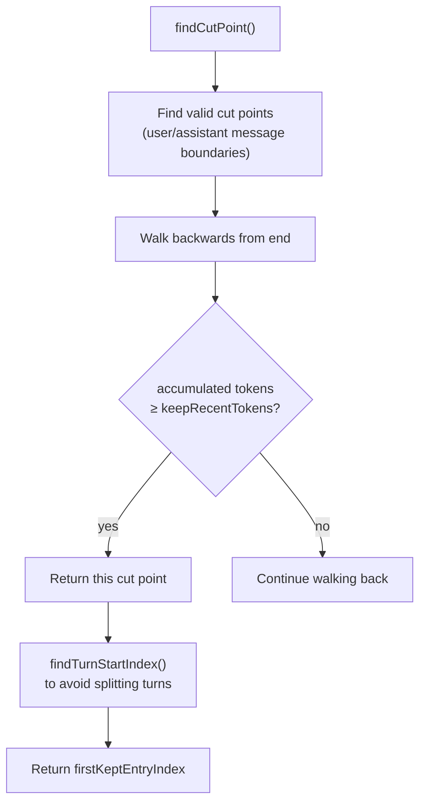
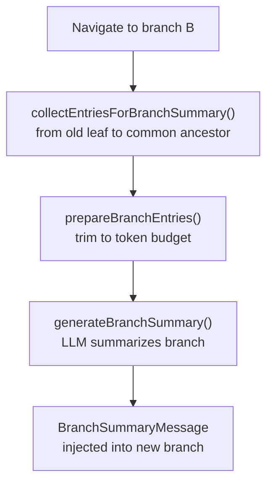

# Compaction System — Overview

**Source:** `packages/coding-agent/src/core/compaction/`

## Purpose

Manages context window limits by summarizing old conversation history via LLM. Also handles branch summarization when navigating the session tree.

## compaction.ts (809 lines)

### How Compaction Works



### Key Functions

| Function | Line | Description |
|---|---|---|
| `calculateContextTokens()` | 128 | Sum token usage from last assistant message |
| `estimateContextTokens()` | 179 | Estimate tokens using last usage + trailing estimate |
| `shouldCompact()` | 212 | Check if compaction needed (context vs window size) |
| `estimateTokens()` | 225 | Chars/4 heuristic per message type |
| `findCutPoint()` | 376 | Find optimal cut point keeping ~`keepRecentTokens` |
| `generateSummary()` | 520 | LLM-based summary generation with custom instructions |
| `prepareCompaction()` | 597 | Prepare compaction data (returns undefined if already compacted) |
| `compact()` | 705 | Execute compaction, return `CompactionResult` |

### Settings

```typescript
// DEFAULT_COMPACTION_SETTINGS (line 114)
{
    enabled: true,
    reserveTokens: 16384,      // Tokens reserved for summary generation
    keepRecentTokens: 20000,   // Keep this many recent tokens uncompacted
}
```

### Cut Point Algorithm (line 376)



Finds the boundary where old context (to-summarize) ends and kept context begins. Avoids splitting mid-turn by finding the user message that starts the turn.

### File Operations Tracking

Compaction tracks which files were read and modified during the compacted portion. This context is included in the summary so the LLM knows what the agent was working on.

```typescript
interface CompactionDetails {
    readFiles: string[];
    modifiedFiles: string[];
}
```

## branch-summarization.ts (352 lines)

Generates summaries when navigating away from a branch in the session tree.

### Key Functions

| Function | Line | Description |
|---|---|---|
| `collectEntriesForBranchSummary()` | 96 | Collect entries from old leaf to common ancestor |
| `prepareBranchEntries()` | 182 | Prepare entries for summarization with token budget |
| `generateBranchSummary()` | 280 | Generate branch summary using LLM |



## utils.ts

Shared utilities for both compaction and branch summarization.

| Function | Line | Description |
|---|---|---|
| `createFileOps()` | 18 | Create empty `FileOperations` (read/written/edited sets) |
| `extractFileOpsFromMessage()` | 29 | Extract file paths from tool calls |
| `computeFileLists()` | 62 | Compute final read-only and modified file lists |
| `formatFileOperations()` | 72 | Format as XML tags for summary prompt |
| `serializeConversation()` | 93 | Serialize messages to text for summarization |
| `SUMMARIZATION_SYSTEM_PROMPT` | 152 | System prompt for LLM summarization |
