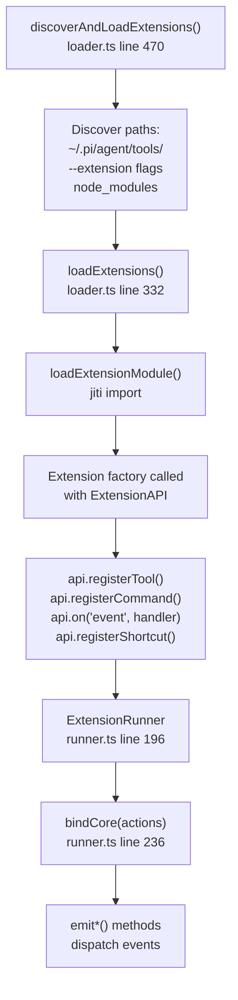
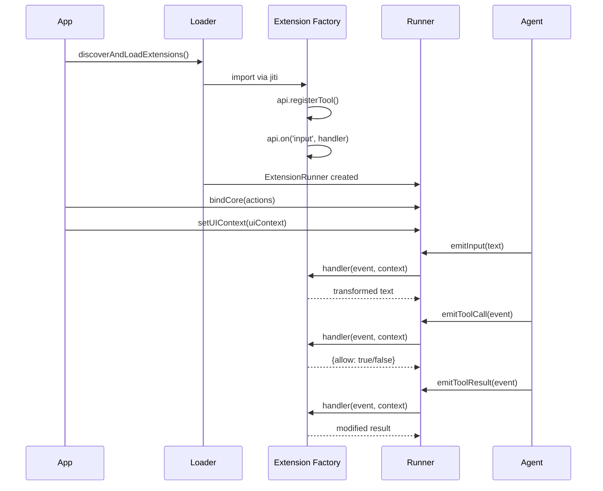

# Extension System — Overview

**Source:** `packages/coding-agent/src/core/extensions/`

## Purpose

Dynamic extension system that hooks into the agent lifecycle. Extensions can register tools, commands, keybindings, message renderers, and event handlers. Loaded as TypeScript files via `jiti` at runtime.

## Architecture



## Key Files

### types.ts (1341 lines)

Defines all extension API types. Key interfaces:

**Extension Events** — discriminated union `ExtensionEvent`:
- `input` — User input transformation (can intercept/modify)
- `before_agent_start` — Inject messages before LLM call
- `message_start/update/end` — Monitor message flow
- `turn_start/end` — Monitor LLM turn lifecycle
- `tool_execution_start/update/end` — Monitor tool execution
- `agent_start/end` — Monitor overall agent lifecycle
- `model_select` — React to model changes
- `session_before_switch/switch` — Hook session switching
- `session_before_fork/fork` — Hook forking
- `session_before_tree/tree` — Hook tree navigation
- `session_before_compact/compact` — Hook compaction
- `resources_discover` — Provide skill/prompt/theme paths
- `session_shutdown` — Graceful shutdown

**Tool-specific events** — Typed per tool:
- `BashToolCallEvent/BashToolResultEvent`
- `EditToolCallEvent/EditToolResultEvent`
- `ReadToolCallEvent/ReadToolResultEvent`
- `WriteToolCallEvent/WriteToolResultEvent`
- `GrepToolCallEvent/GrepToolResultEvent`
- `FindToolCallEvent/FindToolResultEvent`
- `LsToolCallEvent/LsToolResultEvent`

**ExtensionAPI** (line 51) — Provided to extension factory:
```typescript
interface ExtensionAPI {
    registerTool(tool: ToolDefinition): void;
    registerCommand(command: RegisteredCommand): void;
    registerShortcut(shortcut: ExtensionShortcut): void;
    registerFlag(flag: ExtensionFlag): void;
    registerProvider(name: string, config: ProviderConfig): void;
    registerMessageRenderer(renderer: MessageRenderer): void;
    on(event: string, handler: ExtensionHandler): void;
    // ...
}
```

**ExtensionContext** (line 54) — Provided to event handlers:
```typescript
interface ExtensionContext {
    session: ReadonlySessionManager;
    model: Model<any>;
    thinkingLevel: ThinkingLevel;
    cwd: string;
    // ...
}
```

**ExtensionActions** (line 49) — Actions extensions can call:
```typescript
interface ExtensionActions {
    sendMessage(content, options): Promise<void>;
    appendEntry(type, data): void;
    setTools(toolNames): void;
    compact(instructions?): Promise<void>;
    // ...
}
```

### loader.ts (516 lines)

Extension discovery and loading.

| Function | Line | Description |
|---|---|---|
| `discoverAndLoadExtensions()` | 470 | Discover from `~/.pi/agent/tools/`, `--extension` flags, and `node_modules` |
| `loadExtensions()` | 332 | Load from file paths via jiti |
| `loadExtensionFromFactory()` | 316 | Load from inline factory function |
| `loadExtensionModule()` | 258 | Import TypeScript module via jiti |

**Discovery locations:**
1. `~/.pi/agent/tools/` — User extensions
2. `--extension` / `-e` CLI flags
3. `node_modules` packages with `pi` field in `package.json`

### runner.ts (842 lines)

Event dispatch and extension lifecycle management.

| Method | Line | Description |
|---|---|---|
| `bindCore()` | 236 | Connect action methods from agent loop |
| `emit()` | 539 | Emit generic event to all handlers |
| `emitToolResult()` | 573 | Emit tool result (handlers can modify content/details/isError) |
| `emitToolCall()` | 623 | Emit tool call (handlers can block execution) |
| `emitInput()` | 813 | Emit input event with transformation chain |
| `emitBeforeAgentStart()` | 707 | Emit before agent start (can modify system prompt) |
| `emitResourcesDiscover()` | 764 | Collect skill/prompt/theme paths from extensions |
| `emitContext()` | 675 | Emit context messages (handlers can transform) |
| `getAllRegisteredTools()` | 305 | Get all tools (first registration wins) |
| `getRegisteredCommands()` | 428 | Get all commands |
| `getShortcuts()` | 348 | Get keybindings with conflict detection |

### wrapper.ts

Wraps tools with extension event hooks:

| Function | Description |
|---|---|
| `wrapToolsWithExtensions()` | Wrap all tools to emit tool call/result events |
| `wrapToolWithExtensions()` | Wrap single tool |
| `wrapRegisteredTools()` | Wrap extension-registered tools |
| `wrapRegisteredTool()` | Wrap single registered tool |

## Extension Lifecycle


