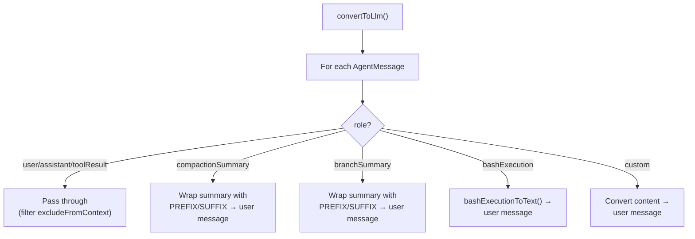

# messages.ts — Custom Message Types

**Source:** `packages/coding-agent/src/core/messages.ts` (195 lines)

## Purpose

Defines custom message types beyond standard LLM messages (user/assistant/toolResult) and provides `convertToLlm()` to transform them for the LLM.

## Custom Message Types

### `BashExecutionMessage` (line 29)

```typescript
export interface BashExecutionMessage {
    role: "bashExecution";
    command: string;
    output: string;
    exitCode: number | undefined;
    cancelled: boolean;
    truncated: boolean;
    fullOutputPath?: string;
    timestamp: number;
    excludeFromContext?: boolean;
}
```

User-initiated bash commands (`!command` in interactive mode). Converted to user message text by `bashExecutionToText()`.

### `CustomMessage<T>` (line 46)

```typescript
export interface CustomMessage<T = unknown> {
    role: "custom";
    customType: string;
    content: string | (TextContent | ImageContent)[];
    display: boolean;
    details?: T;
    timestamp: number;
}
```

Extension-injected messages. `display: true` shows in UI, `customType` identifies the extension handler.

### `BranchSummaryMessage` (line 55)

```typescript
export interface BranchSummaryMessage {
    role: "branchSummary";
    summary: string;
    fromId: string;
    timestamp: number;
}
```

### `CompactionSummaryMessage` (line 62)

```typescript
export interface CompactionSummaryMessage {
    role: "compactionSummary";
    summary: string;
    tokensBefore: number;
    timestamp: number;
}
```

### Declaration Merging (line 70)

Extends `CustomAgentMessages` from `@mariozechner/agent` to register all four custom types.

## `convertToLlm()` (line 148)

```typescript
export function convertToLlm(messages: AgentMessage[]): Message[]
```



## Constants

| Constant | Line | Description |
|---|---|---|
| `COMPACTION_SUMMARY_PREFIX` | 11 | Wraps compaction summaries for LLM context |
| `COMPACTION_SUMMARY_SUFFIX` | 16 | Closing wrapper |
| `BRANCH_SUMMARY_PREFIX` | 19 | Wraps branch summaries for LLM context |
| `BRANCH_SUMMARY_SUFFIX` | 24 | Closing wrapper |
