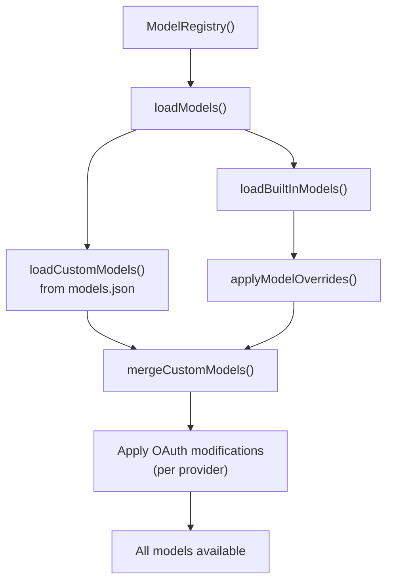

# model-registry.ts — Model Registry

**Source:** `packages/coding-agent/src/core/model-registry.ts` (665 lines)

## Purpose

Manages built-in and custom models. Loads user-defined models from `models.json`, applies overrides, handles OAuth provider modifications, and provides model/API key lookups.

## Custom Models Configuration

Users can define custom models in `~/.pi/agent/models.json`:

```json
{
    "myProvider": {
        "baseUrl": "https://api.example.com/v1",
        "apiKey": "${MY_API_KEY}",
        "api": "openai-completions",
        "models": [
            { "id": "my-model", "name": "My Model", "contextWindow": 128000 }
        ],
        "modelOverrides": {
            "existing-model-id": { "contextWindow": 200000 }
        }
    }
}
```

## Exported Types

### Schema Types (TypeBox)

| Type | Line | Description |
|---|---|---|
| `OpenRouterRoutingSchema` | 31 | OpenRouter routing preferences |
| `OpenAICompletionsCompatSchema` | 43 | OpenAI compatibility settings |
| `ModelDefinitionSchema` | 66 | Custom model definition |
| `ModelOverrideSchema` | 87 | Per-model override (all fields optional) |
| `ProviderConfigSchema` | 107 | Provider configuration |
| `ModelsConfigSchema` | 117 | Root models.json schema |

### `CustomModelsResult` (line 131)

```typescript
export interface CustomModelsResult {
    models: Model<Api>[];
    overrides: Map<string, ProviderOverride>;
    modelOverrides: Map<string, Map<string, ModelOverride>>;
    error: string | undefined;
}
```

## `ModelRegistry` Class (line 217)



### Key Methods

| Method | Line | Description |
|---|---|---|
| `refresh()` | 243 | Reload models from disk |
| `getAll()` | 490 | Return all models (built-in + custom) |
| `getAvailable()` | 498 | Return only models with auth configured |
| `find()` | 505 | Find model by provider + modelId |
| `getApiKey()` | 512 | Get API key for model |
| `isUsingOAuth()` | 526 | Check if model uses OAuth |
| `registerProvider()` | 538 | Dynamically register provider (from extensions) |

### `applyModelOverride()` (line 179)

```typescript
export function applyModelOverride(model: Model<Api>, override: ModelOverride): Model<Api>
```

Deep merges override fields into model. Handles nested `cost` and `compat` objects.

### `registerProvider()` (line 538)

Extensions can register custom providers at runtime:

```typescript
export interface ProviderConfigInput {
    baseUrl?: string;
    apiKey?: string;
    api?: Api;
    streamSimple?: (model, context, options?) => AssistantMessageEventStream;
    headers?: Record<string, string>;
    oauth?: Omit<OAuthProviderInterface, "id">;
    models?: Array<{ id, name, reasoning, input, cost, contextWindow, maxTokens, ... }>;
}
```

Registers API provider, stream function, OAuth flow, and model definitions.
