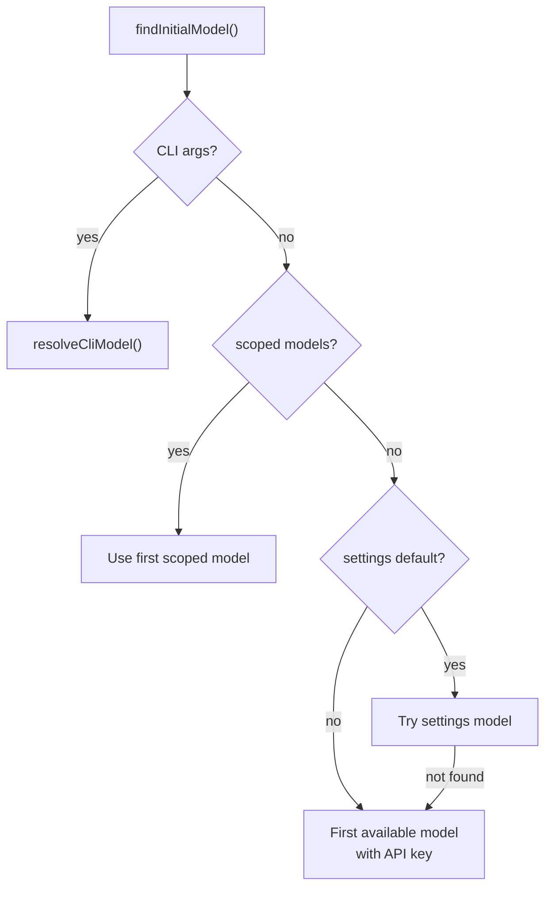

# model-resolver.ts — Model Pattern Matching & Resolution

**Source:** `packages/coding-agent/src/core/model-resolver.ts` (561 lines)

## Purpose

Resolves model patterns (CLI args, config values) to concrete `Model` objects. Supports glob matching, thinking level suffixes, and multi-step fallback chains.

## Exported Types

### `ScopedModel` (line 39)

```typescript
export interface ScopedModel {
    model: Model<Api>;
    thinkingLevel?: ThinkingLevel;
}
```

Model with optional thinking level — used for `--models` cycling.

### `ParsedModelResult` (line 109)

```typescript
export interface ParsedModelResult {
    model: Model<Api> | undefined;
    thinkingLevel?: ThinkingLevel;
    warning: string | undefined;
}
```

### `ResolveCliModelResult` (line 255)

```typescript
export interface ResolveCliModelResult {
    model: Model<Api> | undefined;
    thinkingLevel?: ThinkingLevel;
    warning: string | undefined;
    error: string | undefined;
}
```

### `InitialModelResult` (line 399)

```typescript
export interface InitialModelResult {
    model: Model<Api> | undefined;
    thinkingLevel: ThinkingLevel;
    fallbackMessage: string | undefined;
}
```

## Key Functions

### `tryMatchModel()` (line 62)

```typescript
export function tryMatchModel(
    modelPattern: string, availableModels: Model<Api>[]
): Model<Api> | undefined
```

Matches a pattern to a model. Prefers aliases (no date suffix) over dated versions. Tries exact match first, then glob.

### `parseModelPattern()` (line 129)

```typescript
export function parseModelPattern(
    pattern: string, availableModels: Model<Api>[],
    options?: { allowInvalidThinkingLevelFallback?: boolean }
): ParsedModelResult
```

Parses `"model:thinkingLevel"` patterns. Handles models with colons in their IDs (e.g., `accounts/fireworks/models/...`).

### `resolveModelScope()` (line 195)

```typescript
export async function resolveModelScope(
    patterns: string[], modelRegistry: ModelRegistry
): Promise<ScopedModel[]>
```

Resolves `--models` patterns (supports globs like `anthropic/*`). Returns array of `ScopedModel` for model cycling.

### `resolveCliModel()` (line 277)

```typescript
export function resolveCliModel(options: {
    cliProvider?: string; cliModel?: string; modelRegistry: ModelRegistry
}): ResolveCliModelResult
```

Resolves `--provider` + `--model` CLI flags with fuzzy matching.

### `findInitialModel()` (line 413)

```typescript
export async function findInitialModel(options: {
    cliProvider?: string; cliModel?: string;
    scopedModels: ScopedModel[]; isContinuing: boolean;
    defaultProvider?: string; defaultModelId?: string;
    defaultThinkingLevel?: ThinkingLevel;
    modelRegistry: ModelRegistry;
}): Promise<InitialModelResult>
```



### `restoreModelFromSession()` (line 492)

```typescript
export async function restoreModelFromSession(
    savedProvider: string, savedModelId: string,
    currentModel: Model<Api> | undefined,
    shouldPrintMessages: boolean,
    modelRegistry: ModelRegistry
): Promise<{ model: Model<Api> | undefined; fallbackMessage: string | undefined }>
```

Restores model from session file. Falls back if saved model no longer exists.

## Constants

### `defaultModelPerProvider` (line 14)

Maps each known provider to its default model ID. Used when `--provider` is specified without `--model`.
