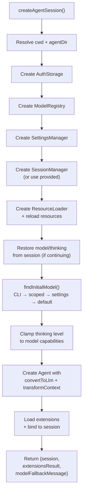

# sdk.ts — Session Factory

**Source:** `packages/coding-agent/src/core/sdk.ts` (366 lines)

## Purpose

Top-level factory that wires all dependencies and creates an `AgentSession`. Primary public API for programmatic usage.

## Exported Types

### `CreateAgentSessionOptions` (line 41)

```typescript
export interface CreateAgentSessionOptions {
    cwd?: string;
    agentDir?: string;
    authStorage?: AuthStorage;
    modelRegistry?: ModelRegistry;
    model?: Model<any>;
    thinkingLevel?: ThinkingLevel;
    scopedModels?: Array<{ model: Model<any>; thinkingLevel: ThinkingLevel }>;
    tools?: Tool[];
    customTools?: ToolDefinition[];
    resourceLoader?: ResourceLoader;
    sessionManager?: SessionManager;
    settingsManager?: SettingsManager;
}
```

### `CreateAgentSessionResult` (line 75)

```typescript
export interface CreateAgentSessionResult {
    session: AgentSession;
    extensionsResult: LoadExtensionsResult;
    modelFallbackMessage?: string;
}
```

## `createAgentSession()` (line 165)

```typescript
export async function createAgentSession(
    options: CreateAgentSessionOptions = {}
): Promise<CreateAgentSessionResult>
```



**Model resolution priority:**
1. CLI flags (`--provider`, `--model`)
2. Scoped models (`--models`)
3. Settings default
4. First available model with API key

**Agent creation (around line 280):** Creates `Agent` with custom `convertToLlm` that filters images based on settings, and `transformContext` from extensions.

## Re-exports (lines 86–122)

Re-exports key types and pre-built tools for SDK consumers:
- Extension API types
- All tool factories (`createBashTool`, `createEditTool`, etc.)
- Pre-built tool instances (`bashTool`, `editTool`, etc.)
- Tool sets (`codingTools`, `readOnlyTools`, `allBuiltInTools`)
