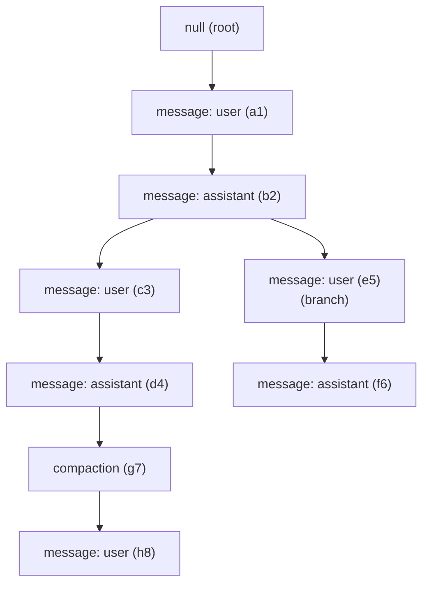
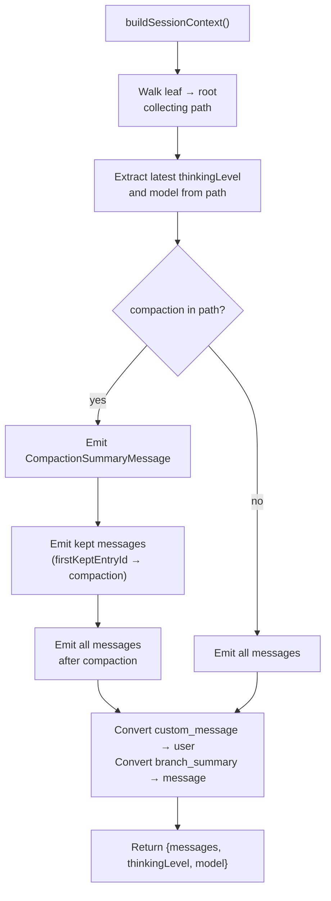

# session-manager.ts — JSONL Persistence & Tree Structure

**Source:** `packages/coding-agent/src/core/session-manager.ts` (1401 lines)

## Purpose

Append-only JSONL persistence layer with tree-structured message history. Supports branching, compaction, session forking, and migrations.

## Session File Format

Each line is one JSON object. First line is the header, rest are entries:

```
{"type":"session","version":3,"id":"..","timestamp":"..","cwd":"..","parentSession":".."}
{"type":"message","id":"a1b2c3d4","parentId":"root","timestamp":"..","message":{...}}
{"type":"message","id":"e5f6g7h8","parentId":"a1b2c3d4","timestamp":"..","message":{...}}
{"type":"compaction","id":"..","parentId":"..","summary":"..","firstKeptEntryId":"..","tokensBefore":500000}
{"type":"model_change","id":"..","parentId":"..","provider":"anthropic","modelId":"claude-sonnet-4-20250514"}
{"type":"thinking_level_change","id":"..","parentId":"..","thinkingLevel":"high"}
{"type":"branch_summary","id":"..","parentId":"..","fromId":"..","summary":".."}
{"type":"custom","id":"..","parentId":"..","customType":"..","data":{}}
{"type":"custom_message","id":"..","parentId":"..","customType":"..","content":"..","display":true}
{"type":"label","id":"..","parentId":"..","targetId":"..","label":"Checkpoint"}
{"type":"session_info","id":"..","parentId":"..","name":"My Session"}
```

## Tree Structure



Each entry has `id` (8 hex chars, collision-checked) and `parentId` pointing to its parent. The `leafId` pointer tracks the current position. Branching moves `leafId` to an earlier entry.

## Exported Types

| Type | Line | Description |
|---|---|---|
| `SessionHeader` | 29 | File header: `version`, `id`, `timestamp`, `cwd`, `parentSession?` |
| `SessionEntry` | 136 | Union of all entry types |
| `SessionTreeNode` | 151 | Tree node: `entry`, `children[]`, `label?` |
| `SessionContext` | 158 | Built context: `messages[]`, `thinkingLevel`, `model` |
| `SessionInfo` | 164 | Session metadata for listing |
| `ReadonlySessionManager` | 180 | Read-only interface subset |

Entry types: `SessionMessageEntry` (49), `ThinkingLevelChangeEntry` (54), `ModelChangeEntry` (59), `CompactionEntry` (65), `BranchSummaryEntry` (76), `CustomEntry` (96), `LabelEntry` (103), `SessionInfoEntry` (110), `CustomMessageEntry` (127).

## `buildSessionContext()` (line 307)

```typescript
export function buildSessionContext(
    entries: SessionEntry[], leafId?: string | null, byId?: Map<string, SessionEntry>
): SessionContext
```

Flattens tree path into LLM-ready message array.



Compaction acts as a slice point — early context is discarded, summary replaces it, then kept + subsequent messages form the active context.

## `SessionManager` Class (line 663)

### Static Factories

| Factory | Line | Description |
|---|---|---|
| `create()` | 1246 | Create new session |
| `open()` | 1256 | Open specific session file |
| `continueRecent()` | 1271 | Continue most recent or create new |
| `inMemory()` | 1281 | In-memory session (no file persistence) |
| `forkFrom()` | 1292 | Fork session into new working directory |
| `list()` | 1341 | List sessions for cwd |
| `listAll()` | 1352 | List sessions across all cwds |

### Append Methods

| Method | Line | Description |
|---|---|---|
| `appendMessage()` | 824 | Append message as child of leaf |
| `appendThinkingLevelChange()` | 837 | Record thinking level change |
| `appendModelChange()` | 850 | Record model change |
| `appendCompaction()` | 864 | Record compaction summary with `firstKeptEntryId` |
| `appendCustomEntry()` | 887 | Extension-specific data entry |
| `appendSessionInfo()` | 901 | User-defined session name |
| `appendCustomMessageEntry()` | 934 | Extension message (participates in LLM context) |
| `appendLabelChange()` | 995 | Set/clear label on entry |

### Tree Traversal

| Method | Line | Description |
|---|---|---|
| `getLeafId()` | 958 | Current leaf pointer |
| `getEntry()` | 966 | Get entry by id |
| `getBranch()` | 1021 | Walk leaf → root, return path |
| `getTree()` | 1062 | Return full tree with roots and children |
| `getChildren()` | 973 | Get direct children of entry |
| `buildSessionContext()` | 1036 | Flatten tree to LLM context |

### Branching

| Method | Line | Description |
|---|---|---|
| `branch()` | 1111 | Move leaf to earlier entry |
| `resetLeaf()` | 1123 | Reset leaf to null (before all entries) |
| `branchWithSummary()` | 1132 | Branch with abandonment summary |
| `createBranchedSession()` | 1156 | Create new session file from branch path |

### Persistence

- **`_persist()`** (line 791): Appends entry to JSONL file. Lazy write — buffers until first assistant message.
- **`_buildIndex()`** (line 747): Indexes entries by id, updates leaf pointer, processes labels.
- **Migrations**: V1→V2 (add tree structure), V2→V3 (rename hookMessage→custom).

### Session Directory

Sessions stored at `~/.pi/agent/sessions/<encoded-cwd>/` where `<encoded-cwd>` is the base64-encoded working directory path. Each session is a `.jsonl` file named with timestamp + random suffix.
