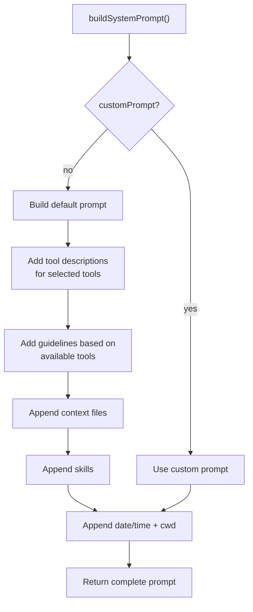

# system-prompt.ts — System Prompt Builder

**Source:** `packages/coding-agent/src/core/system-prompt.ts` (188 lines)

## Purpose

Builds the system prompt sent to the LLM before each conversation. Includes tool descriptions, guidelines, context files, skills, and current date/time.

## Exported Types

### `BuildSystemPromptOptions` (line 19)

```typescript
export interface BuildSystemPromptOptions {
    customPrompt?: string;
    selectedTools?: string[];
    appendSystemPrompt?: string;
    cwd?: string;
    contextFiles?: Array<{ path: string; content: string }>;
    skills?: Skill[];
}
```

## `buildSystemPrompt()` (line 35)

```typescript
export function buildSystemPrompt(options: BuildSystemPromptOptions = {}): string
```



**Tool descriptions** (line 9): Maps tool names to human-readable descriptions for the LLM.

**Guidelines** (lines 102–145): Context-sensitive rules based on available tools — e.g., if `bash` tool is available, adds shell execution guidelines; if `edit` tool is available, adds file editing guidelines.
