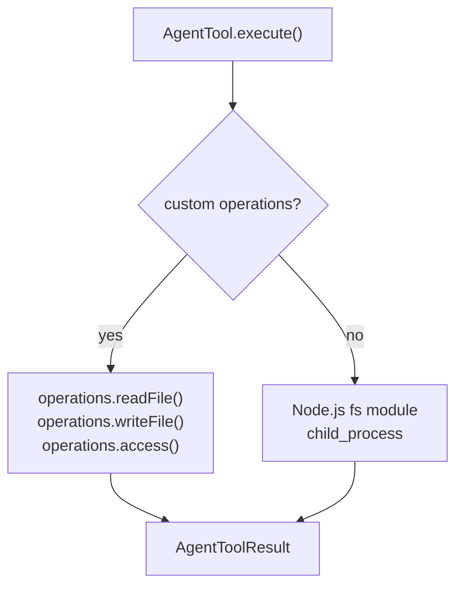

# Built-in Tools — Overview

**Source:** `packages/coding-agent/src/core/tools/`

## Purpose

Implements the built-in agent tools: bash, read, edit, write, grep, find, ls. Each tool is an `AgentTool` from `@mariozechner/agent` with pluggable operations for remote execution.

## Tool Sets

| Set | Line | Tools | Description |
|---|---|---|---|
| `codingTools` | 82 | read, bash, edit, write | Default for coding tasks |
| `readOnlyTools` | 85 | read, grep, find, ls | Read-only access |
| `allTools` | 88 | all 7 | Complete toolset |

Factory functions: `createCodingTools(cwd)`, `createReadOnlyTools(cwd)`, `createAllTools(cwd)`.

## bash.ts (321 lines)

```typescript
export function createBashTool(cwd: string, options?: BashToolOptions): AgentTool
```

| Input | Description |
|---|---|
| `command: string` | Shell command to run |
| `timeout?: number` | Timeout in milliseconds |

**Behavior:**
- Streams output to temp file if >30KB
- Supports timeout and AbortSignal
- Rolling buffer tracks partial output
- Truncates to last 5000 lines or 30KB
- Supports `BashSpawnHook` for customizing command/cwd/env before execution
- `BashOperations` interface for pluggable execution backends

## read.ts (222 lines)

```typescript
export function createReadTool(cwd: string, options?: ReadToolOptions): AgentTool
```

| Input | Description |
|---|---|
| `path: string` | File path to read |
| `offset?: number` | Line offset (1-indexed) |
| `limit?: number` | Max lines to read |

**Behavior:**
- Text files truncated to 5000 lines or 30KB
- Supports `offset` + `limit` for large files
- Detects and reads images (jpg, png, gif, webp) with auto-resize to 2000x2000
- Returns instructions for continuing large files

## edit.ts (227 lines)

```typescript
export function createEditTool(cwd: string, options?: EditToolOptions): AgentTool
```

| Input | Description |
|---|---|
| `path: string` | File path to edit |
| `oldText: string` | Text to find and replace |
| `newText: string` | Replacement text |

**Behavior:**
- Fuzzy matching for `oldText` (tolerates minor whitespace differences)
- Normalizes line endings (LF internally, restores original on write)
- Strips BOM before matching, restores after
- Rejects multiple occurrences (ambiguous edit)
- Returns unified diff in result

## write.ts

```typescript
export function createWriteTool(cwd: string, options?: WriteToolOptions): AgentTool
```

| Input | Description |
|---|---|
| `path: string` | File path to write |
| `content: string` | Full file content |

Creates parent directories if needed.

## grep.ts (346 lines)

```typescript
export function createGrepTool(cwd: string, options?: GrepToolOptions): AgentTool
```

| Input | Description |
|---|---|
| `pattern: string` | Regex pattern |
| `path?: string` | Directory to search |
| `include?: string` | Glob filter |

Uses `rg` (ripgrep) for fast search. Falls back to built-in if `rg` not available.

## find.ts (273 lines)

```typescript
export function createFindTool(cwd: string, options?: FindToolOptions): AgentTool
```

| Input | Description |
|---|---|
| `pattern: string` | Glob pattern |
| `path?: string` | Directory to search |

Uses `fd` for fast file finding. Falls back to built-in glob if `fd` not available.

## ls.ts

```typescript
export function createLsTool(cwd: string, options?: LsToolOptions): AgentTool
```

| Input | Description |
|---|---|
| `path: string` | Directory to list |

Lists directory contents with file sizes and types.

## Pluggable Operations Pattern

All tools accept an `operations` interface for custom backends:



This enables remote execution (SSH, containers) without changing tool logic.
