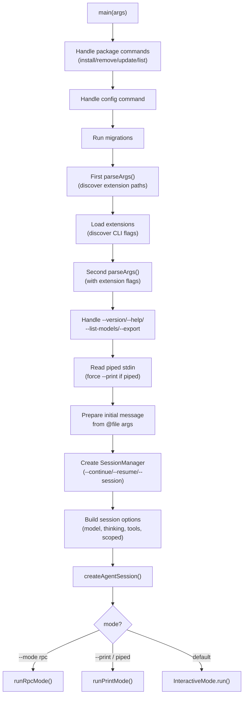
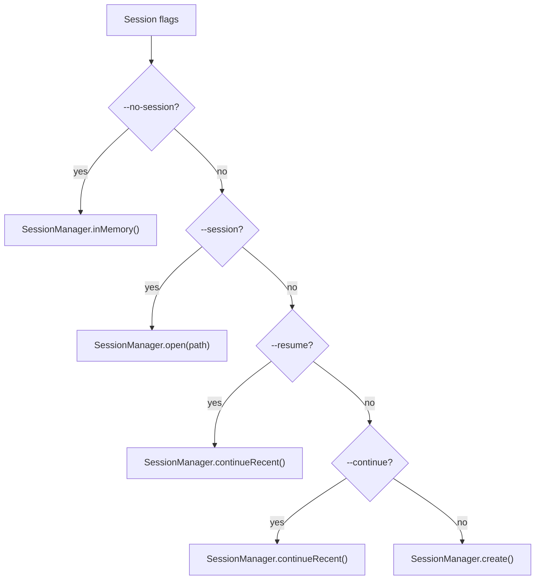

# main.ts — CLI Entry Point

**Source:** `packages/coding-agent/src/main.ts` (781 lines)

## Purpose

CLI entry point. Parses arguments, resolves session, creates `AgentSession`, and dispatches to one of three modes.

## Entry Flow

## Key Functions

| Function | Line | Description |
|---|---|---|
| `main()` | 542 | Main entry — orchestrates full CLI flow |
| `readPipedStdin()` | 39 | Read stdin if piped (non-TTY) |
| `prepareInitialMessage()` | 304 | Combine `@file` args + CLI messages into initial prompt |
| `resolveSessionPath()` | 331 | Resolve `--session` to file path (by path, local ID, global ID) |
| `createSessionManager()` | 383 | Create SessionManager from session flags |
| `buildSessionOptions()` | 423 | Build `CreateAgentSessionOptions` from parsed args |
| `handlePackageCommand()` | 189 | Execute package management (install/remove/update/list extensions) |
| `handleConfigCommand()` | 519 | Interactive settings TUI |

## Two-Pass Argument Parsing

Extensions can register CLI flags, requiring args to be parsed twice:

1. **First pass** (line 561): Parse without extension flags → discover `--extension` paths
2. **Load extensions** (line 573): Discover and load, collect registered `ExtensionFlag`s
3. **Second pass** (line 609): Re-parse with extension flags available → unknown flags resolved

## Session Resolution

## CLI Arguments (cli/args.ts)

Key flags:

| Flag | Description |
|---|---|
| `--model`, `--provider` | Model selection |
| `--thinking` | Thinking level |
| `--continue`, `--resume` | Session continuation |
| `--session` | Open specific session |
| `--models` | Scoped models for cycling |
| `--tools`, `--no-tools` | Tool selection |
| `--extension`, `-e` | Extension paths |
| `--print`, `-p` | Non-interactive mode |
| `--mode rpc` | Headless RPC mode |
| `--skill`, `--prompt-template` | Skill/template paths |
