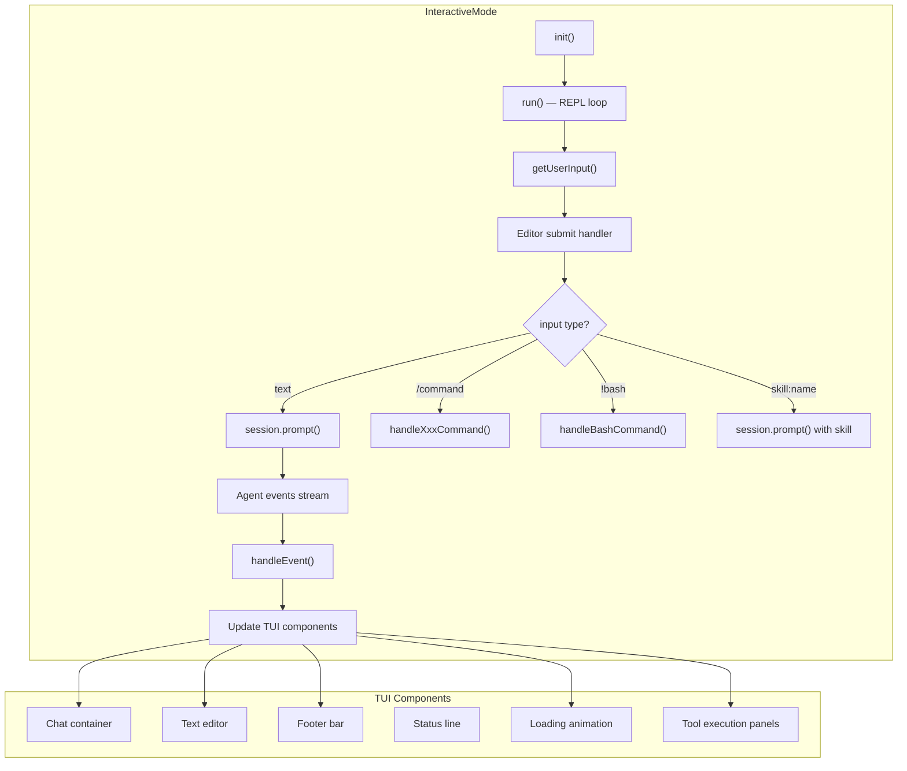

# interactive-mode.ts — Interactive TUI Mode

**Source:** `packages/coding-agent/src/modes/interactive/interactive-mode.ts` (4396 lines)

## Purpose

Full terminal UI mode — the default when running `pi`. Manages the REPL loop, renders messages, handles keybindings, slash commands, extension UI, model/session selectors, and bash execution.

## Architecture

## `InteractiveMode` Class (line 149)

### Lifecycle

| Method | Line | Description |
|---|---|---|
| `constructor()` | 255 | Initialize with AgentSession, create UI containers |
| `init()` | 368 | Load changelog, ensure tools (fd/rg), build UI, subscribe to events |
| `run()` | 512 | Main REPL loop — prompt user in loop until exit |
| `stop()` | 4380 | Cleanup: stop loader, unsubscribe, stop UI |

### Event Handling

**`handleEvent()`** (line 2043) dispatches on `AgentSessionEvent.type`:

| Event | Action |
|---|---|
| `message_start` | Create/update streaming component |
| `message_update` | Update streaming component with delta |
| `message_end` | Finalize message component |
| `tool_execution_start` | Create tool execution panel |
| `tool_execution_update` | Update tool panel with partial result |
| `tool_execution_end` | Finalize tool panel |
| `compaction_started/done/failed` | Show/hide compaction UI |
| `auto_retry_start/end` | Show/hide retry countdown |
| `pending_messages_changed` | Update footer queue count |
| `error` | Display error message |

### Keybindings

| Key | Line | Action |
|---|---|---|
| Ctrl+C | 2561 | Interrupt agent / abort |
| Ctrl+D | 2571 | Exit (if editor empty) |
| Ctrl+Z | 2614 | Suspend process (SIGSTOP) |
| Ctrl+T | 2678 | Cycle thinking level |
| Ctrl+P | 2689 | Cycle model forward |
| Ctrl+N | 2689 | Cycle model backward |
| Ctrl+X | 2739 | Open external `$EDITOR` |
| Ctrl+V | 1849 | Paste clipboard image |
| Ctrl+U | — | Queue steer message |
| Ctrl+O | — | Queue follow-up message |
| Esc Esc | — | Exit |

### Slash Commands

| Command | Line | Description |
|---|---|---|
| `/model` | 3161 | Model selector (fuzzy search) |
| `/reload` | 3737 | Reload extensions + settings |
| `/export` | 3808 | Export session to HTML |
| `/share` | 3820 | Upload session to pi.dev |
| `/copy` | 3914 | Copy last assistant message to clipboard |
| `/name` | 3929 | Set session name |
| `/session` | 3950 | Session selector |
| `/changelog` | 3987 | Show changelog |
| `/hotkeys` | 4037 | Show keybindings |
| `/clear` | 4148 | Clear chat history |
| `/debug` | 4172 | Write debug log |
| `/compact` | 4312 | Manual compaction |

### Extension UI Integration

Extensions can inject UI elements:

| Method | Line | Description |
|---|---|---|
| `setExtensionWidget()` | 1178 | Render widget above/below editor |
| `setExtensionFooter()` | 1298 | Custom footer component |
| `setExtensionHeader()` | 1331 | Custom header component |
| `setExtensionStatus()` | 1170 | Transient status message |
| `showExtensionSelector()` | 1447 | String selector dialog |
| `showExtensionConfirm()` | 1502 | Confirmation dialog |
| `showExtensionInput()` | 1514 | Text input dialog |
| `showExtensionEditor()` | 1569 | Multi-line editor dialog |

### Internal State (150+ fields)

Key state groups:
- **Streaming**: `streamingComponent`, `streamingMessage`, `pendingTools` map
- **Bash**: `isBashMode`, `bashComponent`, `pendingBashComponents`
- **Auto-operations**: `autoCompactionLoader`, `retryLoader` with escape handlers
- **Extension UI**: `extensionWidgetsAbove/Below`, `customFooter/Header`
- **Session**: `skillCommands` map, `shutdownRequested` flag
