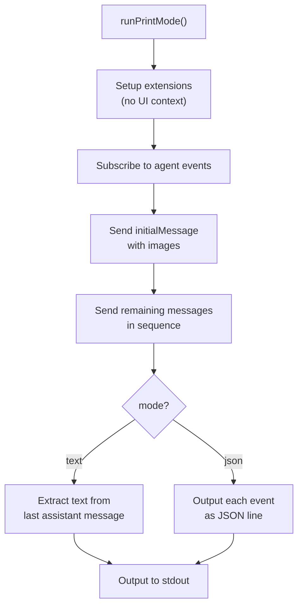

# print-mode.ts — Non-Interactive Mode

**Source:** `packages/coding-agent/src/modes/print-mode.ts` (125 lines)

## Purpose

Single-shot execution mode. Sends prompt, collects response, outputs result, returns. Used with `pi -p "prompt"` or piped stdin.

## Exported Types

### `PrintModeOptions` (line 15)

```typescript
export interface PrintModeOptions {
    mode: "text" | "json";
    messages?: string[];
    initialMessage?: string;
    initialImages?: ImageContent[];
}
```

## `runPrintMode()` (line 30)

```typescript
export async function runPrintMode(
    session: AgentSession, options: PrintModeOptions
): Promise<void>
```



**Text mode**: Only outputs the final assistant response text.
**JSON mode**: Outputs every `AgentEvent` as a JSON line (for programmatic consumption).
