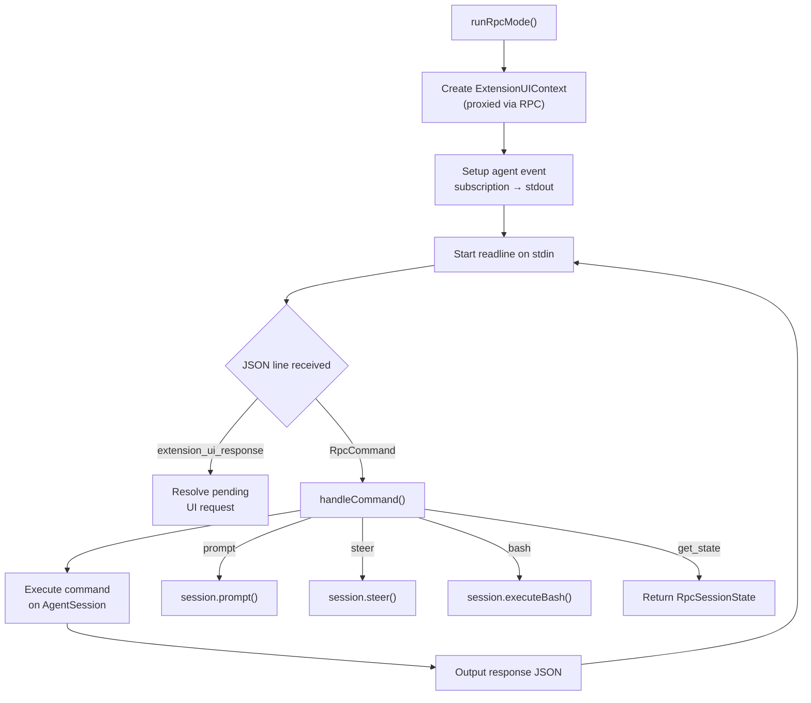

# RPC Mode — Headless JSON-RPC

**Source:** `packages/coding-agent/src/modes/rpc/`

## Purpose

Headless mode for IDE integrations and programmatic control. Communicates via JSON lines on stdin/stdout. Supports all agent operations plus extension UI proxying.

## Protocol

```
stdin  → JSON commands  (one per line)
stdout ← JSON responses + events + extension UI requests
```

## rpc-types.ts (264 lines)

### `RpcCommand` (line 18)

Union of all command types:

| Command | Description |
|---|---|
| `prompt` | Send prompt with optional images |
| `steer` | Queue steering message |
| `follow_up` | Queue follow-up message |
| `abort` | Abort current operation |
| `new_session` | Start new session |
| `get_state` | Get `RpcSessionState` |
| `set_model` | Set model by provider/modelId |
| `cycle_model` | Cycle to next/previous model |
| `get_available_models` | List available models |
| `set_thinking_level` | Set thinking level |
| `cycle_thinking_level` | Cycle thinking level |
| `compact` | Manual compaction |
| `bash` | Execute bash command |
| `abort_bash` | Abort bash execution |
| `get_session_stats` | Get session statistics |
| `export_html` | Export to HTML |
| `switch_session` | Switch session file |
| `fork` | Fork session |
| `get_messages` | Get all messages |
| `get_commands` | Get available commands |

### `RpcSessionState` (line 91)

```typescript
export interface RpcSessionState {
    model: { provider: string; id: string; name: string };
    thinkingLevel: ThinkingLevel;
    isStreaming: boolean;
    isCompacting: boolean;
    steeringMode: "all" | "one-at-a-time";
    followUpMode: "all" | "one-at-a-time";
    sessionFile: string | undefined;
    sessionId: string;
    sessionName: string | undefined;
    autoCompactionEnabled: boolean;
    messageCount: number;
    pendingMessageCount: number;
}
```

### `RpcExtensionUIRequest` (line 212)

Extensions can trigger UI interactions that are proxied through RPC:

| Request Type | Description |
|---|---|
| `select` | Multiple choice selection |
| `confirm` | Yes/no confirmation |
| `input` | Text input |
| `editor` | Multi-line editor |
| `notify` | Notification (no response needed) |
| `setStatus` | Status bar update |
| `setWidget` | Widget display |
| `set_editor_text` | Set editor content |

## rpc-mode.ts (639 lines)

### `runRpcMode()` (line 45)

```typescript
export async function runRpcMode(session: AgentSession): Promise<never>
```



**Extension UI proxying**: When an extension calls `select()`, `confirm()`, etc., the RPC mode sends an `extension_ui_request` to stdout. The IDE client responds with `extension_ui_response` on stdin. This allows headless operation while supporting interactive extension features.

## rpc-client.ts (510 lines)

Client-side library for connecting to an RPC-mode `pi` process:

```typescript
export class RpcClient {
    constructor(options: RpcClientOptions);
    prompt(text: string, images?: ImageContent[]): Promise<RpcResponse>;
    steer(text: string): Promise<RpcResponse>;
    getState(): Promise<RpcSessionState>;
    setModel(provider: string, modelId: string): Promise<RpcResponse>;
    // ... all commands
    on(listener: RpcEventListener): () => void;
}
```

Spawns `pi --mode rpc` as a child process and communicates via stdin/stdout JSON lines.
